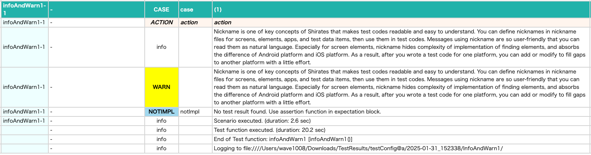
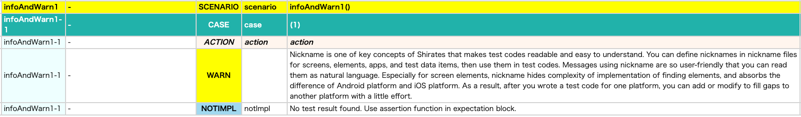

# info, warn (Vision)

You can use info and warn function to output additional information.

| function | description                               |
|:---------|:------------------------------------------|
| info     | For **detail** report only                |
| warn     | For both **simple** and **detail** report |

## Sample code

[Getting samples](../../../getting_samples.md)

### InfoAndWarn1.kt

(`src/test/kotlin/tutorial/basic/InfoAndWarn1.kt`)

```kotlin
    @Test
    @Order(10)
    fun infoAndWarn1() {

        scenario {
            case(1) {
                action {
                    info("Nickname is one of key concepts of Shirates that makes test codes readable and easy to understand. You can define nicknames in nickname files for screens, elements, apps, and test data items, then use them in test codes. Messages using nickname are so user-friendly that you can read them as natural language. Especially for screen elements, nickname hides complexity of implementation of finding elements, and absorbs the difference of Android platform and iOS platform. As a result, after you wrote a test code for one platform, you can add or modify to fill gaps to another platform with a little effort.")
                    warn("Nickname is one of key concepts of Shirates that makes test codes readable and easy to understand. You can define nicknames in nickname files for screens, elements, apps, and test data items, then use them in test codes. Messages using nickname are so user-friendly that you can read them as natural language. Especially for screen elements, nickname hides complexity of implementation of finding elements, and absorbs the difference of Android platform and iOS platform. As a result, after you wrote a test code for one platform, you can add or modify to fill gaps to another platform with a little effort.")
                }
            }
        }
    }

```

### Html-Report(detail)



Both info and warn messages are output.

### Html-Report(simple)



Only warn message is output.

### Link

- [index](../../../../index.md)
