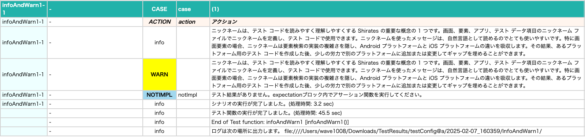
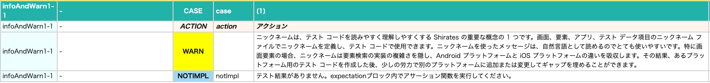

# info, warn (Vision)

これらの関数を使用すると追加のメッセージを出力することができます。

| 関数   | 説明                                      |
|:-----|:----------------------------------------|
| info | **detail**のレポートでのみ出力されます                |
| warn | **simple** と **detail** の両方のレポートで出力されます |

### サンプルコード

[サンプルの入手](../../../getting_samples_ja.md)

### InfoAndWarn1.kt

(`src/test/kotlin/tutorial/basic/InfoAndWarn1.kt`)

```kotlin
    @Test
    @Order(10)
    fun infoAndWarn1() {

        scenario {
            case(1) {
                action {
                    info("ニックネームは、テスト コードを読みやすく理解しやすくする Shirates の重要な概念の 1 つです。画面、要素、アプリ、テスト データ項目のニックネーム ファイルでニックネームを定義し、テスト コードで使用できます。ニックネームを使ったメッセージは、自然言語として読めるのでとても使いやすいです。特に画面要素の場合、ニックネームは要素検索の実装の複雑さを隠し、Android プラットフォームと iOS プラットフォームの違いを吸収します。その結果、あるプラットフォーム用のテスト コードを作成した後、少しの労力で別のプラットフォームに追加または変更してギャップを埋めることができます。")
                    warn("ニックネームは、テスト コードを読みやすく理解しやすくする Shirates の重要な概念の 1 つです。画面、要素、アプリ、テスト データ項目のニックネーム ファイルでニックネームを定義し、テスト コードで使用できます。ニックネームを使ったメッセージは、自然言語として読めるのでとても使いやすいです。特に画面要素の場合、ニックネームは要素検索の実装の複雑さを隠し、Android プラットフォームと iOS プラットフォームの違いを吸収します。その結果、あるプラットフォーム用のテスト コードを作成した後、少しの労力で別のプラットフォームに追加または変更してギャップを埋めることができます。")
                }
            }
        }
    }
```

### Html-Report(detail)



infoとwarnの両方のメッセージが出力されます。

### Html-Report(simple)



warnのメッセージのみが出力されます。

### Link

- [index](../../../../index_ja.md)
