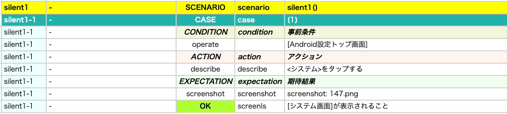
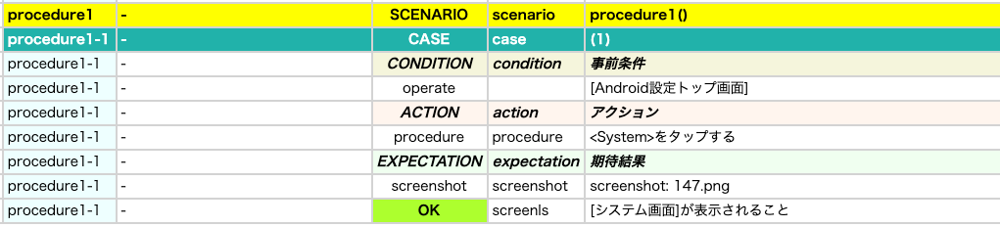

# silent, procedure (Vision)

## silent関数

**silent**関数を使用するとログ出力を抑制することができます。

### サンプルコード

[サンプルの入手](../../../getting_samples_ja.md)

### SilentAndProcedure1.kt

(`src/test/kotlin/tutorial/basic/SilentAndProcedure1.kt`)

```kotlin
    @Test
    @Order(10)
    fun silent1() {

        scenario {
            case(1) {
                condition {
                    macro("[Android設定トップ画面]")
                }.action {
                    describe("<システム>をタップする")
                    silent {
                        it.scrollToBottom()
                            .tap("システム")
                    }
                }.expectation {
                    it.screenIs("[システム画面]")
                }
            }
        }
    }
```

### Html-Report



`describe`は出力されています。<br>
`scrollToEnd`と`tap`は出力されていません。

<br>

## procedure関数

**procedure**関数を使用するとdescribe関数 と silent関数を組み合わせることなく代用できます。

### SilentAndProcedure1.kt

```kotlin
    @Test
    @Order(20)
    fun procedure1() {

        scenario {
            case(1) {
                condition {
                    macro("[Android設定トップ画面]")
                }.action {
                    procedure("<System>をタップする") {
                        it.scrollToBottom()
                            .tap("システム")
                    }
                }.expectation {
                    it.screenIs("[システム画面]")
                }
            }
        }
    }
```

### Html-Report



`procedure` は出力されています。<br>
`scrollToEnd` と `tap`は出力されていません。

### Link

- [index](../../../../index_ja.md)
