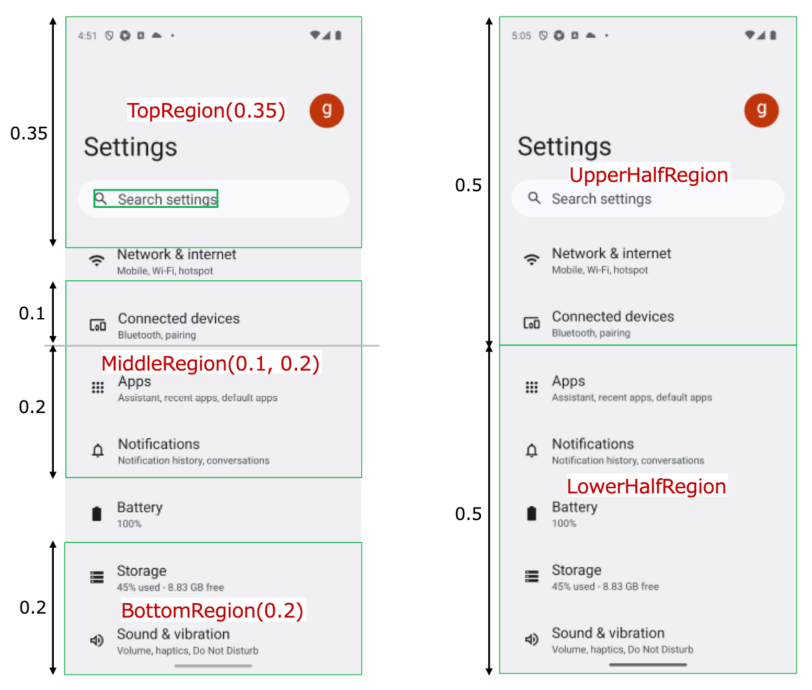

# Setting working region (Vision)

Finding image is a computationally intensive process. Especially splitting the image into segments is heavy.<br>
You can set working region to get better performance by reducing the size of the image using these functions.<br>
Also, by setting a work area, you can verify whether the text/image exists within that work area.

| function               | description                                                                                  |
|:-----------------------|:---------------------------------------------------------------------------------------------|
| onThisElementRegion    | Set it as working region.                                                                    |
| onCellOf               | Get the rectangle that includes the text and set it as a working region.                     |
| onCellOfWithScrollDown | Get the rectangle that includes the text with scrolling down and set it as a working region. |
| onTopRegion            | Cut the screen image of top region and set it as a working region.                           |
| onBottomRegion         | Cut the screen image of bottom region and set it as a working region.                        |
| onMiddleRegion         | Cut the screen image of middle region and set it as a working region.                        |
| onRegion               | Cut the screen image with specified rectangle and set it as a working region.                |
| onUpperHalfRegion      | Cut the screen image of upper half region and set it as a working region.                    |
| onLowerHalfRegion      | Cut the screen image of lower half region and set it as a working region.                    |
| onLeftHalfRegion       | Cut the screen image of left half region and set it as a working region.                     |
| onRightHalfRegion      | Cut the screen image of right half region and set it as a working region.                    |
| onAbove                | Cut above region of the column of the element and set it as a working region.                |
| onBelow                | Cut below region of the column of the element and set it as a working region.                |
| onLeft                 | Cut left region of the line of the region and set it as a working region.                    |
| onRight                | Cut right region of the line of the region and set it as a working region.                   |
| onAboveScreen          | Cut above region of the element and set it as a working region.                              |
| onBelowScreen          | Cut below region of the element and set it as a working region.                              |
| onLeftScreen           | Cut left region and set it as a working region.                                              |
| onRightScreen          | Cut right region and set it as a working region.                                             |

## Sample code

[Getting samples](../../../getting_samples.md)

### SettingWorkingRegion1.kt

(`src/test/kotlin/tutorial/basic/SettingWorkingRegion1.kt`)

```kotlin
    @Test
    @Order(10)
    fun settingWorkingRegion() {

        scenario {
            case(1) {
                condition {
                    it.screenIs("[Android Settings Top Screen]")
                }.expectation {
                    onTopRegion(topRate = 0.35) {
                        it.exist("Search settings")
                        it.dontExist("Storage")
                    }
                }
            }
            case(2) {
                expectation {
                    onBottomRegion {
                        it.dontExist("Search settings")
                        it.exist("Storage")
                    }
                }
            }
            case(3) {
                expectation {
                    onMiddleRegion(upperRate = 0.1, lowerRate = 0.2) {
                        it.dontExist("Search settings")
                        it.exist("Apps")
                        it.exist("Notifications")
                    }
                }
            }
            case(4) {
                expectation {
                    val v = detect("Search settings")
                    val r = v.rect
                    onRegion(left = r.left, top = r.top, right = r.right, bottom = r.bottom) {
                        it.exist("Search settings")
                    }
                }
            }
            case(5) {
                expectation {
                    onUpperHalfRegion {
                        it.exist("Search settings")
                        it.dontExist("Storage")
                    }
                }
            }
            case(6) {
                expectation {
                    onLowerHalfRegion {
                        it.dontExist("Search settings")
                        it.exist("Storage")
                    }
                }
            }
        }
    }
```



```kotlin
    @Test
    @Order(20)
    fun measureTime() {

        scenario {
            case(1) {
                condition {
                    it.screenIs("[Android Settings Top Screen]")
                }.action {
                    val sw = StopWatch("Full Screen")
                    it.findImage("[Network & internet Icon]")
                    s1 = "Full Screen:       ${sw.elapsedSeconds} sec"
                }
            }
            case(2) {
                action {
                    val sw = StopWatch("onUpperHalfRegion")
                    onUpperHalfRegion {
                        it.findImage("[Network & internet Icon]")
                    }
                    s2 = "onUpperHalfRegion: ${sw.elapsedSeconds} sec"
                }
            }
            case(3) {
                action {
                    val sw = StopWatch("onBottomRegion")
                    onBottomRegion {
                        it.findImage("[Sound & vibration Icon]")
                    }
                    s3 = "onBottomRegion:    ${sw.elapsedSeconds} sec"
                }
            }

            printInfo(s1)
            printInfo(s2)
            printInfo(s3)
        }
    }
```

#### Cosole output

```
156	[00:00:25]	2025/02/15 00:05:26.138	{measureTime-3}	0	-	[info]	+1	!	()	Full Screen:       1.308 sec
157	[00:00:25]	2025/02/15 00:05:26.138	{measureTime-3}	0	-	[info]	+0	!	()	onUpperHalfRegion: 0.54 sec
158	[00:00:25]	2025/02/15 00:05:26.138	{measureTime-3}	0	-	[info]	+0	!	()	onBottomRegion:    0.31 sec
```

### Link

- [index](../../../../index.md)

