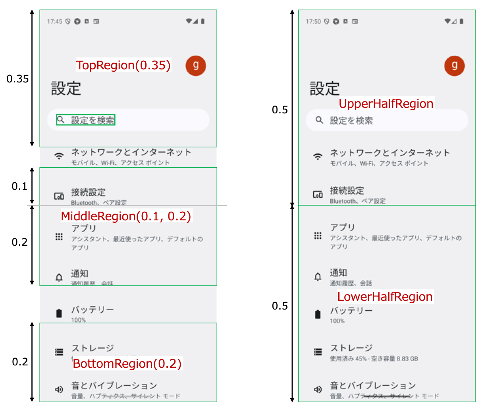

# 作業領域を指定する (Vision)

画像の検索は大量の計算を必要とするプロセスです。特に画像をセグメントに分割する処理は重いです。<br>
これらの関数を使用して画像のサイズを縮小し作業領域を設定することでパフォーマンスを向上できます。<br>
また、作業領域を設定することで、その作業領域内にテキストや画像が存在するかどうかを検証できます。

| 関数                  | 説明                                    |
|:--------------------|:--------------------------------------|
| onThisElementRegion | 指定した要素を作業領域として設定します。                  |
| onCellOf            | 指定したテキストを含む矩形領域を取得し、これを作業領域として設定します。  |
| onTopRegion         | 画面イメージの上部領域を切り取り、これを作業領域として設定します。     |
| onBottomRegion      | 画面イメージの下部領域を切り取り、これを作業領域として設定します。     |
| onMiddleRegion      | 画面イメージの中間領域を切り取り、これを作業領域として設定します。     |
| onRegion            | 画面イメージを指定した矩形領域で切り取り、これを作業領域として設定します。 |
| onUpperHalfRegion   | 画面イメージの上半分を切り取り、これを作業領域として設定します。      |
| onLowerHalfRegion   | 画面イメージの下半分を切り取り、これを作業領域として設定します。      |
| onLeftHalfRegion    | 画面イメージの左半分を切り取り、これを作業領域として設定します。      |
| onRightHalfRegion   | 画面イメージの右半分を切り取り、これを作業領域として設定します。      |
| onAbove             | 要素の属する列の上側の領域を切り取り、これを作業領域として設定します。   |
| onBelow             | 要素の属する列の下側の領域を切り取り、これを作業領域として設定します。   |
| onLeft              | 要素の属するラインの左側の領域を切り取り、これを作業領域として設定します。 |
| onRight             | 要素の属するラインの右側の領域を切り取り、これを作業領域として設定します。 |
| onAboveScreen       | 要素の上側の領域を切り取り、これを作業領域として設定します。        |
| onBelowScreen       | 要素の下側の領域を切り取り、これを作業領域として設定します。        |
| onLeftScreen        | 要素の左側の領域を切り取り、これを作業領域として設定します。        |
| onRightScreen       | 要素の右側の領域を切り取り、これを作業領域として設定します。        |

## サンプルコード

[サンプルの入手](../../../getting_samples_ja.md)

### SettingWorkingRegion1.kt

(`src/test/kotlin/tutorial/basic/SettingWorkingRegion1.kt`)

```kotlin
    @Test
    @Order(10)
    fun settingWorkingRegion() {

        scenario {
            case(1) {
                condition {
                    it.screenIs("[Android設定トップ画面]")
                }.expectation {
                    onTopRegion(topRate = 0.35) {
                        it.exist("設定を検索")
                        it.dontExist("ストレージ")
                    }
                }
            }
            case(2) {
                expectation {
                    onBottomRegion {
                        it.dontExist("設定を検索")
                        it.exist("ストレージ")
                    }
                }
            }
            case(3) {
                expectation {
                    onMiddleRegion(upperRate = 0.1, lowerRate = 0.2) {
                        it.dontExist("設定を検索")
                        it.exist("アプリ")
                        it.exist("通知")
                    }
                }
            }
            case(4) {
                expectation {
                    val v = detect("設定を検索")
                    val r = v.rect
                    onRegion(left = r.left, top = r.top, right = r.right, bottom = r.bottom) {
                        it.exist("設定を検索")
                    }
                }
            }
            case(5) {
                expectation {
                    onUpperHalfRegion {
                        it.exist("設定を検索")
                        it.dontExist("ストレージ")
                    }
                }
            }
            case(6) {
                expectation {
                    onLowerHalfRegion {
                        it.dontExist("設定を検索")
                        it.exist("ストレージ")
                    }
                }
            }
        }
    }
```



```kotlin
    @Test
    @Order(20)
    fun measureTime() {

        scenario {
            case(1) {
                condition {
                    it.screenIs("[Android設定トップ画面]")
                }.action {
                    val sw = StopWatch("全画面")
                    it.findImage("[ネットワークとインターネットアイコン]")
                    s1 = "全画面:             ${sw.elapsedSeconds} sec"
                }
            }
            case(2) {
                action {
                    val sw = StopWatch("onUpperHalfRegion")
                    onUpperHalfRegion {
                        it.findImage("[ネットワークとインターネットアイコン]")
                    }
                    s2 = "onUpperHalfRegion: ${sw.elapsedSeconds} sec"
                }
            }
            case(3) {
                action {
                    val sw = StopWatch("onBottomRegion")
                    onBottomRegion {
                        it.findImage("[音とバイブレーションアイコン]")
                    }
                    s3 = "onBottomRegion:    ${sw.elapsedSeconds} sec"
                }
            }

            printInfo(s1)
            printInfo(s2)
            printInfo(s3)
        }
    }
```

#### Cosole output

```
162	[00:00:33]	2025/02/15 00:10:09.327	{measureTime-3}	0	-	[info]	+1	!	()	全画面:             1.747 sec
163	[00:00:33]	2025/02/15 00:10:09.328	{measureTime-3}	0	-	[info]	+1	!	()	onUpperHalfRegion: 0.627 sec
164	[00:00:33]	2025/02/15 00:10:09.328	{measureTime-3}	0	-	[info]	+0	!	()	onBottomRegion:    0.453 sec
```

### Link

- [index](../../../../index_ja.md)

