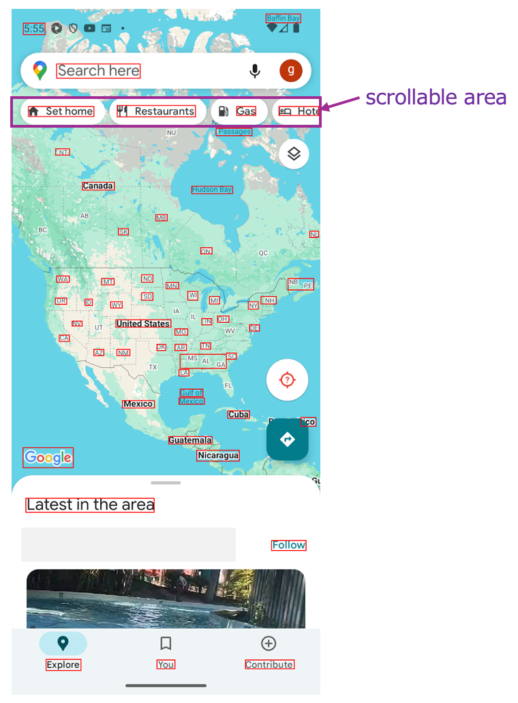

# Determining scrollable area (Vision)

On calling functions such as scroll, swipe, flick, etc.,
the scrollable area is determined and operations are performed on that area.

## Determining the scrollable area explicitly

You can determine the scrollable area explicitly using these functions.

| 関数                     | 説明                                                                                                                 |
|:-----------------------|:-------------------------------------------------------------------------------------------------------------------|
| onLine                 | Set the horizontal line including current selected element as scrollable area.                                     |
| onColumn               | Set the Vertical line including current selected element as scrollable area.                                       |
| onLineOf(expression)   | Gets the text that matches with expression, then set the horizontal line including the element as scrollable area. |
| onColumnOf(expression) | Gets the text that matches with expression, then set the vertical line including the element as scrollable area.   |

## Sample code

[Getting samples](../../../getting_samples.md)

### Scroll2.kt

(`src/test/kotlin/tutorial/basic/Scroll2.kt`)

```kotlin
    @Test
    fun scrollToRightEdge_scrollToLeftEdge() {

        scenario {
            case(1) {
                condition {
                    it.macro("[Maps Top Screen]")
                }.action {
                    it.detect("Restaurants").onLine {
                        it.scrollToRightEdge()
                    }
                }.expectation {
                    it.exist("More")
                }
            }
            case(2) {
                action {
                    it.detect("More").onLine {
                        it.scrollToLeftEdge()
                    }
                }.expectation {
                    it.dontExist("More")
                }
            }
        }
    }
```

`onLine()` function creates working area on the line of "Restaurants".



### Link

- [index](../../../../index.md)

