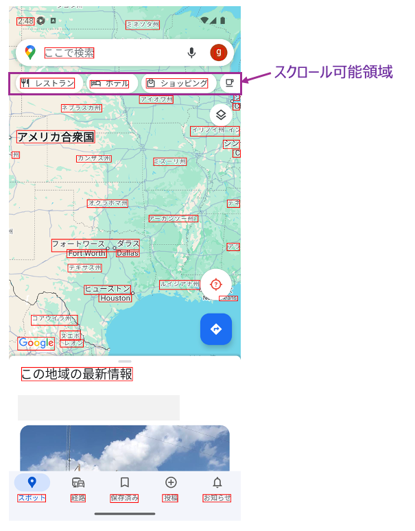

# スクロール可能領域の決定 (Vision)

scroll, swipe, flickなどのような関数を呼び出す場合はスクロール可能領域が決定され、各操作はその領域に対して実行されます。

## スクロール可能領域を明示的に決定する

以下の関数を使用すればスクロール可能領域を明示的に決定することができます。

| 関数                     | 説明                                                   |
|:-----------------------|:-----------------------------------------------------|
| onLine                 | 現在選択している要素を含む水平ラインをスクロール可能領域に設定する                    |
| onColumn               | 現在選択している要素を含む垂直ラインをスクロール可能領域に設定する                    |
| onLineOf(expression)   | expressionにマッチするテキストを取得し、この要素を含む水平ラインをスクロール可能領域に設定する |
| onColumnOf(expression) | expressionにマッチするテキストを取得し、この要素を含む垂直ラインをスクロール可能領域に設定する |

## サンプルコード

[サンプルの入手](../../../getting_samples_ja.md)

### Scroll2.kt

(`src/test/kotlin/tutorial/basic/Scroll2.kt`)

```kotlin
    @Test
    fun scrollToRightEdge_scrollToLeftEdge() {

        scenario {
            case(1) {
                condition {
                    it.macro("[マップトップ画面]")
                }.action {
                    it.detect("レストラン").onLine {
                        it.scrollToRightEdge()
                    }
                }.expectation {
                    it.exist("もっと見る")
                }
            }
            case(2) {
                action {
                    it.detect("もっと見る").onLine {
                        it.scrollToLeftEdge()
                    }
                }.expectation {
                    it.dontExist("もっと見る")
                }
            }
        }
    }
```

`onLine()` 関数は"レストラン"を含む水平ラインに作業領域を作成します。



### Link

- [index](../../../../index_ja.md)
