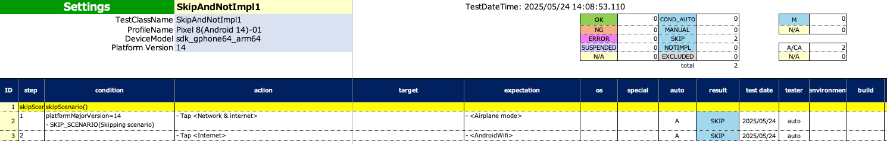
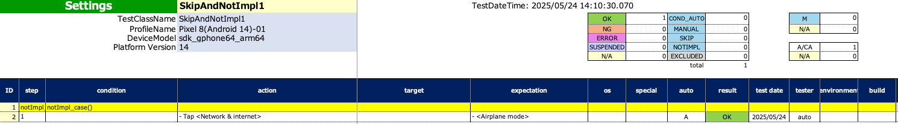

# Test flow control using SKIP, MANUAL, NOTIMPL (Vision)

You can skip or abort test using these functions.

| function        | description                              |
|:----------------|:-----------------------------------------|
| SKIP_CASE       | Skip the test case. SKIP is set.         |
| SKIP_SCENARIO   | Skip the test scenario. SKIP is set.     |
| MANUAL_CASE     | Skip the test case. MANUAL is set.       |
| MANUAL_SCENARIO | Skip the test scenario. MANUAL is set.   |
| NOTIMPL         | Abort the test as it is not implemented. |

## Sample code

[Getting samples](../../../getting_samples.md)

### SkipAndNotImpl1.kt

(`src/test/kotlin/tutorial/basic/SkipAndNotImpl1.kt`)

```kotlin
    @Test
    @Order(10)
    fun skipCase() {

        scenario {
            case(1) {
                condition {
                    output("platformMajorVersion=$platformMajorVersion")
                    if (platformMajorVersion > 5) {
                        SKIP_CASE("case(1) skipped.")   // Skip execution of commands (log only)
                    }
                }.action {
                    it.tap("Network & internet")  // Skipped
                }.expectation {
                    it.exist("Airplane mode")   // Skipped
                }
            }
            case(2) {
                action {
                    it.tap("Network & internet")  // Executed
                }.expectation {
                    it.exist("Airplane mode")   // Executed
                }
            }
        }
    }
```

### Spec-Report


<br>
<br>

```kotlin
    @Test
    @Order(20)
    fun skipScenario() {

        scenario {
            case(1) {
                condition {
                    output("platformMajorVersion=$platformMajorVersion")
                    if (platformMajorVersion > 5) {
                        SKIP_SCENARIO()     // Skip execution of commands (log only)
                    }
                }.action {
                    it.tap("Network & internet")  // Skipped
                }.expectation {
                    it.exist("Airplane mode")   // Skipped
                }
            }
            case(2) {
                action {
                    it.tap("Internet")  // Skipped
                }.expectation {
                    it.exist("AndroidWifi")   // Skipped
                }
            }
        }
    }
```

#### Spec-Report



<br>
<br>

```kotlin
    @Test
    @Order(30)
    fun notImpl_case() {

        scenario {
            case(1) {
                action {
                    it.tap("Network & internet")  // Executed
                }.expectation {
                    it.exist("Airplane mode")   // Executed
                }
            }
            case(2) {
                condition {
                    NOTIMPL()   // Abort this test
                }.action {
                    it.tap("Internet")  // Not reached
                }.expectation {
                    it.exist("AndroidWifi")   // Not reached
                }
            }
            case(3) {
                action {
                    it.tap("AndroidWifi")  // Not reached
                }.expectation {
                    it.exist("Network details")    // Not reached
                    NOTIMPL("To be implement.")     // Not reached
                }
            }
        }
    }
```

### Spec-Report



<br>
<br>

```kotlin
    @Test
    @Order(40)
    fun notImpl_scenario() {

        scenario {
            NOTIMPL()   // Abort this scenario

            case(1) {
                action {
                    it.tap("Network & internet")    // Not reached
                }.expectation {
                    it.exist("Airplane mode")   // Not reached
                }
            }
        }
    }
```

### Spec-Report


### Link

- [index](../../../../index.md)
