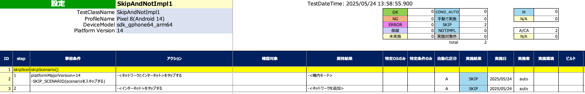
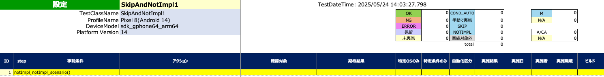

# SKIP, MANUAL, NOTIMPL を使用したテストフロー制御 (Vision)

これらの関数を使用するとテストの実行をスキップしたり中止したりすることができます。

| 関数              | 説明                                 |
|:----------------|:-----------------------------------|
| SKIP_CASE       | 現在のテストケースをスキップします。結果はSKIPを設定します    |
| SKIP_SCENARIO   | 現在のテストシナリオをスキップします。結果はSKIPを設定します   |
| MANUAL_CASE     | 現在のテストケースをスキップします。結果はMANUALを設定します  |
| MANUAL_SCENARIO | 現在のテストシナリオをスキップします。結果はMANUALを設定します |
| NOTIMPL         | テストが実装されていないためテストの実行を中止します         |

## サンプルコード

[サンプルの入手](../../../getting_samples_ja.md)

### SkipAndNotImpl1.kt

(`src/test/kotlin/tutorial/basic/SkipAndNotImpl1.kt`)

```kotlin
    @Test
    @Order(10)
    fun skipCase() {

        scenario {
            case(1) {
                condition {
                    output("platformMajorVersion=$platformMajorVersion")
                    if (platformMajorVersion > 5) {
                        SKIP_CASE("case(1) skipped.")   // Skip execution of commands (log only)
                    }
                }.action {
                    it.tap("ネットワークとインターネット")  // Skipped
                }.expectation {
                    it.exist("機内モード")    // Skipped
                }
            }
            case(2) {
                action {
                    it.tap("ネットワークとインターネット")  // Executed
                }.expectation {
                    it.exist("機内モード")    // Executed
                }
            }
        }
    }
```

### Spec-Report


<br>
<br>

```kotlin
    @Test
    @Order(20)
    fun skipScenario() {

        scenario {
            case(1) {
                condition {
                    output("platformMajorVersion=$platformMajorVersion")
                    if (platformMajorVersion > 5) {
                        SKIP_SCENARIO()     // Skip execution of commands (log only)
                    }
                }.action {
                    it.tap("ネットワークとインターネット")  // Skipped
                }.expectation {
                    it.exist("機内モード")    // Skipped
                }
            }
            case(2) {
                action {
                    it.tap("インターネット")  // Skipped
                }.expectation {
                    it.exist("ネットワークを追加")    // Skipped
                }
            }
        }
    }
```

#### Spec-Report



<br>
<br>

```kotlin
    @Test
    @Order(30)
    fun notImpl_case() {

        scenario {
            case(1) {
                action {
                    it.tap("ネットワークとインターネット")  // Executed
                }.expectation {
                    it.exist("機内モード")    // Executed
                }
            }
            case(2) {
                condition {
                    NOTIMPL()   // Abort this test
                }.action {
                    it.tap("ネットワークとインターネット")  // Not reached
                }.expectation {
                    it.exist("機内モード")    // Not reached
                }
            }
            case(3) {
                action {
                    it.tap("インターネット")  // Not reached
                }.expectation {
                    it.exist("ネットワークを追加")    // Not reached
                    NOTIMPL("To be implement.")     // Not reached
                }
            }
        }
    }
```

### Spec-Report


<br>
<br>

```kotlin
    @Test
    @Order(40)
    fun notImpl_scenario() {

        scenario {
            NOTIMPL()   // Abort this scenario

            case(1) {
                action {
                    it.tap("ネットワークとインターネット")    // Not reached
                }.expectation {
                    it.exist("機内モード")   // Not reached
                }
            }
        }
    }
```

### Spec-Report



### Link

- [index](../../../../index_ja.md)
