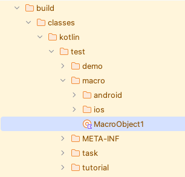

# マクロ (Vision)

テストコードを再利用することはとても重要です。定型処理はマクロとして登録することができます。

## マクロオブジェクト/マクロ関数を作成する

1. `src/test/kotlin`の配下の任意の場所にobjectクラスを作成します。例えば、`macro`packageディレクトリを作成し、その下に
   `MacroObject1`を作成します。<br>
   <br><br>
2. 以下のようにコードを実装します。
    1. **@MacroObject** アノテーションをobjectクラスに付与します。
    2. **TestDrive** インターフェースを継承します。
    3. 関数を作成し、**@Macro** アノテーションを付与します。

```kotlin
package macro

import shirates.core.macro.Macro
import shirates.core.macro.MacroObject
import shirates.core.vision.driver.commandextension.tap
import shirates.core.vision.driver.commandextension.waitScreen
import shirates.core.vision.testcode.VisionTest

@MacroObject
object MacroObject1 : VisionTest() {

    @Macro("[Network preferences Screen]")
    fun internetScreen() {

        it.waitScreen("[Android設定トップ画面]")
            .tap("ネットワークとインターネット")
        it.waitScreen("[ネットワークとインターネット画面]")
            .tap("Internet")
        it.waitScreen("[Internet Screen]")
            .tap("Network preferences")
    }

}
```

4. プロジェクトをビルドします。`build` ディレクトリ内にマクロのクラスファイルが作成されます。
   <br>

## マクロ関数の使用

1. `kotlin/exercise` の下に`Macro1`クラスを作成します。
2. テストコードを以下のように実装します。

```kotlin
package tutorial.basic

import org.junit.jupiter.api.Order
import org.junit.jupiter.api.Test
import shirates.core.vision.driver.commandextension.exist
import shirates.core.vision.driver.commandextension.macro
import shirates.core.vision.testcode.VisionTest

class Macro1 : VisionTest() {

    @Test
    @Order(10)
    fun macro1() {

        scenario {
            case(1) {
                action {
                    it.macro("[システム画面]")
                }.expectation {
                    it.exist("言語")
                }
            }
        }

    }
}
```

テストコードを実行します。コンソールに以下のようなログが出力されます。

```
[info]	()	Registering macro. (macro.MacroObject1)
```

### Link

- [index](../../../index_ja.md)

