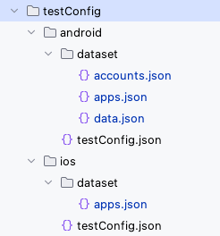

# Nickname (Vision)

## What is nickname?

**Nickname** is alias of something
(selector, screen name, app, user data, etc) that provides a set of data (maybe user data or program metadata). You
can define nicknames and use them in test codes. This mechanism makes it very easy for writing and reading test codes.

## Nickname files

Nickname is defined in nickname file.



## Nickname types

These are types of nickname.

- [Selector nickname](../../../classic/basic/selector_and_nickname/nickname/selector_nickname.md)
- [Screen nickname (for classic mode)](../../../classic/basic/selector_and_nickname/nickname/screen_nickname.md)
- [Dataset nickname](../../../classic/basic/selector_and_nickname/nickname/dataset_nickname.md)

**Screen nickname** is designed for classic mode.<br>
**Selector nickname** and **Dataset nickname** can be used in both vision mode/classic mode.

## Nickname declaration (General format)

A Nickname is defined of key and value pair. Key is nickname, value is some expression.

A nickname is decorated with **"[ ]"**(square brackets).

```
"[nickname]": (some expression)
```

```
"{nickname}": (some expression)
```

<br>

### Link

- [account](../../../vision/basic/function_property/data_storage/account.md)
- [app](basic/function_property/data_storage/app.md)
- [data](basic/function_property/data_storage/data.md)


- [index](../../../../index.md)

