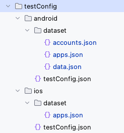

# Nickname (Vision)

## What is nickname?

**Nickname** is alias of something
(selector, screen name, app, user data, etc) that provides a set of data (maybe user data or program metadata). You
can define nicknames and use them in test codes. This mechanism makes it very easy for writing and reading test codes.

## Nickname files

Nickname is defined in nickname file.



## Nickname types

These are types of nickname.

- [Selector nickname (Not supported)](../../../../classic/basic/selector_and_nickname/nickname/selector_nickname.md)
- [Screen nickname (Not supported)](../../../../classic/basic/selector_and_nickname/nickname/screen_nickname.md)
- [Dataset nickname](../../../../classic/basic/selector_and_nickname/nickname/dataset_nickname.md)

In vision mode, only **Dataset nickname** is supported.

## Nickname declaration (General format)

A Nickname is defined of key and value pair. Key is nickname, value is some expression.

A nickname is decorated with **"[ ]"**(square brackets).

```
"[nickname]": (some expression)
```

## Dataset nickname

You can define nicknames in

- data.json
- app.json
- account.json

### Sample code

[Getting samples](../../getting_samples.md)

### data.json

(`testConfig/android/dataset/data.json`)

```json
{
  "[product1]": {
    "product_name": "Super High Tension",
    "product_code": "P001",
    "unit_price": "100"
  },

  "[product2]": {
    "product_name": "Ultra High",
    "product_code": "P002",
    "unit_price": "200"
  }
}
```

Now you can get the attribute value using `data()` function.

### Data1.kt

(`src/test/kotlin/tutorial/basic/Data1.kt`)

```kotlin
    @Test
    @Order(10)
    fun data1() {

        scenario {
            case(1) {
                condition {
                    it.macro("[Android Settings Search Screen]")
                        .tap("Search settings")
                }.action {
                    it.sendKeys(data("[product1].product_name"))
                }.expectation {
                    it.textIs("Super High Tension")
                }
            }
        }

    }
```

<br>
<hr>

### apps.json

(`testConfig/android/dataset/app.json`)

```json
{
  "[Settings]": {
    "packageOrBundleId": "com.android.settings",
    "appIconName": "Settings"
  },
  "[Calendar]": {
    "packageOrBundleId": "com.google.android.calendar",
    "appIconName": "Calendar"
  },
  "[Calculator]": {
    "packageOrBundleId": "com.google.android.calculator",
    "appIconName": "Calculator"
  },
  "[Chrome]": {
    "packageOrBundleId": "com.android.chrome",
    "appIconName": "Chrome"
  },
  "[Maps]": {
    "packageOrBundleId": "com.google.android.apps.maps",
    "appIconName": "Maps"
  },
  "[Play Store]": {
    "packageOrBundleId": "com.android.vending",
    "appIconName": "Play Store"
  },
  "[Clock]": {
    "packageOrBundleId": "com.google.android.deskclock",
    "appIconName": "Clock"
  },
  "[Downloads]": {
    "packageOrBundleId": "com.google.android.documentsui",
    "appIconName": "Downloads"
  },
  "[App1]": {
    "packageOrBundleId": "com.example.app1",
    "appIconName": "App1"
  }
}
```

Now you can launch app by `[Nickname]`. <br>
And you can get the attribute value using `app()` function.

### App1.kt

(`src/test/kotlin/tutorial/basic/App1.kt`)

```kotlin
    @Test
    @Order(10)
    fun app() {

        scenario {
            case(1) {
                condition {
                    it.launchApp("[Settings]")
                        .tap("Search settings")
                        .screenIs("[Android Settings Search Screen]")
                        .tap("[Search Box]")
                }.action {
                    it.sendKeys(app("[Settings].packageOrBundleId"))
                }.expectation {
                    it.textIs(app("[Settings].packageOrBundleId"))
                }
            }
        }
    }
```

### LaunchApp1.kt

(`src/test/kotlin/tutorial/basic/LaunchApp1.kt`)

```kotlin
            case(2) {
                condition {
                    it.terminateApp("[Chrome]")     // App Nickname in app.json
                }.action {
                    it.launchApp("[Chrome]")
                }.expectation {
                    it.appIs("[Chrome]")
                }
            }
```

<br>
<hr>

### accounts.json

(`testConfig/android/dataset/accounts.json`)

```json
{
  "[account1]": {
    "id": "account1@example.com",
    "password": "p@ssword"
  },

  "[account2]": {
    "id": "account2@example.com",
    "password": "p@ssword"
  }
}
```

Now you can get the attribute value using `account()` function.

### Account1.kt

(`src/test/kotlin/tutorial/basic/Account1.kt`)

```kotlin
    @Test
    @Order(10)
    fun account() {

        scenario {
            case(1) {
                condition {
                    it.macro("[Android Settings Top Screen]")
                        .tap("Search settings")
                        .screenIs("[Android Settings Search Screen]")
                }.action {
                    it.sendKeys(account("[account1].id"))
                }.expectation {
                    it.textIs(account("[account1].id"))
                }
            }
        }

    }
```

### Link

- [index](../../../../index.md)

