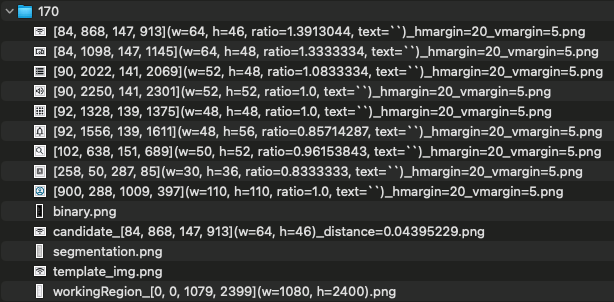
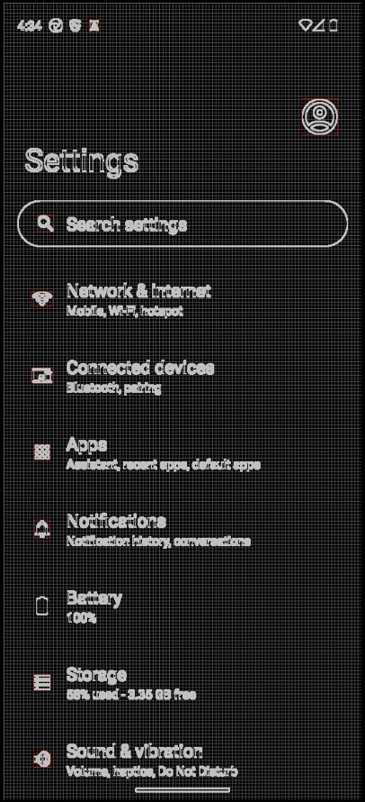
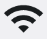

# Finding image by AI/ML (Vision)

Shirates/Vision recognizes images in the screen by AI/ML feature of Vision Framework.

### Pros.

- Using AI inference, it is more robust than pixel-by-pixel comparisons
- Fewer template images for matching are required. They can be shared between Android and iOS at each display
  resolution (if the design is the same).

### Cons.

- Smaller images may result in less accurate comparisons

### Workaround

If you have to match images pixel-by-pixel, use classic mode (Boof-CV).

## Sample code

[Getting samples](../../getting_samples.md)

### FindImage.kt

(`src/test/kotlin/tutorial/basic/FindImage1.kt`)

```kotlin
    @Test
    @Order(10)
    fun findImage() {

        scenario {
            case(1) {
                condition {
                    it.macro("[Android Settings Top Screen]")
                }.action {
                    withScrollDown {
                        v1 = it.findImage("[Display Icon]")
                        v2 = it.findImage("[System Icon]")
                    }
                }.expectation {
                    v1.isFound.thisIsTrue("[Network & internet Icon] is found.")
                    v2.isFound.thisIsTrue("[System Icon] is found.")
                }
            }
        }
    }
```

### Running test

1. Set `os` in `testrun.global.properties` to run as android (default is android).

```properties
## OS --------------------
#os=ios
```

2. Right-click on `findImage()` and select `debug` to run test.

### Console output

```
132	[00:01:03]	2025/04/26 16:44:05.829	{findImage-1}	0	-	[CASE]	+368	!	()	(1)
133	[00:01:03]	2025/04/26 16:44:05.835	{findImage-1}	0	-	[CONDITION]	+6	!	()	condition
134	[00:01:03]	2025/04/26 16:44:05.836	{findImage-1}	0	-	[operate]	+1	!	()	[Android Settings Top Screen]
135	[00:01:05]	2025/04/26 16:44:07.689	{findImage-1}	1	[Android Settings Top Screen]	[screenshot]	+1853	!	()	screenshot: 135.png
136	[00:01:06]	2025/04/26 16:44:08.026	{findImage-1}	1	[Android Settings Top Screen]	[info]	+337	!	()	135_[135.png]_recognizeText_rectangles.png
137	[00:01:06]	2025/04/26 16:44:08.141	{findImage-1}	1	[Android Settings Top Screen]	[info]	+115	!	()	[Android Settings Top Screen] found by matchTextScoreRate
138	[00:01:07]	2025/04/26 16:44:09.267	{findImage-1}	0	-	[info]	+1126	!	()	Syncing screen.(isSame: true, changed: false, matchRate: 0.9999645929347025, distance=3.540706529747695E-5)
139	[00:01:07]	2025/04/26 16:44:09.269	{findImage-1}	0	-	[ACTION]	+2	!	()	action
140	[00:01:07]	2025/04/26 16:44:09.272	{findImage-1}	0	-	[info]	+3	!	()	Trying to find image with scroll. (label="[Network & internet Icon]")
141	[00:01:07]	2025/04/26 16:44:09.369	{findImage-1}	0	-	[info]	+97	!	()	140_[0, 0, 1079, 2399](w=1080, h=2400).png
142	[00:01:07]	2025/04/26 16:44:09.677	{findImage-1}	0	-	[info]	+308	!	()	template_img.png
143	[00:01:08]	2025/04/26 16:44:10.344	{findImage-1}	0	-	[info]	+667	!	()	Trying to find image with scroll. (label="[Display Icon]")
144	[00:01:08]	2025/04/26 16:44:10.436	{findImage-1}	0	-	[info]	+92	!	()	143_[0, 0, 1079, 2399](w=1080, h=2400).png
145	[00:01:08]	2025/04/26 16:44:10.715	{findImage-1}	0	-	[info]	+279	!	()	template_img.png
146	[00:01:09]	2025/04/26 16:44:11.391	{findImage-1}	0	-	[info]	+676	!	()	145_null_normalized.png
147	[00:01:09]	2025/04/26 16:44:11.820	{findImage-1}	0	-	[info]	+429	!	()	Syncing screen.(isSame: false, changed: false, matchRate: 0.0, distance=1.0)
148	[00:01:10]	2025/04/26 16:44:12.749	{findImage-1}	0	-	[info]	+929	!	()	Syncing screen.(isSame: true, changed: true, matchRate: 1.0, distance=0.0)
149	[00:01:10]	2025/04/26 16:44:12.750	{findImage-1}	0	-	[screenshot]	+1	!	()	screenshot: 149.png
150	[00:01:11]	2025/04/26 16:44:13.085	{findImage-1}	0	-	[info]	+335	!	()	149_[149.png]_recognizeText_rectangles.png
151	[00:01:11]	2025/04/26 16:44:13.228	{findImage-1}	0	-	[info]	+143	!	()	[Android Settings Top Screen] found by matchTextScoreRate
152	[00:01:11]	2025/04/26 16:44:13.229	{findImage-1}	0	-	[info]	+1	!	()	[recognizeScreen] in 0.478 sec
153	[00:01:11]	2025/04/26 16:44:13.229	{findImage-1}	0	-	[info]	+0	!	()	currentScreen=[Android Settings Top Screen]
154	[00:01:11]	2025/04/26 16:44:13.230	{findImage-1}	0	-	[info]	+1	!	()	153_[0, 0, 1079, 2399](w=1080, h=2400).png
155	[00:01:11]	2025/04/26 16:44:13.470	{findImage-1}	0	-	[info]	+240	!	()	template_img.png
156	[00:01:12]	2025/04/26 16:44:14.039	{findImage-1}	0	-	[info]	+569	!	()	155_null_normalized.png
157	[00:01:12]	2025/04/26 16:44:14.135	{findImage-1}	0	-	[info]	+96	!	()	findImage("[Display Icon]") not found.
158	[00:01:12]	2025/04/26 16:44:14.138	{findImage-1}	0	-	[operate]	+3	!	(scrollDown)	Scroll down
159	[00:01:12]	2025/04/26 16:44:14.142	{findImage-1}	0	-	[info]	+4	!	(scrollDown)	scrollableRect: [0,0][1079,2399] width=1080, height=2400, centerX=540, centerY=1200
160	[00:01:15]	2025/04/26 16:44:17.624	{findImage-1}	0	-	[info]	+3482	!	(scrollDown)	Syncing screen.(isSame: false, changed: false, matchRate: 0.8399565517902374, distance=0.16004344820976257)
161	[00:01:16]	2025/04/26 16:44:18.542	{findImage-1}	0	-	[info]	+918	!	(scrollDown)	Syncing screen.(isSame: false, changed: true, matchRate: 0.9607135504484177, distance=0.039286449551582336)
162	[00:01:17]	2025/04/26 16:44:19.484	{findImage-1}	0	-	[info]	+942	!	(scrollDown)	Syncing screen.(isSame: true, changed: true, matchRate: 1.0, distance=0.0)
163	[00:01:17]	2025/04/26 16:44:19.485	{findImage-1}	0	-	[screenshot]	+1	!	(scrollDown)	screenshot: 163.png
164	[00:01:17]	2025/04/26 16:44:19.887	{findImage-1}	0	-	[info]	+402	!	(scrollDown)	163_[163.png]_recognizeText_rectangles.png
165	[00:01:18]	2025/04/26 16:44:20.254	{findImage-1}	0	-	[info]	+367	!	(scrollDown)	[recognizeScreen] in 0.768 sec
166	[00:01:18]	2025/04/26 16:44:20.257	{findImage-1}	0	-	[info]	+3	!	(scrollDown)	currentScreen=[Android Settings Top Screen]
167	[00:01:18]	2025/04/26 16:44:20.367	{findImage-1}	0	-	[info]	+110	!	()	endOfScroll=false
168	[00:01:18]	2025/04/26 16:44:20.369	{findImage-1}	0	-	[info]	+2	!	()	167_[0, 0, 1079, 2399](w=1080, h=2400).png
169	[00:01:18]	2025/04/26 16:44:20.610	{findImage-1}	0	-	[info]	+241	!	()	template_img.png
170	[00:01:19]	2025/04/26 16:44:21.263	{findImage-1}	0	-	[EXPECTATION]	+653	!	()	expectation
171	[00:01:19]	2025/04/26 16:44:21.270	{findImage-1}	0	-	[OK]	+7	!	(thisIsTrue)	[Network & internet Icon] is found.
172	[00:01:19]	2025/04/26 16:44:21.273	{findImage-1}	0	-	[OK]	+3	!	(thisIsTrue)	[Display Icon] is found.
```

### TestResults

You got test results files in TestResults directory(`~/Downloads/TestResults` is default).


### 170



### segmentation



### templage



### candidate (find result)


### template files


### Link

- [index](../../../index.md)
