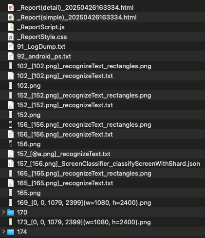
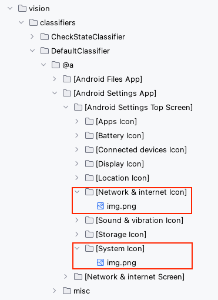

# Finding image by AI/ML (Vision)

Shirates/Vision recognizes images in the screen by AI/ML feature of Vision Framework.

### Pros.

- Using AI inference, it is more robust than pixel-by-pixel comparisons
- Fewer template images for matching are required. They can be shared between Android and iOS at each display
  resolution (if the design is the same).

### Cons.

- Smaller images may result in less accurate comparisons

### Workaround

If you have to match images pixel-by-pixel, use classic mode (Boof-CV).

## Sample code

[Getting samples](../../getting_samples.md)

### FindImage.kt

(`src/test/kotlin/tutorial/basic/FindImage1.kt`)

```kotlin
    @Test
    @Order(10)
    fun findImage() {

        scenario {
            case(1) {
                condition {
                    it.macro("[Android Settings Top Screen]")
                }.action {
                    withScrollDown {
                        v1 = it.findImage("[Display Icon]")
                        v2 = it.findImage("[System Icon]")
                    }
                }.expectation {
                    v1.isFound.thisIsTrue("[Network & internet Icon] is found.")
                    v2.isFound.thisIsTrue("[System Icon] is found.")
                }
            }
        }
    }
```

### Running test

1. Set `os` in `testrun.global.properties` to run as android (default is android).

```properties
## OS --------------------
#os=ios
```

2. Right-click on `findImage()` and select `debug` to run test.

### Console output

```
123	[00:00:22]	2025/01/27 18:10:41.488	{findImage-1}	0	-	[CASE]	+362	!	()	(1)
124	[00:00:22]	2025/01/27 18:10:41.489	{findImage-1}	0	-	[CONDITION]	+1	!	()	condition
125	[00:00:22]	2025/01/27 18:10:41.490	{findImage-1}	0	-	[operate]	+1	!	()	[Android Settings Top Screen]
126	[00:00:25]	2025/01/27 18:10:45.013	{findImage-1}	0	-	[ACTION]	+3523	!	()	action
127	[00:00:25]	2025/01/27 18:10:45.015	{findImage-1}	0	-	[info]	+2	!	()	Trying to find image with scroll. (label="[Network & internet Icon]")
128	[00:00:26]	2025/01/27 18:10:45.102	{findImage-1}	0	-	[info]	+87	!	()	127_[0, 0, 1079, 2399](w=1080, h=2400).png
129	[00:00:26]	2025/01/27 18:10:45.485	{findImage-1}	0	-	[info]	+383	!	()	normalized_template_img.png
2025-01-27 18:10:45.675 java[77255:8203431] +[IMKClient subclass]: chose IMKClient_Modern
2025-01-27 18:10:45.675 java[77255:8203431] +[IMKInputSession subclass]: chose IMKInputSession_Modern
130	[00:00:28]	2025/01/27 18:10:47.954	{findImage-1}	0	-	[info]	+2469	!	()	[findImage] in 2.939 sec
131	[00:00:28]	2025/01/27 18:10:47.956	{findImage-1}	0	-	[info]	+2	!	()	Trying to find image with scroll. (label="[Display Icon]")
132	[00:00:29]	2025/01/27 18:10:48.084	{findImage-1}	0	-	[info]	+128	!	()	131_[0, 0, 1079, 2399](w=1080, h=2400).png
133	[00:00:29]	2025/01/27 18:10:48.195	{findImage-1}	0	-	[info]	+111	!	()	normalized_template_img.png
134	[00:00:31]	2025/01/27 18:10:50.223	{findImage-1}	0	-	[info]	+2028	!	()	findImage("[Display Icon]") not found. (distance 0.6129697 > 0.1)
135	[00:00:31]	2025/01/27 18:10:50.225	{findImage-1}	0	-	[operate]	+2	!	(scrollDown)	Scroll down
136	[00:00:35]	2025/01/27 18:10:54.434	{findImage-1}	0	-	[info]	+4209	!	()	endOfScroll=false
137	[00:00:35]	2025/01/27 18:10:54.435	{findImage-1}	0	-	[info]	+1	!	()	136_[0, 0, 1079, 2399](w=1080, h=2400).png
138	[00:00:35]	2025/01/27 18:10:54.513	{findImage-1}	0	-	[info]	+78	!	()	normalized_template_img.png
139	[00:00:37]	2025/01/27 18:10:56.795	{findImage-1}	0	-	[info]	+2282	!	()	[findImage] in 8.839 sec
140	[00:00:37]	2025/01/27 18:10:56.796	{findImage-1}	0	-	[EXPECTATION]	+1	!	()	expectation
141	[00:00:37]	2025/01/27 18:10:56.797	{findImage-1}	0	-	[OK]	+1	!	(thisIsTrue)	[Network & internet Icon] is found.
142	[00:00:37]	2025/01/27 18:10:56.801	{findImage-1}	0	-	[OK]	+4	!	(thisIsTrue)	[Display Icon] is found.
```

### TestResults

You got test results files in TestResults directory(`~/Downloads/TestResults` is default).



### 128


### 128/workingregion

.png)

### 128/segmentation


### 128/templage


### 128/candidate (find result)


### template files



### Link

- [index](../../../index.md)
