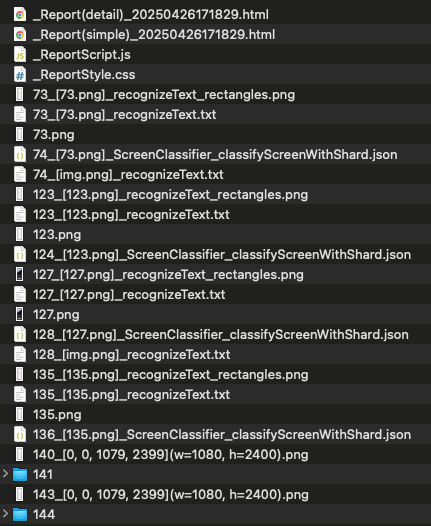

# AI/MLによる画像検索 (Vision)

Shirates/VisionはVision FrameworkのAI/ML機能を使用して画面内の画像を認識します。

### 利点

- AIの推論を使用するため、ピクセル比較による検索よりもロバストです
- 用意しなければならないテンプレート画像が少なくなります。AndroidとiOSでデザインが同じ場合は、AndroidとiOSの各解像度にまたがってテンプレートマッチング用の画像を共有できます

### 難点

- 画像が小さいと比較の精度が低くなる場合があります

### 回避策

ピクセル比較でイメージを検索する必要がある場合はclassicモード(Boof-CV)を使用してください。

## サンプルコード

[サンプルの入手](../../getting_samples_ja.md)

### FindImage.kt

(`src/test/kotlin/tutorial/basic/FindImage1.kt`)

```kotlin
    @Test
    @Order(10)
    fun findImage() {

        scenario {
            case(1) {
                condition {
                    it.macro("[Android設定トップ画面]")
                }.action {
                    withScrollDown {
                        v1 = it.findImage("[ネットワークとインターネットアイコン]")
                        v2 = it.findImage("[ディスプレイアイコン]")
                    }
                }.expectation {
                    v1.isFound.thisIsTrue("[ネットワークとインターネットアイコン] is found.")
                    v2.isFound.thisIsTrue("[ディスプレイアイコン] is found.")
                }
            }
        }
    }
```

### テストを実行する

1. Androidで実行されるように`testrun.global.properties`の`os`を設定します (デフォルトは`android`
   なので単にコメントアウトします)。

```properties
## OS --------------------
#os=ios
```

2. `findImage()`を右クリックして`debug`を選択し、テストを実行します。

### コンソール出力

```
126	[00:00:18]	2025/02/07 01:26:45.416	{findImage-1}	0	-	[CASE]	+404	!	()	(1)
127	[00:00:18]	2025/02/07 01:26:45.418	{findImage-1}	0	-	[CONDITION]	+2	!	()	事前条件
128	[00:00:18]	2025/02/07 01:26:45.419	{findImage-1}	0	-	[operate]	+1	!	()	[Android設定トップ画面]
129	[00:00:22]	2025/02/07 01:26:49.996	{findImage-1}	0	-	[ACTION]	+4577	!	()	アクション
130	[00:00:22]	2025/02/07 01:26:49.999	{findImage-1}	0	-	[info]	+3	!	()	Trying to find image with scroll. (label="[ネットワークとインターネットアイコン]")
131	[00:00:22]	2025/02/07 01:26:50.104	{findImage-1}	0	-	[info]	+105	!	()	130_[0, 0, 1079, 2399](w=1080, h=2400).png
132	[00:00:23]	2025/02/07 01:26:50.478	{findImage-1}	0	-	[info]	+374	!	()	normalized_template_img.png
133	[00:00:26]	2025/02/07 01:26:53.700	{findImage-1}	0	-	[info]	+3222	!	()	[findImage] in 3.701 sec
134	[00:00:26]	2025/02/07 01:26:53.700	{findImage-1}	0	-	[info]	+0	!	()	Trying to find image with scroll. (label="[ディスプレイアイコン]")
135	[00:00:26]	2025/02/07 01:26:53.811	{findImage-1}	0	-	[info]	+111	!	()	134_[0, 0, 1079, 2399](w=1080, h=2400).png
136	[00:00:26]	2025/02/07 01:26:53.927	{findImage-1}	0	-	[info]	+116	!	()	normalized_template_img.png
137	[00:00:29]	2025/02/07 01:26:56.565	{findImage-1}	0	-	[info]	+2638	!	()	findImage("[ディスプレイアイコン]") not found. (distance:0.6129697 > threshold:0.1)
138	[00:00:29]	2025/02/07 01:26:56.567	{findImage-1}	0	-	[operate]	+2	!	(scrollDown)	下方向へスクロールする
139	[00:00:33]	2025/02/07 01:27:00.787	{findImage-1}	0	-	[info]	+4220	!	()	endOfScroll=false
140	[00:00:33]	2025/02/07 01:27:00.789	{findImage-1}	0	-	[info]	+2	!	()	139_[0, 0, 1079, 2399](w=1080, h=2400).png
141	[00:00:33]	2025/02/07 01:27:00.867	{findImage-1}	0	-	[info]	+78	!	()	normalized_template_img.png
142	[00:00:37]	2025/02/07 01:27:04.826	{findImage-1}	0	-	[info]	+3959	!	()	[findImage] in 11.126 sec
143	[00:00:37]	2025/02/07 01:27:04.827	{findImage-1}	0	-	[EXPECTATION]	+1	!	()	期待結果
144	[00:00:37]	2025/02/07 01:27:04.828	{findImage-1}	0	-	[OK]	+1	!	(thisIsTrue)	[ネットワークとインターネットアイコン]が見つかりました。
145	[00:00:37]	2025/02/07 01:27:04.828	{findImage-1}	0	-	[OK]	+0	!	(thisIsTrue)	[ディスプレイアイコン]が見つかりました。
```

### TestResults

TestResults ディレクトリ(デフォルトは`~/Downloads/TestResults`)にテスト結果のファイルが出力されます。



### 131


### 131/workingregion


### 131/segmentation


### 131/templage


### 131/candidate (find result)


### template files


### Link

- [index](../../../index_ja.md)
