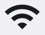

# AI/MLによる画像検索 (Vision)

Shirates/VisionはVision FrameworkのAI/ML機能を使用して画面内の画像を認識します。

### 利点

- AIの推論を使用するため、ピクセル比較による検索よりもロバストです
- 用意しなければならないテンプレート画像が少なくなります。AndroidとiOSでデザインが同じ場合は、AndroidとiOSの各解像度にまたがってテンプレートマッチング用の画像を共有できます

### 難点

- 画像が小さいと比較の精度が低くなる場合があります

### 回避策

ピクセル比較でイメージを検索する必要がある場合はclassicモード(Boof-CV)を使用してください。

## サンプルコード

[サンプルの入手](../../getting_samples_ja.md)

### FindImage.kt

(`src/test/kotlin/tutorial/basic/FindImage1.kt`)

```kotlin
    @Test
    @Order(10)
    fun findImage() {

        scenario {
            case(1) {
                condition {
                    it.macro("[Android設定トップ画面]")
                }.action {
                    withScrollDown {
                        v1 = it.findImage("[ネットワークとインターネットアイコン]")
                        v2 = it.findImage("[ディスプレイアイコン]")
                    }
                }.expectation {
                    v1.isFound.thisIsTrue("[ネットワークとインターネットアイコン] is found.")
                    v2.isFound.thisIsTrue("[ディスプレイアイコン] is found.")
                }
            }
        }
    }
```

### テストを実行する

1. Androidで実行されるように`testrun.global.properties`の`os`を設定します (デフォルトは`android`
   なので単にコメントアウトします)。

```properties
## OS --------------------
#os=ios
```

2. `findImage()`を右クリックして`debug`を選択し、テストを実行します。

### コンソール出力

```
131	[00:00:42]	2025/04/26 17:01:30.701	{findImage-1}	0	-	[CASE]	+673	!	()	(1)
132	[00:00:42]	2025/04/26 17:01:30.703	{findImage-1}	0	-	[CONDITION]	+2	!	()	事前条件
133	[00:00:42]	2025/04/26 17:01:30.704	{findImage-1}	0	-	[operate]	+1	!	()	[Android設定トップ画面]
134	[00:00:44]	2025/04/26 17:01:33.119	{findImage-1}	1	[Android設定トップ画面]	[screenshot]	+2415	!	()	screenshot: 134.png
135	[00:00:45]	2025/04/26 17:01:33.695	{findImage-1}	1	[Android設定トップ画面]	[info]	+576	!	()	134_[134.png]_recognizeText_rectangles.png
136	[00:00:45]	2025/04/26 17:01:33.827	{findImage-1}	1	[Android設定トップ画面]	[info]	+132	!	()	[Android設定トップ画面] found by matchTextScoreRate
137	[00:00:46]	2025/04/26 17:01:34.604	{findImage-1}	0	-	[info]	+777	!	()	Syncing screen.(isSame: true, changed: false, matchRate: 1.0, distance=0.0)
138	[00:00:46]	2025/04/26 17:01:34.606	{findImage-1}	0	-	[ACTION]	+2	!	()	アクション
139	[00:00:46]	2025/04/26 17:01:34.610	{findImage-1}	0	-	[info]	+4	!	()	Trying to find image with scroll. (label="[ネットワークとインターネットアイコン]")
140	[00:00:46]	2025/04/26 17:01:34.777	{findImage-1}	0	-	[info]	+167	!	()	139_[0, 0, 1079, 2399](w=1080, h=2400).png
141	[00:00:46]	2025/04/26 17:01:35.108	{findImage-1}	0	-	[info]	+331	!	()	template_img.png
142	[00:00:47]	2025/04/26 17:01:35.818	{findImage-1}	0	-	[info]	+710	!	()	Trying to find image with scroll. (label="[ディスプレイアイコン]")
143	[00:00:47]	2025/04/26 17:01:35.907	{findImage-1}	0	-	[info]	+89	!	()	142_[0, 0, 1079, 2399](w=1080, h=2400).png
144	[00:00:47]	2025/04/26 17:01:36.224	{findImage-1}	0	-	[info]	+317	!	()	template_img.png
145	[00:00:48]	2025/04/26 17:01:36.883	{findImage-1}	0	-	[info]	+659	!	()	144_null_normalized.png
146	[00:00:49]	2025/04/26 17:01:37.301	{findImage-1}	0	-	[info]	+418	!	()	Syncing screen.(isSame: false, changed: false, matchRate: 0.0, distance=1.0)
147	[00:00:49]	2025/04/26 17:01:38.221	{findImage-1}	0	-	[info]	+920	!	()	Syncing screen.(isSame: true, changed: true, matchRate: 1.0, distance=0.0)
148	[00:00:49]	2025/04/26 17:01:38.222	{findImage-1}	0	-	[screenshot]	+1	!	()	screenshot: 148.png
149	[00:00:50]	2025/04/26 17:01:38.797	{findImage-1}	0	-	[info]	+575	!	()	148_[148.png]_recognizeText_rectangles.png
150	[00:00:50]	2025/04/26 17:01:38.928	{findImage-1}	0	-	[info]	+131	!	()	[Android設定トップ画面] found by matchTextScoreRate
151	[00:00:50]	2025/04/26 17:01:38.930	{findImage-1}	0	-	[info]	+2	!	()	[recognizeScreen] in 0.707 sec
152	[00:00:50]	2025/04/26 17:01:38.930	{findImage-1}	0	-	[info]	+0	!	()	currentScreen=[Android設定トップ画面]
153	[00:00:50]	2025/04/26 17:01:38.931	{findImage-1}	0	-	[info]	+1	!	()	152_[0, 0, 1079, 2399](w=1080, h=2400).png
154	[00:00:50]	2025/04/26 17:01:39.199	{findImage-1}	0	-	[info]	+268	!	()	template_img.png
155	[00:00:51]	2025/04/26 17:01:39.780	{findImage-1}	0	-	[info]	+581	!	()	154_null_normalized.png
156	[00:00:51]	2025/04/26 17:01:39.886	{findImage-1}	0	-	[info]	+106	!	()	findImage("[ディスプレイアイコン]") not found. (distance:0.58815855 > threshold:0.15)
157	[00:00:51]	2025/04/26 17:01:39.889	{findImage-1}	0	-	[operate]	+3	!	(scrollDown)	下方向へスクロールする
158	[00:00:51]	2025/04/26 17:01:39.896	{findImage-1}	0	-	[info]	+7	!	(scrollDown)	scrollableRect: [0,0][1079,2399] width=1080, height=2400, centerX=540, centerY=1200
159	[00:00:55]	2025/04/26 17:01:43.368	{findImage-1}	0	-	[info]	+3472	!	(scrollDown)	Syncing screen.(isSame: false, changed: false, matchRate: 0.9294923692941666, distance=0.07050763070583344)
160	[00:00:55]	2025/04/26 17:01:44.270	{findImage-1}	0	-	[info]	+902	!	(scrollDown)	Syncing screen.(isSame: false, changed: true, matchRate: 0.9843385312706232, distance=0.015661468729376793)
161	[00:00:56]	2025/04/26 17:01:45.172	{findImage-1}	0	-	[info]	+902	!	(scrollDown)	Syncing screen.(isSame: true, changed: true, matchRate: 1.0, distance=0.0)
162	[00:00:56]	2025/04/26 17:01:45.173	{findImage-1}	0	-	[screenshot]	+1	!	(scrollDown)	screenshot: 162.png
163	[00:00:57]	2025/04/26 17:01:45.993	{findImage-1}	0	-	[info]	+820	!	(scrollDown)	162_[162.png]_recognizeText_rectangles.png
164	[00:00:58]	2025/04/26 17:01:46.629	{findImage-1}	0	-	[info]	+636	!	(scrollDown)	[recognizeScreen] in 1.455 sec
165	[00:00:58]	2025/04/26 17:01:46.631	{findImage-1}	0	-	[info]	+2	!	(scrollDown)	currentScreen=[Android設定トップ画面]
166	[00:00:58]	2025/04/26 17:01:46.729	{findImage-1}	0	-	[info]	+98	!	()	endOfScroll=false
167	[00:00:58]	2025/04/26 17:01:46.730	{findImage-1}	0	-	[info]	+1	!	()	166_[0, 0, 1079, 2399](w=1080, h=2400).png
168	[00:00:58]	2025/04/26 17:01:46.981	{findImage-1}	0	-	[info]	+251	!	()	template_img.png
169	[00:00:59]	2025/04/26 17:01:47.830	{findImage-1}	0	-	[EXPECTATION]	+849	!	()	期待結果
170	[00:00:59]	2025/04/26 17:01:47.834	{findImage-1}	0	-	[OK]	+4	!	(thisIsTrue)	[ネットワークとインターネットアイコン]が見つかりました。
171	[00:00:59]	2025/04/26 17:01:47.835	{findImage-1}	0	-	[OK]	+1	!	(thisIsTrue)	[ディスプレイアイコン]が見つかりました。
```

### TestResults

TestResults ディレクトリ(デフォルトは`~/Downloads/TestResults`)にテスト結果のファイルが出力されます。


### 141


### segmentation


### templage


### candidate (find result)



### template files


### Link

- [index](../../../index_ja.md)
