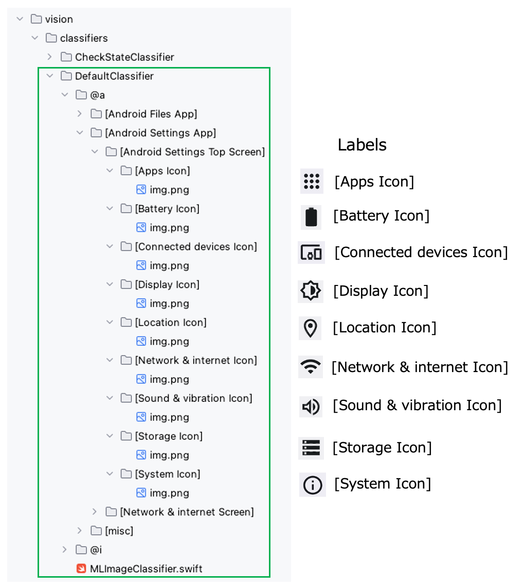

# Learning images (Vision)

Shirates/Vision integrates machine learning tool(**CreateML**) in test running process. <br>
You can utilize the power of image classification in your test code. <br>
Just put template image files in labeled directories of classifiers.

## DefaultClassifier

**DefaultClassifier** is an image classifier for template matching.<br>
The name of parent directory of the image corresponds to the label.



A label directory has at least one child image file. Basically you may prepare one image file for one label.<br>
Label name is arbitrary, but we recommend notation like `[Nickname]`.

## CheckStateClassifier

**CheckStateClassifier** is the classifier for toggle widget states. This classifier has only two label (`[ON]` and
`[OFF]`).


In above example, radio button and switch is supported. <br>
If you want to support checkbox state, append images into [ON]/[OFF] directory and run learning.

## Running learning


To run learning explicitly

Right-click `CreateMlExecute` (`src/test/kotlin/batch/CreateMLExecute.kt`) and select `Debug 'CreateMLExecute'`.

**Note**<br>
You don't have to run learning explicitly. Learning is executed on demand when you start run your test.

### Console output

```
Connected to the target VM, address: '127.0.0.1:60450', transport: 'socket'
lineNo	[elapsedTime]	logDateTime	{testCaseId}	macroDepth	macroName	[logType]	timeDiff	mode	(group)	message
1	[00:00:00]	2025/04/23 04:22:40.200	{}	0	-	[info]	+0	C	()	Classifier files loaded.(CheckStateClassifier, 2 labels, directory=/Users/wave1008/github/ldi-github/shirates-core-vision-samples_en/build/vision/classifiers/CheckStateClassifier/1)
Copying jar content createml/MLImageClassifier.swift to /Users/wave1008/Downloads/TestResults/2025-04-23_042239
2	[00:00:00]	2025/04/23 04:22:40.535	{}	0	-	[info]	+335	C	()	Starting leaning. [CheckStateClassifier]
3	[00:00:03]	2025/04/23 04:22:43.062	{}	0	-	[info]	+2527	C	()	Learning completed. ([swift /Users/wave1008/github/ldi-github/shirates-core-vision-samples_en/build/vision/classifiers/CheckStateClassifier/1/MLImageClassifier.swift /Users/wave1008/github/ldi-github/shirates-core-vision-samples_en/build/vision/classifiers/CheckStateClassifier/1 -noise -blur] in 2.513 sec)
["/Users/wave1008/github/ldi-github/shirates-core-vision-samples_en/build/vision/classifiers/CheckStateClassifier/1/MLImageClassifier.swift", "/Users/wave1008/github/ldi-github/shirates-core-vision-samples_en/build/vision/classifiers/CheckStateClassifier/1", "-noise", "-blur"]
----------------------------------
dataSourceName: 1
dataSourcePath: file:///Users/wave1008/github/ldi-github/shirates-core-vision-samples_en/build/vision/classifiers/CheckStateClassifier/1/
options: ["-noise", "-blur"]
featureExtractor: Image Feature Print V2
----------------------------------
Number of examples: 16
Number of classes: 2
Accuracy: 100.00%

******CONFUSION MATRIX******
----------------------------------
True\Pred [OFF] [ON]  
[OFF]     8     0     
[ON]      0     8     

******PRECISION RECALL******
----------------------------------
Class Precision(%) Recall(%)
[OFF] 100.00          100.00         
[ON]  100.00          100.00         


Model saved to /Users/wave1008/github/ldi-github/shirates-core-vision-samples_en/build/vision/classifiers/CheckStateClassifier/1/1.mlmodel
4	[00:00:03]	2025/04/23 04:22:43.082	{}	0	-	[info]	+20	C	()	Classifier files loaded.(ScreenClassifier, 20 labels, directory=/Users/wave1008/github/ldi-github/shirates-core-vision-samples_en/build/vision/classifiers/ScreenClassifier/1)
Copying jar content createml/MLImageClassifier.swift to /Users/wave1008/Downloads/TestResults/2025-04-23_042239
5	[00:00:05]	2025/04/23 04:22:45.000	{}	0	-	[info]	+1918	C	()	Starting leaning. [ScreenClassifier]
6	[00:00:07]	2025/04/23 04:22:47.519	{}	0	-	[info]	+2519	C	()	Learning completed. ([swift /Users/wave1008/github/ldi-github/shirates-core-vision-samples_en/build/vision/classifiers/ScreenClassifier/1/MLImageClassifier.swift /Users/wave1008/github/ldi-github/shirates-core-vision-samples_en/build/vision/classifiers/ScreenClassifier/1 -noise -blur] in 2.519 sec)
["/Users/wave1008/github/ldi-github/shirates-core-vision-samples_en/build/vision/classifiers/ScreenClassifier/1/MLImageClassifier.swift", "/Users/wave1008/github/ldi-github/shirates-core-vision-samples_en/build/vision/classifiers/ScreenClassifier/1", "-noise", "-blur"]
----------------------------------
dataSourceName: 1
dataSourcePath: file:///Users/wave1008/github/ldi-github/shirates-core-vision-samples_en/build/vision/classifiers/ScreenClassifier/1/
options: ["-noise", "-blur"]
featureExtractor: Image Feature Print V2
----------------------------------
Number of examples: 20
Number of classes: 19
Accuracy: 100.00%

******CONFUSION MATRIX******
----------------------------------
True\Pred                                            @a_Android Settings_[About phone Screen]             @a_Android Settings_[Accessibility Screen]           @a_Android Settings_[Android Settings Search Screen] @a_Android Settings_[Android Settings Top Screen]    @a_Android Settings_[Battery Screen]                 @a_Android Settings_[Connected devices Screen]       @a_Android Settings_[Internet Screen]                @a_Android Settings_[Network & internet Screen]      @a_Android Settings_[Notifications Screen]           @a_Android Settings_[System Screen]                  @a_Android_[Android Home Screen]                     @a_Calculator_[Calculator Main Screen]               @a_Files_[Files Top Screen]                          @a_Maps_[Maps Top Screen]                            @i_iOS Settings_[About Screen]                       @i_iOS Settings_[Developer Screen]                   @i_iOS Settings_[General Screen]                     @i_iOS Settings_[iOS Settings Top Screen]            @i_iOS_[iOS Home Screen]                             
@a_Android Settings_[About phone Screen]             1                                                    0                                                    0                                                    0                                                    0                                                    0                                                    0                                                    0                                                    0                                                    0                                                    0                                                    0                                                    0                                                    0                                                    0                                                    0                                                    0                                                    0                                                    0                                                    
@a_Android Settings_[Accessibility Screen]           0                                                    1                                                    0                                                    0                                                    0                                                    0                                                    0                                                    0                                                    0                                                    0                                                    0                                                    0                                                    0                                                    0                                                    0                                                    0                                                    0                                                    0                                                    0                                                    
@a_Android Settings_[Android Settings Search Screen] 0                                                    0                                                    1                                                    0                                                    0                                                    0                                                    0                                                    0                                                    0                                                    0                                                    0                                                    0                                                    0                                                    0                                                    0                                                    0                                                    0                                                    0                                                    0                                                    
@a_Android Settings_[Android Settings Top Screen]    0                                                    0                                                    0                                                    1                                                    0                                                    0                                                    0                                                    0                                                    0                                                    0                                                    0                                                    0                                                    0                                                    0                                                    0                                                    0                                                    0                                                    0                                                    0                                                    
@a_Android Settings_[Battery Screen]                 0                                                    0                                                    0                                                    0                                                    1                                                    0                                                    0                                                    0                                                    0                                                    0                                                    0                                                    0                                                    0                                                    0                                                    0                                                    0                                                    0                                                    0                                                    0                                                    
@a_Android Settings_[Connected devices Screen]       0                                                    0                                                    0                                                    0                                                    0                                                    1                                                    0                                                    0                                                    0                                                    0                                                    0                                                    0                                                    0                                                    0                                                    0                                                    0                                                    0                                                    0                                                    0                                                    
@a_Android Settings_[Internet Screen]                0                                                    0                                                    0                                                    0                                                    0                                                    0                                                    1                                                    0                                                    0                                                    0                                                    0                                                    0                                                    0                                                    0                                                    0                                                    0                                                    0                                                    0                                                    0                                                    
@a_Android Settings_[Network & internet Screen]      0                                                    0                                                    0                                                    0                                                    0                                                    0                                                    0                                                    1                                                    0                                                    0                                                    0                                                    0                                                    0                                                    0                                                    0                                                    0                                                    0                                                    0                                                    0                                                    
@a_Android Settings_[Notifications Screen]           0                                                    0                                                    0                                                    0                                                    0                                                    0                                                    0                                                    0                                                    1                                                    0                                                    0                                                    0                                                    0                                                    0                                                    0                                                    0                                                    0                                                    0                                                    0                                                    
@a_Android Settings_[System Screen]                  0                                                    0                                                    0                                                    0                                                    0                                                    0                                                    0                                                    0                                                    0                                                    1                                                    0                                                    0                                                    0                                                    0                                                    0                                                    0                                                    0                                                    0                                                    0                                                    
@a_Android_[Android Home Screen]                     0                                                    0                                                    0                                                    0                                                    0                                                    0                                                    0                                                    0                                                    0                                                    0                                                    1                                                    0                                                    0                                                    0                                                    0                                                    0                                                    0                                                    0                                                    0                                                    
@a_Calculator_[Calculator Main Screen]               0                                                    0                                                    0                                                    0                                                    0                                                    0                                                    0                                                    0                                                    0                                                    0                                                    0                                                    1                                                    0                                                    0                                                    0                                                    0                                                    0                                                    0                                                    0                                                    
@a_Files_[Files Top Screen]                          0                                                    0                                                    0                                                    0                                                    0                                                    0                                                    0                                                    0                                                    0                                                    0                                                    0                                                    0                                                    1                                                    0                                                    0                                                    0                                                    0                                                    0                                                    0                                                    
@a_Maps_[Maps Top Screen]                            0                                                    0                                                    0                                                    0                                                    0                                                    0                                                    0                                                    0                                                    0                                                    0                                                    0                                                    0                                                    0                                                    1                                                    0                                                    0                                                    0                                                    0                                                    0                                                    
@i_iOS Settings_[About Screen]                       0                                                    0                                                    0                                                    0                                                    0                                                    0                                                    0                                                    0                                                    0                                                    0                                                    0                                                    0                                                    0                                                    0                                                    1                                                    0                                                    0                                                    0                                                    0                                                    
@i_iOS Settings_[Developer Screen]                   0                                                    0                                                    0                                                    0                                                    0                                                    0                                                    0                                                    0                                                    0                                                    0                                                    0                                                    0                                                    0                                                    0                                                    0                                                    1                                                    0                                                    0                                                    0                                                    
@i_iOS Settings_[General Screen]                     0                                                    0                                                    0                                                    0                                                    0                                                    0                                                    0                                                    0                                                    0                                                    0                                                    0                                                    0                                                    0                                                    0                                                    0                                                    0                                                    1                                                    0                                                    0                                                    
@i_iOS Settings_[iOS Settings Top Screen]            0                                                    0                                                    0                                                    0                                                    0                                                    0                                                    0                                                    0                                                    0                                                    0                                                    0                                                    0                                                    0                                                    0                                                    0                                                    0                                                    0                                                    2                                                    0                                                    
@i_iOS_[iOS Home Screen]                             0                                                    0                                                    0                                                    0                                                    0                                                    0                                                    0                                                    0                                                    0                                                    0                                                    0                                                    0                                                    0                                                    0                                                    0                                                    0                                                    0                                                    0                                                    1                                                    

******PRECISION RECALL******
----------------------------------
Class                                                Precision(%) Recall(%)
@a_Android Settings_[About phone Screen]             100.00          100.00         
@a_Android Settings_[Accessibility Screen]           100.00          100.00         
@a_Android Settings_[Android Settings Search Screen] 100.00          100.00         
@a_Android Settings_[Android Settings Top Screen]    100.00          100.00         
@a_Android Settings_[Battery Screen]                 100.00          100.00         
@a_Android Settings_[Connected devices Screen]       100.00          100.00         
@a_Android Settings_[Internet Screen]                100.00          100.00         
@a_Android Settings_[Network & internet Screen]      100.00          100.00         
@a_Android Settings_[Notifications Screen]           100.00          100.00         
@a_Android Settings_[System Screen]                  100.00          100.00         
@a_Android_[Android Home Screen]                     100.00          100.00         
@a_Calculator_[Calculator Main Screen]               100.00          100.00         
@a_Files_[Files Top Screen]                          100.00          100.00         
@a_Maps_[Maps Top Screen]                            100.00          100.00         
@i_iOS Settings_[About Screen]                       100.00          100.00         
@i_iOS Settings_[Developer Screen]                   100.00          100.00         
@i_iOS Settings_[General Screen]                     100.00          100.00         
@i_iOS Settings_[iOS Settings Top Screen]            100.00          100.00         
@i_iOS_[iOS Home Screen]                             100.00          100.00         


Model saved to /Users/wave1008/github/ldi-github/shirates-core-vision-samples_en/build/vision/classifiers/ScreenClassifier/1/1.mlmodel
7	[00:00:07]	2025/04/23 04:22:47.542	{}	0	-	[info]	+23	C	()	Classifier files loaded.(DefaultClassifier, 32 labels, directory=/Users/wave1008/github/ldi-github/shirates-core-vision-samples_en/build/vision/classifiers/DefaultClassifier/1)
Copying jar content createml/MLImageClassifier.swift to /Users/wave1008/Downloads/TestResults/2025-04-23_042239
8	[00:00:08]	2025/04/23 04:22:47.815	{}	0	-	[info]	+273	C	()	Starting leaning. [DefaultClassifier]
9	[00:00:11]	2025/04/23 04:22:50.826	{}	0	-	[info]	+3011	C	()	Learning completed. ([swift /Users/wave1008/github/ldi-github/shirates-core-vision-samples_en/build/vision/classifiers/DefaultClassifier/1/MLImageClassifier.swift /Users/wave1008/github/ldi-github/shirates-core-vision-samples_en/build/vision/classifiers/DefaultClassifier/1 -noise -blur] in 3.011 sec)
["/Users/wave1008/github/ldi-github/shirates-core-vision-samples_en/build/vision/classifiers/DefaultClassifier/1/MLImageClassifier.swift", "/Users/wave1008/github/ldi-github/shirates-core-vision-samples_en/build/vision/classifiers/DefaultClassifier/1", "-noise", "-blur"]
----------------------------------
dataSourceName: 1
dataSourcePath: file:///Users/wave1008/github/ldi-github/shirates-core-vision-samples_en/build/vision/classifiers/DefaultClassifier/1/
options: ["-noise", "-blur"]
featureExtractor: Image Feature Print V2
----------------------------------
Number of examples: 33
Number of classes: 32
Accuracy: 100.00%

******CONFUSION MATRIX******
**** (upperleft 20-by-20) ****
----------------------------------
True\Pred                                                                 @a_Android Files_[Audio Button]                                           @a_Android Files_[Documents Button]                                       @a_Android Files_[Images Button]                                          @a_Android Files_[Large files Button]                                     @a_Android Files_[This week Button]                                       @a_Android Files_[Videos Button]                                          @a_Android Settings_Android Settings Top Screen_[Apps Icon]               @a_Android Settings_Android Settings Top Screen_[Battery Icon]            @a_Android Settings_Android Settings Top Screen_[Connected devices Icon]  @a_Android Settings_Android Settings Top Screen_[Display Icon]            @a_Android Settings_Android Settings Top Screen_[Location Icon]           @a_Android Settings_Android Settings Top Screen_[Network & internet Icon] @a_Android Settings_Android Settings Top Screen_[Sound & vibration Icon]  @a_Android Settings_Android Settings Top Screen_[Storage Icon]            @a_Android Settings_Android Settings Top Screen_[System Icon]             @a_Android Settings_Network & internet Screen_[Airplane mode Icon]        @a_Android Settings_Network & internet Screen_[Calls & SMS Icon]          @a_Android Settings_Network & internet Screen_[Data Saver Icon]           @a_Android Settings_Network & internet Screen_[Hotspot & tethering Icon]  @a_Android Settings_Network & internet Screen_[Internet Icon]             
@a_Android Files_[Audio Button]                                           1                                                                         0                                                                         0                                                                         0                                                                         0                                                                         0                                                                         0                                                                         0                                                                         0                                                                         0                                                                         0                                                                         0                                                                         0                                                                         0                                                                         0                                                                         0                                                                         0                                                                         0                                                                         0                                                                         0                                                                         
@a_Android Files_[Documents Button]                                       0                                                                         1                                                                         0                                                                         0                                                                         0                                                                         0                                                                         0                                                                         0                                                                         0                                                                         0                                                                         0                                                                         0                                                                         0                                                                         0                                                                         0                                                                         0                                                                         0                                                                         0                                                                         0                                                                         0                                                                         
@a_Android Files_[Images Button]                                          0                                                                         0                                                                         1                                                                         0                                                                         0                                                                         0                                                                         0                                                                         0                                                                         0                                                                         0                                                                         0                                                                         0                                                                         0                                                                         0                                                                         0                                                                         0                                                                         0                                                                         0                                                                         0                                                                         0                                                                         
@a_Android Files_[Large files Button]                                     0                                                                         0                                                                         0                                                                         1                                                                         0                                                                         0                                                                         0                                                                         0                                                                         0                                                                         0                                                                         0                                                                         0                                                                         0                                                                         0                                                                         0                                                                         0                                                                         0                                                                         0                                                                         0                                                                         0                                                                         
@a_Android Files_[This week Button]                                       0                                                                         0                                                                         0                                                                         0                                                                         1                                                                         0                                                                         0                                                                         0                                                                         0                                                                         0                                                                         0                                                                         0                                                                         0                                                                         0                                                                         0                                                                         0                                                                         0                                                                         0                                                                         0                                                                         0                                                                         
@a_Android Files_[Videos Button]                                          0                                                                         0                                                                         0                                                                         0                                                                         0                                                                         1                                                                         0                                                                         0                                                                         0                                                                         0                                                                         0                                                                         0                                                                         0                                                                         0                                                                         0                                                                         0                                                                         0                                                                         0                                                                         0                                                                         0                                                                         
@a_Android Settings_Android Settings Top Screen_[Apps Icon]               0                                                                         0                                                                         0                                                                         0                                                                         0                                                                         0                                                                         1                                                                         0                                                                         0                                                                         0                                                                         0                                                                         0                                                                         0                                                                         0                                                                         0                                                                         0                                                                         0                                                                         0                                                                         0                                                                         0                                                                         
@a_Android Settings_Android Settings Top Screen_[Battery Icon]            0                                                                         0                                                                         0                                                                         0                                                                         0                                                                         0                                                                         0                                                                         1                                                                         0                                                                         0                                                                         0                                                                         0                                                                         0                                                                         0                                                                         0                                                                         0                                                                         0                                                                         0                                                                         0                                                                         0                                                                         
@a_Android Settings_Android Settings Top Screen_[Connected devices Icon]  0                                                                         0                                                                         0                                                                         0                                                                         0                                                                         0                                                                         0                                                                         0                                                                         1                                                                         0                                                                         0                                                                         0                                                                         0                                                                         0                                                                         0                                                                         0                                                                         0                                                                         0                                                                         0                                                                         0                                                                         
@a_Android Settings_Android Settings Top Screen_[Display Icon]            0                                                                         0                                                                         0                                                                         0                                                                         0                                                                         0                                                                         0                                                                         0                                                                         0                                                                         1                                                                         0                                                                         0                                                                         0                                                                         0                                                                         0                                                                         0                                                                         0                                                                         0                                                                         0                                                                         0                                                                         
@a_Android Settings_Android Settings Top Screen_[Location Icon]           0                                                                         0                                                                         0                                                                         0                                                                         0                                                                         0                                                                         0                                                                         0                                                                         0                                                                         0                                                                         1                                                                         0                                                                         0                                                                         0                                                                         0                                                                         0                                                                         0                                                                         0                                                                         0                                                                         0                                                                         
@a_Android Settings_Android Settings Top Screen_[Network & internet Icon] 0                                                                         0                                                                         0                                                                         0                                                                         0                                                                         0                                                                         0                                                                         0                                                                         0                                                                         0                                                                         0                                                                         1                                                                         0                                                                         0                                                                         0                                                                         0                                                                         0                                                                         0                                                                         0                                                                         0                                                                         
@a_Android Settings_Android Settings Top Screen_[Sound & vibration Icon]  0                                                                         0                                                                         0                                                                         0                                                                         0                                                                         0                                                                         0                                                                         0                                                                         0                                                                         0                                                                         0                                                                         0                                                                         1                                                                         0                                                                         0                                                                         0                                                                         0                                                                         0                                                                         0                                                                         0                                                                         
@a_Android Settings_Android Settings Top Screen_[Storage Icon]            0                                                                         0                                                                         0                                                                         0                                                                         0                                                                         0                                                                         0                                                                         0                                                                         0                                                                         0                                                                         0                                                                         0                                                                         0                                                                         1                                                                         0                                                                         0                                                                         0                                                                         0                                                                         0                                                                         0                                                                         
@a_Android Settings_Android Settings Top Screen_[System Icon]             0                                                                         0                                                                         0                                                                         0                                                                         0                                                                         0                                                                         0                                                                         0                                                                         0                                                                         0                                                                         0                                                                         0                                                                         0                                                                         0                                                                         1                                                                         0                                                                         0                                                                         0                                                                         0                                                                         0                                                                         
@a_Android Settings_Network & internet Screen_[Airplane mode Icon]        0                                                                         0                                                                         0                                                                         0                                                                         0                                                                         0                                                                         0                                                                         0                                                                         0                                                                         0                                                                         0                                                                         0                                                                         0                                                                         0                                                                         0                                                                         1                                                                         0                                                                         0                                                                         0                                                                         0                                                                         
@a_Android Settings_Network & internet Screen_[Calls & SMS Icon]          0                                                                         0                                                                         0                                                                         0                                                                         0                                                                         0                                                                         0                                                                         0                                                                         0                                                                         0                                                                         0                                                                         0                                                                         0                                                                         0                                                                         0                                                                         0                                                                         1                                                                         0                                                                         0                                                                         0                                                                         
@a_Android Settings_Network & internet Screen_[Data Saver Icon]           0                                                                         0                                                                         0                                                                         0                                                                         0                                                                         0                                                                         0                                                                         0                                                                         0                                                                         0                                                                         0                                                                         0                                                                         0                                                                         0                                                                         0                                                                         0                                                                         0                                                                         1                                                                         0                                                                         0                                                                         
@a_Android Settings_Network & internet Screen_[Hotspot & tethering Icon]  0                                                                         0                                                                         0                                                                         0                                                                         0                                                                         0                                                                         0                                                                         0                                                                         0                                                                         0                                                                         0                                                                         0                                                                         0                                                                         0                                                                         0                                                                         0                                                                         0                                                                         0                                                                         1                                                                         0                                                                         
@a_Android Settings_Network & internet Screen_[Internet Icon]             0                                                                         0                                                                         0                                                                         0                                                                         0                                                                         0                                                                         0                                                                         0                                                                         0                                                                         0                                                                         0                                                                         0                                                                         0                                                                         0                                                                         0                                                                         0                                                                         0                                                                         0                                                                         0                                                                         1                                                                         

******PRECISION RECALL******
----------------------------------
Class                                                                     Precision(%) Recall(%)
@a_Android Files_[Audio Button]                                           100.00          100.00         
@a_Android Files_[Documents Button]                                       100.00          100.00         
@a_Android Files_[Images Button]                                          100.00          100.00         
@a_Android Files_[Large files Button]                                     100.00          100.00         
@a_Android Files_[This week Button]                                       100.00          100.00         
@a_Android Files_[Videos Button]                                          100.00          100.00         
@a_Android Settings_Android Settings Top Screen_[Apps Icon]               100.00          100.00         
@a_Android Settings_Android Settings Top Screen_[Battery Icon]            100.00          100.00         
@a_Android Settings_Android Settings Top Screen_[Connected devices Icon]  100.00          100.00         
@a_Android Settings_Android Settings Top Screen_[Display Icon]            100.00          100.00         
@a_Android Settings_Android Settings Top Screen_[Location Icon]           100.00          100.00         
@a_Android Settings_Android Settings Top Screen_[Network & internet Icon] 100.00          100.00         
@a_Android Settings_Android Settings Top Screen_[Sound & vibration Icon]  100.00          100.00         
@a_Android Settings_Android Settings Top Screen_[Storage Icon]            100.00          100.00         
@a_Android Settings_Android Settings Top Screen_[System Icon]             100.00          100.00         
@a_Android Settings_Network & internet Screen_[Airplane mode Icon]        100.00          100.00         
@a_Android Settings_Network & internet Screen_[Calls & SMS Icon]          100.00          100.00         
@a_Android Settings_Network & internet Screen_[Data Saver Icon]           100.00          100.00         
@a_Android Settings_Network & internet Screen_[Hotspot & tethering Icon]  100.00          100.00         
@a_Android Settings_Network & internet Screen_[Internet Icon]             100.00          100.00         
@a_Android Settings_Network & internet Screen_[SIMs Icon]                 100.00          100.00         
@a_Android Settings_Network & internet Screen_[VPN Icon]                  100.00          100.00         
@a_misc_[RadioButton(OFF)]                                                100.00          100.00         
@a_misc_[RadioButton(ON)]                                                 100.00          100.00         
@a_misc_[]                                                               100.00          100.00         
@i_iOS Settings_[Accessibility Icon]                                      100.00          100.00         
@i_iOS Settings_[Action Button Icon]                                      100.00          100.00         
@i_iOS Settings_[Apple Intelligence & Siri Icon]                          100.00          100.00         
@i_iOS Settings_[Camera Icon]                                             100.00          100.00         
@i_iOS Settings_[Developer Icon]                                          100.00          100.00         
@i_iOS Settings_[General Icon]                                            100.00          100.00         
@i_iOS Settings_[Screen Time Icon]                                        100.00          100.00         


Model saved to /Users/wave1008/github/ldi-github/shirates-core-vision-samples_en/build/vision/classifiers/DefaultClassifier/1/1.mlmodel
Disconnected from the target VM, address: '127.0.0.1:60450', transport: 'socket'

Process finished with exit code 0
```

## build/vision/classifiers

Result files are output at `build/vision/classifiers`.


### 1.mlmodel

This is the result mlmodel file.

### createML.log

This is the console log (see above **Console output**).

### MLImageClassifier.swift

This is the running script.

```swift
import CreateML
import Foundation

let arguments = CommandLine.arguments
print(arguments)
if arguments.count < 2 {
    print("path to data source is required")
    exit(1)
}
let options = arguments.filter { $0.starts(with: "-") }

var revision = 2
if let opt = options.first(where: { $0.starts(with: "-fp:")}) {
    if let r = Int(opt.components(separatedBy: [":","="]).last!) {
        revision = r
    }
}

let dataSourcePath = arguments[1]
let dataSourceURL = URL(fileURLWithPath: dataSourcePath)
let dataSourceName = dataSourceURL.lastPathComponent

print("----------------------------------")
print("dataSourceName: \(dataSourceName)")
print("dataSourcePath: \(dataSourceURL)")
print("options: \(options)")
print("featureExtractor: Image Feature Print V\(revision)")

// data source URLs
let trainingDataURL = dataSourceURL.appending(path: "training")
let testingDataURL = dataSourceURL.appending(path: "test")

// data sources
let trainingData = MLImageClassifier.DataSource.labeledDirectories(at: trainingDataURL)
let testingData = MLImageClassifier.DataSource.labeledDirectories(at: testingDataURL)

// model parameters
var augmentation = MLImageClassifier.ImageAugmentationOptions()
if options.contains("-noise") {
    augmentation.insert(.noise)
}
if options.contains("-blur") {
    augmentation.insert(.blur)
}
if options.contains("-crop") {
    augmentation.insert(.crop)
}
if options.contains("-exposure") {
    augmentation.insert(.exposure)
}
if options.contains("-flip") {
    augmentation.insert(.flip)
}
if options.contains("-rotation") {
    augmentation.insert(.rotation)
}
let modelParameters = MLImageClassifier.ModelParameters(
    validation: .split(strategy: .automatic),
    augmentation: augmentation,
    algorithm: .transferLearning(
        featureExtractor: .scenePrint(revision: revision),
        classifier: .logisticRegressor
    )
)

// training
let classifier = try MLImageClassifier(trainingData: trainingData, parameters: modelParameters)

// evaluation
let evaluation = classifier.evaluation(on: testingData)
print("\(evaluation)")

// save
var parent = dataSourceURL
parent.deleteLastPathComponent()
parent.append(path: "models")
let modelURL = URL(fileURLWithPath: "\(dataSourcePath)/\(dataSourceName).mlmodel")
try classifier.write(to: modelURL)

print("Model saved to \(modelURL.path)")
```

### Link

- [index](../../../index.md)
