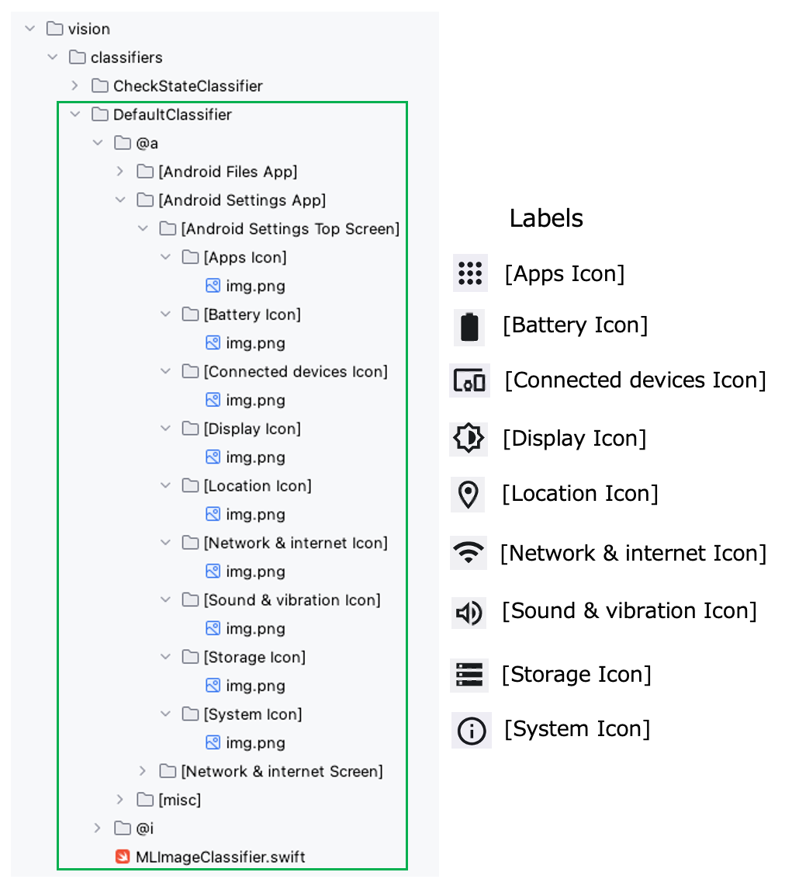
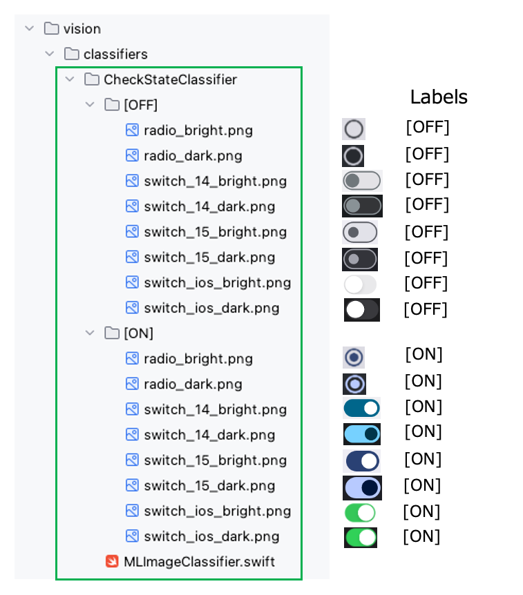
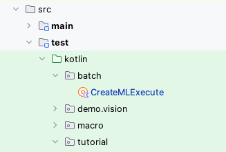
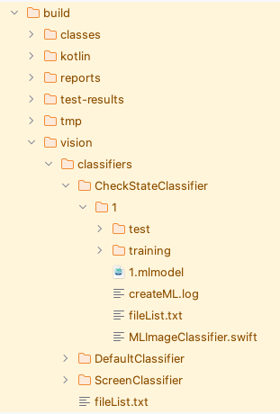

# 画像の学習 (Vision)

Shirates/Visionは機械学習ツール(**CreateML**)をテスト実行プロセスに統合します。<br>
画像分類のパワーをテストコードで利用できます。<br>
分類器のラベルのディレクトリにテンプレート画像を配置してください。

## DefaultClassifier

**DefaultClassifier** テンプレートマッチング用の画像分類器です。<br>
画像のディレクトリの名前がラベルに対応します。



ラベルのディレクトリには1つ以上の画像ファイルを配置します。基本的には1つのラベルに対して1つの画像を用意すれば十分です。<br>
ラベル名は任意ですが、`[ニックネーム]`のような表記を推奨します。

## CheckStateClassifier

**CheckStateClassifier**はトグル型のウィジェットの状態用の分類器です。この分類器は2つのラベル (`[ON]`と`[OFF]`)のみを持ちます。



上記の例ではラジオボタンとスイッチがサポートされます。<br>
チェックボックスをサポートしたい場合は[ON]/[OFF]のディレクトリに画像を追加し学習を実行してください。

## 学習の実行



明示的に学習を実行したい場合は

`CreateMlExecute` (`src/test/kotlin/batch/CreateMLExecute.kt`)を右クリックし`Debug 'CreateMLExecute'`
を選択します。

**注意**<br>
学習を明示的に実行する必要はありません。必要な場合はテストを開始した際に学習が実行されます。

### コンソール出力

```
Connected to the target VM, address: '127.0.0.1:65452', transport: 'socket'
Copying jar content createml/MLImageClassifier.swift to /Users/wave1008/Downloads/TestResults/2025-01-28_133942
Copying jar content createml/MLImageClassifier.swift to /Users/wave1008/Downloads/TestResults/2025-01-28_133942
lineNo	[elapsedTime]	logDateTime	{testCaseId}	macroDepth	macroName	[logType]	timeDiff	mode	(group)	message
1	[00:00:00]	2025/01/28 13:39:42.978	{}	0	-	[info]	+0	C	()	Starting leaning. [CheckStateClassifier]
2	[00:00:01]	2025/01/28 13:39:44.361	{}	0	-	[info]	+1383	C	()	Learning completed. (in 1.340 sec)
["/Users/wave1008/github/ldi-github/shirates-core-vision-samples_en/build/vision/classifiers/CheckStateClassifier/MLImageClassifier.swift", "/Users/wave1008/github/ldi-github/shirates-core-vision-samples_en/build/vision/classifiers/CheckStateClassifier", "-noise", "-blur"]
----------------------------------
dataSourceName: CheckStateClassifier
dataSourcePath: file:///Users/wave1008/github/ldi-github/shirates-core-vision-samples_en/build/vision/classifiers/CheckStateClassifier/
options: ["-noise", "-blur"]
featureExtractor: Image Feature Print V2
----------------------------------
Number of examples: 16
Number of classes: 2
Accuracy: 100.00%

******CONFUSION MATRIX******
----------------------------------
True\Pred [OFF] [ON]  
[OFF]     8     0     
[ON]      0     8     

******PRECISION RECALL******
----------------------------------
Class Precision(%) Recall(%)
[OFF] 100.00          100.00         
[ON]  100.00          100.00         


Model saved to /Users/wave1008/github/ldi-github/shirates-core-vision-samples_en/build/vision/classifiers/CheckStateClassifier/CheckStateClassifier.mlmodel
3	[00:00:01]	2025/01/28 13:39:44.367	{}	0	-	[info]	+6	C	()	[learning [CheckStateClassifier]] in 1.631 sec
4	[00:00:01]	2025/01/28 13:39:44.368	{}	0	-	[info]	+1	C	()	Starting leaning. [DefaultClassifier]
5	[00:00:04]	2025/01/28 13:39:46.888	{}	0	-	[info]	+2520	C	()	Learning completed. (in 2.520 sec)
["/Users/wave1008/github/ldi-github/shirates-core-vision-samples_en/build/vision/classifiers/DefaultClassifier/MLImageClassifier.swift", "/Users/wave1008/github/ldi-github/shirates-core-vision-samples_en/build/vision/classifiers/DefaultClassifier", "-noise", "-blur"]
----------------------------------
dataSourceName: DefaultClassifier
dataSourcePath: file:///Users/wave1008/github/ldi-github/shirates-core-vision-samples_en/build/vision/classifiers/DefaultClassifier/
options: ["-noise", "-blur"]
featureExtractor: Image Feature Print V2
----------------------------------
Number of examples: 29
Number of classes: 28
Accuracy: 100.00%

******CONFUSION MATRIX******
**** (upperleft 20-by-20) ****
----------------------------------
True\Pred                                                                      @a[Android Files App][Images Button]                                           @a[Android Files App][This week Button]                                        @a[Android Settings App][Android Settings Top Screen][Apps Icon]               @a[Android Settings App][Android Settings Top Screen][Battery Icon]            @a[Android Settings App][Android Settings Top Screen][Connected devices Icon]  @a[Android Settings App][Android Settings Top Screen][Display Icon]            @a[Android Settings App][Android Settings Top Screen][Location Icon]           @a[Android Settings App][Android Settings Top Screen][Network & internet Icon] @a[Android Settings App][Android Settings Top Screen][Sound & vibration Icon]  @a[Android Settings App][Android Settings Top Screen][Storage Icon]            @a[Android Settings App][Android Settings Top Screen][System Icon]             @a[Android Settings App][Network & internet Screen][Airplane mode Icon]        @a[Android Settings App][Network & internet Screen][Calls & SMS Icon]          @a[Android Settings App][Network & internet Screen][Data Saver Icon]           @a[Android Settings App][Network & internet Screen][Hotspot & tethering Icon]  @a[Android Settings App][Network & internet Screen][Internet Icon]             @a[Android Settings App][Network & internet Screen][SIMs Icon]                 @a[Android Settings App][Network & internet Screen][VPN Icon]                  @a[misc][RadioButton(OFF)]                                                     @a[misc][RadioButton(ON)]                                                      
@a[Android Files App][Images Button]                                           1                                                                              0                                                                              0                                                                              0                                                                              0                                                                              0                                                                              0                                                                              0                                                                              0                                                                              0                                                                              0                                                                              0                                                                              0                                                                              0                                                                              0                                                                              0                                                                              0                                                                              0                                                                              0                                                                              0                                                                              
@a[Android Files App][This week Button]                                        0                                                                              1                                                                              0                                                                              0                                                                              0                                                                              0                                                                              0                                                                              0                                                                              0                                                                              0                                                                              0                                                                              0                                                                              0                                                                              0                                                                              0                                                                              0                                                                              0                                                                              0                                                                              0                                                                              0                                                                              
@a[Android Settings App][Android Settings Top Screen][Apps Icon]               0                                                                              0                                                                              1                                                                              0                                                                              0                                                                              0                                                                              0                                                                              0                                                                              0                                                                              0                                                                              0                                                                              0                                                                              0                                                                              0                                                                              0                                                                              0                                                                              0                                                                              0                                                                              0                                                                              0                                                                              
@a[Android Settings App][Android Settings Top Screen][Battery Icon]            0                                                                              0                                                                              0                                                                              1                                                                              0                                                                              0                                                                              0                                                                              0                                                                              0                                                                              0                                                                              0                                                                              0                                                                              0                                                                              0                                                                              0                                                                              0                                                                              0                                                                              0                                                                              0                                                                              0                                                                              
@a[Android Settings App][Android Settings Top Screen][Connected devices Icon]  0                                                                              0                                                                              0                                                                              0                                                                              1                                                                              0                                                                              0                                                                              0                                                                              0                                                                              0                                                                              0                                                                              0                                                                              0                                                                              0                                                                              0                                                                              0                                                                              0                                                                              0                                                                              0                                                                              0                                                                              
@a[Android Settings App][Android Settings Top Screen][Display Icon]            0                                                                              0                                                                              0                                                                              0                                                                              0                                                                              1                                                                              0                                                                              0                                                                              0                                                                              0                                                                              0                                                                              0                                                                              0                                                                              0                                                                              0                                                                              0                                                                              0                                                                              0                                                                              0                                                                              0                                                                              
@a[Android Settings App][Android Settings Top Screen][Location Icon]           0                                                                              0                                                                              0                                                                              0                                                                              0                                                                              0                                                                              1                                                                              0                                                                              0                                                                              0                                                                              0                                                                              0                                                                              0                                                                              0                                                                              0                                                                              0                                                                              0                                                                              0                                                                              0                                                                              0                                                                              
@a[Android Settings App][Android Settings Top Screen][Network & internet Icon] 0                                                                              0                                                                              0                                                                              0                                                                              0                                                                              0                                                                              0                                                                              1                                                                              0                                                                              0                                                                              0                                                                              0                                                                              0                                                                              0                                                                              0                                                                              0                                                                              0                                                                              0                                                                              0                                                                              0                                                                              
@a[Android Settings App][Android Settings Top Screen][Sound & vibration Icon]  0                                                                              0                                                                              0                                                                              0                                                                              0                                                                              0                                                                              0                                                                              0                                                                              1                                                                              0                                                                              0                                                                              0                                                                              0                                                                              0                                                                              0                                                                              0                                                                              0                                                                              0                                                                              0                                                                              0                                                                              
@a[Android Settings App][Android Settings Top Screen][Storage Icon]            0                                                                              0                                                                              0                                                                              0                                                                              0                                                                              0                                                                              0                                                                              0                                                                              0                                                                              1                                                                              0                                                                              0                                                                              0                                                                              0                                                                              0                                                                              0                                                                              0                                                                              0                                                                              0                                                                              0                                                                              
@a[Android Settings App][Android Settings Top Screen][System Icon]             0                                                                              0                                                                              0                                                                              0                                                                              0                                                                              0                                                                              0                                                                              0                                                                              0                                                                              0                                                                              1                                                                              0                                                                              0                                                                              0                                                                              0                                                                              0                                                                              0                                                                              0                                                                              0                                                                              0                                                                              
@a[Android Settings App][Network & internet Screen][Airplane mode Icon]        0                                                                              0                                                                              0                                                                              0                                                                              0                                                                              0                                                                              0                                                                              0                                                                              0                                                                              0                                                                              0                                                                              1                                                                              0                                                                              0                                                                              0                                                                              0                                                                              0                                                                              0                                                                              0                                                                              0                                                                              
@a[Android Settings App][Network & internet Screen][Calls & SMS Icon]          0                                                                              0                                                                              0                                                                              0                                                                              0                                                                              0                                                                              0                                                                              0                                                                              0                                                                              0                                                                              0                                                                              0                                                                              1                                                                              0                                                                              0                                                                              0                                                                              0                                                                              0                                                                              0                                                                              0                                                                              
@a[Android Settings App][Network & internet Screen][Data Saver Icon]           0                                                                              0                                                                              0                                                                              0                                                                              0                                                                              0                                                                              0                                                                              0                                                                              0                                                                              0                                                                              0                                                                              0                                                                              0                                                                              1                                                                              0                                                                              0                                                                              0                                                                              0                                                                              0                                                                              0                                                                              
@a[Android Settings App][Network & internet Screen][Hotspot & tethering Icon]  0                                                                              0                                                                              0                                                                              0                                                                              0                                                                              0                                                                              0                                                                              0                                                                              0                                                                              0                                                                              0                                                                              0                                                                              0                                                                              0                                                                              1                                                                              0                                                                              0                                                                              0                                                                              0                                                                              0                                                                              
@a[Android Settings App][Network & internet Screen][Internet Icon]             0                                                                              0                                                                              0                                                                              0                                                                              0                                                                              0                                                                              0                                                                              0                                                                              0                                                                              0                                                                              0                                                                              0                                                                              0                                                                              0                                                                              0                                                                              1                                                                              0                                                                              0                                                                              0                                                                              0                                                                              
@a[Android Settings App][Network & internet Screen][SIMs Icon]                 0                                                                              0                                                                              0                                                                              0                                                                              0                                                                              0                                                                              0                                                                              0                                                                              0                                                                              0                                                                              0                                                                              0                                                                              0                                                                              0                                                                              0                                                                              0                                                                              1                                                                              0                                                                              0                                                                              0                                                                              
@a[Android Settings App][Network & internet Screen][VPN Icon]                  0                                                                              0                                                                              0                                                                              0                                                                              0                                                                              0                                                                              0                                                                              0                                                                              0                                                                              0                                                                              0                                                                              0                                                                              0                                                                              0                                                                              0                                                                              0                                                                              0                                                                              1                                                                              0                                                                              0                                                                              
@a[misc][RadioButton(OFF)]                                                     0                                                                              0                                                                              0                                                                              0                                                                              0                                                                              0                                                                              0                                                                              0                                                                              0                                                                              0                                                                              0                                                                              0                                                                              0                                                                              0                                                                              0                                                                              0                                                                              0                                                                              0                                                                              1                                                                              0                                                                              
@a[misc][RadioButton(ON)]                                                      0                                                                              0                                                                              0                                                                              0                                                                              0                                                                              0                                                                              0                                                                              0                                                                              0                                                                              0                                                                              0                                                                              0                                                                              0                                                                              0                                                                              0                                                                              0                                                                              0                                                                              0                                                                              0                                                                              1                                                                              

******PRECISION RECALL******
----------------------------------
Class                                                                          Precision(%) Recall(%)
@a[Android Files App][Images Button]                                           100.00          100.00         
@a[Android Files App][This week Button]                                        100.00          100.00         
@a[Android Settings App][Android Settings Top Screen][Apps Icon]               100.00          100.00         
@a[Android Settings App][Android Settings Top Screen][Battery Icon]            100.00          100.00         
@a[Android Settings App][Android Settings Top Screen][Connected devices Icon]  100.00          100.00         
@a[Android Settings App][Android Settings Top Screen][Display Icon]            100.00          100.00         
@a[Android Settings App][Android Settings Top Screen][Location Icon]           100.00          100.00         
@a[Android Settings App][Android Settings Top Screen][Network & internet Icon] 100.00          100.00         
@a[Android Settings App][Android Settings Top Screen][Sound & vibration Icon]  100.00          100.00         
@a[Android Settings App][Android Settings Top Screen][Storage Icon]            100.00          100.00         
@a[Android Settings App][Android Settings Top Screen][System Icon]             100.00          100.00         
@a[Android Settings App][Network & internet Screen][Airplane mode Icon]        100.00          100.00         
@a[Android Settings App][Network & internet Screen][Calls & SMS Icon]          100.00          100.00         
@a[Android Settings App][Network & internet Screen][Data Saver Icon]           100.00          100.00         
@a[Android Settings App][Network & internet Screen][Hotspot & tethering Icon]  100.00          100.00         
@a[Android Settings App][Network & internet Screen][Internet Icon]             100.00          100.00         
@a[Android Settings App][Network & internet Screen][SIMs Icon]                 100.00          100.00         
@a[Android Settings App][Network & internet Screen][VPN Icon]                  100.00          100.00         
@a[misc][RadioButton(OFF)]                                                     100.00          100.00         
@a[misc][RadioButton(ON)]                                                      100.00          100.00         
@a[misc][←]                                                                    100.00          100.00         
@i[iOS Settings App][Accessibility Icon]                                       100.00          100.00         
@i[iOS Settings App][Action Button Icon]                                       100.00          100.00         
@i[iOS Settings App][Apple Intelligence & Siri Icon]                           100.00          100.00         
@i[iOS Settings App][Camera Icon]                                              100.00          100.00         
@i[iOS Settings App][Developer Icon]                                           100.00          100.00         
@i[iOS Settings App][General Icon]                                             100.00          100.00         
@i[iOS Settings App][Screen Time Icon]                                         100.00          100.00         


Model saved to /Users/wave1008/github/ldi-github/shirates-core-vision-samples_en/build/vision/classifiers/DefaultClassifier/DefaultClassifier.mlmodel
6	[00:00:04]	2025/01/28 13:39:46.893	{}	0	-	[info]	+5	C	()	[learning [DefaultClassifier]] in 2.525 sec
Disconnected from the target VM, address: '127.0.0.1:65452', transport: 'socket'

Process finished with exit code 0
```

## build/vision/classifiers

結果のファイルは`build/vision/classifiers`へ出力されます。



### CheckStateClassifier.mlmodel

出力されたmlmodelファイルです。

### createML.log

コンソールのログです（上記の**コンソール出力**を参照）。

### MLImageClassifier.swift

実行されるスクリプトです。

```swift
import CreateML
import Foundation

let arguments = CommandLine.arguments
print(arguments)
if arguments.count < 2 {
    print("path to data source is required")
    exit(1)
}
let options = arguments.filter { $0.starts(with: "-") }

var revision = 2
if let opt = options.first(where: { $0.starts(with: "-fp:")}) {
    if let r = Int(opt.components(separatedBy: [":","="]).last!) {
        revision = r
    }
}

let dataSourcePath = arguments[1]
let dataSourceURL = URL(fileURLWithPath: dataSourcePath)
let dataSourceName = dataSourceURL.lastPathComponent

print("----------------------------------")
print("dataSourceName: \(dataSourceName)")
print("dataSourcePath: \(dataSourceURL)")
print("options: \(options)")
print("featureExtractor: Image Feature Print V\(revision)")

// data source URLs
let trainingDataURL = dataSourceURL.appending(path: "training")
let testingDataURL = dataSourceURL.appending(path: "test")

// data sources
let trainingData = MLImageClassifier.DataSource.labeledDirectories(at: trainingDataURL)
let testingData = MLImageClassifier.DataSource.labeledDirectories(at: testingDataURL)

// model parameters
var augmentation = MLImageClassifier.ImageAugmentationOptions()
if options.contains("-noise") {
    augmentation.insert(.noise)
}
if options.contains("-blur") {
    augmentation.insert(.blur)
}
if options.contains("-crop") {
    augmentation.insert(.crop)
}
if options.contains("-exposure") {
    augmentation.insert(.exposure)
}
if options.contains("-flip") {
    augmentation.insert(.flip)
}
if options.contains("-rotation") {
    augmentation.insert(.rotation)
}
let modelParameters = MLImageClassifier.ModelParameters(
    validation: .split(strategy: .automatic),
    augmentation: augmentation,
    algorithm: .transferLearning(
        featureExtractor: .scenePrint(revision: revision),
        classifier: .logisticRegressor
    )
)

// training
let classifier = try MLImageClassifier(trainingData: trainingData, parameters: modelParameters)

// evaluation
let evaluation = classifier.evaluation(on: testingData)
print("\(evaluation)")

// save
var parent = dataSourceURL
parent.deleteLastPathComponent()
parent.append(path: "models")
let modelURL = URL(fileURLWithPath: "\(dataSourcePath)/\(dataSourceName).mlmodel")
try classifier.write(to: modelURL)

print("Model saved to \(modelURL.path)")
```

### Link

- [index](../../../index_ja.md)
