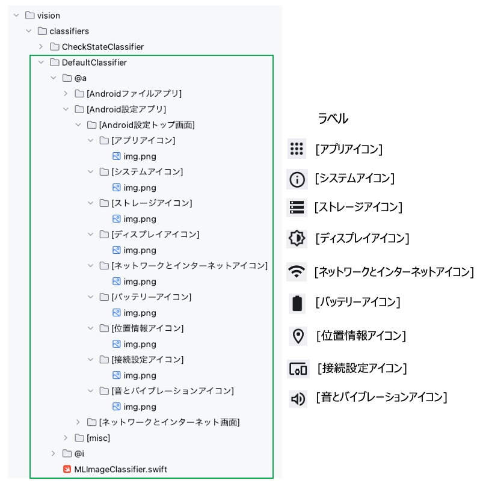

# 画像の学習 (Vision)

Shirates/Visionは機械学習ツール(**CreateML**)をテスト実行プロセスに統合します。<br>
画像分類のパワーをテストコードで利用できます。<br>
分類器のラベルのディレクトリにテンプレート画像を配置してください。

## DefaultClassifier

**DefaultClassifier** テンプレートマッチング用の画像分類器です。<br>
画像のディレクトリの名前がラベルに対応します。



ラベルのディレクトリには1つ以上の画像ファイルを配置します。基本的には1つのラベルに対して1つの画像を用意すれば十分です。<br>
ラベル名は任意ですが、`[ニックネーム]`のような表記を推奨します。

## CheckStateClassifier

**CheckStateClassifier**はトグル型のウィジェットの状態用の分類器です。この分類器は2つのラベル (`[ON]`と`[OFF]`)のみを持ちます。


上記の例ではラジオボタンとスイッチがサポートされます。<br>
チェックボックスをサポートしたい場合は[ON]/[OFF]のディレクトリに画像を追加し学習を実行してください。

## 学習の実行


明示的に学習を実行したい場合は

`CreateMlExecute` (`src/test/kotlin/batch/CreateMLExecute.kt`)を右クリックし`Debug 'CreateMLExecute'`
を選択します。

**注意**<br>
学習を明示的に実行する必要はありません。必要な場合はテストを開始した際に学習が実行されます。

### コンソール出力

```
"/Applications/IntelliJ IDEA CE.app/Contents/jbr/Contents/Home/bin/java" -agentlib:jdwp=transport=dt_socket,address=127.0.0.1:57698,suspend=y,server=n -javaagent:/Users/wave1008/Library/Caches/JetBrains/IdeaIC2024.3/captureAgent/debugger-agent.jar=file:/private/var/folders/8k/zxnhqvmn5ps_4nlbqp_bwpww0000gp/T/capture.props -Dkotlinx.coroutines.debug.enable.creation.stack.trace=false -Ddebugger.agent.enable.coroutines=true -Dkotlinx.coroutines.debug.enable.flows.stack.trace=true -Dkotlinx.coroutines.debug.enable.mutable.state.flows.stack.trace=true -Dfile.encoding=UTF-8 -Dsun.stdout.encoding=UTF-8 -Dsun.stderr.encoding=UTF-8 -classpath /Users/wave1008/github/ldi-github/shirates-core-vision-samples_ja/out/test/classes:/Users/wave1008/.gradle/caches/modules-2/files-2.1/org.jetbrains.kotlin/kotlin-stdlib-jdk8/1.8.21/67f57e154437cd9e6e9cf368394b95814836ff88/kotlin-stdlib-jdk8-1.8.21.jar:/Users/wave1008/.gradle/caches/modules-2/files-2.1/org.junit.jupiter/junit-jupiter-api/5.10.5/a5c09855b0087daaddaa5faa5100ab2555d5e111/junit-jupiter-api-5.10.5.jar:/Users/wave1008/.gradle/caches/modules-2/files-2.1/io.github.ldi-github/shirates-core/8.0.10/9804e4dfe7c9fa63274cb16c762534d3671048f1/shirates-core-8.0.10.jar:/Users/wave1008/.gradle/caches/modules-2/files-2.1/io.appium/java-client/9.4.0/fbfa56ae362c1517e8b0e88b27c41500f1c8476a/java-client-9.4.0.jar:/Users/wave1008/.gradle/caches/modules-2/files-2.1/commons-io/commons-io/2.18.0/44084ef756763795b31c578403dd028ff4a22950/commons-io-2.18.0.jar:/Users/wave1008/.gradle/caches/modules-2/files-2.1/org.jetbrains.kotlin/kotlin-stdlib-jdk7/1.8.21/7473b8cd3c0ef9932345baf569bc398e8a717046/kotlin-stdlib-jdk7-1.8.21.jar:/Users/wave1008/.gradle/caches/modules-2/files-2.1/org.jetbrains.kotlin/kotlin-stdlib/1.8.21/43d50ab85bc7587adfe3dda3dbe579e5f8d51265/kotlin-stdlib-1.8.21.jar:/Users/wave1008/.gradle/caches/modules-2/files-2.1/org.junit.platform/junit-platform-commons/1.10.5/6d1985c5eece30fb9faafe9bf1f5e005ac3d0fcc/junit-platform-commons-1.10.5.jar:/Users/wave1008/.gradle/caches/modules-2/files-2.1/org.opentest4j/opentest4j/1.3.0/152ea56b3a72f655d4fd677fc0ef2596c3dd5e6e/opentest4j-1.3.0.jar:/Users/wave1008/.gradle/caches/modules-2/files-2.1/org.apiguardian/apiguardian-api/1.1.2/a231e0d844d2721b0fa1b238006d15c6ded6842a/apiguardian-api-1.1.2.jar:/Users/wave1008/.gradle/caches/modules-2/files-2.1/org.seleniumhq.selenium/selenium-support/4.26.0/892bfb9e52ca1cea44ba01cb42082e5650446c91/selenium-support-4.26.0.jar:/Users/wave1008/.gradle/caches/modules-2/files-2.1/org.seleniumhq.selenium/selenium-remote-driver/4.26.0/8fbe026c831a2c53a9b13734b54474b9b0f755ea/selenium-remote-driver-4.26.0.jar:/Users/wave1008/.gradle/caches/modules-2/files-2.1/org.seleniumhq.selenium/selenium-api/4.26.0/da8e97731db1d51a92b92f34fae0a44b312de6b9/selenium-api-4.26.0.jar:/Users/wave1008/.gradle/caches/modules-2/files-2.1/org.jetbrains.kotlin/kotlin-stdlib-common/1.8.21/d749cd5ae25da36d06e5028785038e24f9d37976/kotlin-stdlib-common-1.8.21.jar:/Users/wave1008/.gradle/caches/modules-2/files-2.1/org.jetbrains/annotations/13.0/919f0dfe192fb4e063e7dacadee7f8bb9a2672a9/annotations-13.0.jar:/Users/wave1008/.gradle/caches/modules-2/files-2.1/org.seleniumhq.selenium/selenium-json/4.26.0/a6702380e592496b41d5a88e185c04e3205a4048/selenium-json-4.26.0.jar:/Users/wave1008/.gradle/caches/modules-2/files-2.1/com.google.auto.service/auto-service-annotations/1.1.1/da12a15cd058ba90a0ff55357fb521161af4736d/auto-service-annotations-1.1.1.jar:/Users/wave1008/.gradle/caches/modules-2/files-2.1/com.google.guava/guava/33.3.1-jre/852f8b363da0111e819460021ca693cacca3e8db/guava-33.3.1-jre.jar:/Users/wave1008/.gradle/caches/modules-2/files-2.1/net.bytebuddy/byte-buddy/1.15.7/658064662e33b045bb9499b1c8afeae656974b18/byte-buddy-1.15.7.jar:/Users/wave1008/.gradle/caches/modules-2/files-2.1/org.seleniumhq.selenium/selenium-http/4.26.0/becadcb2debfac2b747fc3941ae128a088c2df37/selenium-http-4.26.0.jar:/Users/wave1008/.gradle/caches/modules-2/files-2.1/org.seleniumhq.selenium/selenium-manager/4.26.0/a84f93e91dfd8761eb463e76b58a9ed125aa46ed/selenium-manager-4.26.0.jar:/Users/wave1008/.gradle/caches/modules-2/files-2.1/org.seleniumhq.selenium/selenium-os/4.26.0/579f94f663857d2905200f8646fb889186444a2a/selenium-os-4.26.0.jar:/Users/wave1008/.gradle/caches/modules-2/files-2.1/io.opentelemetry.semconv/opentelemetry-semconv/1.25.0-alpha/76b3d4ca0a8f20b27c1590ceece54f0c7fb5857e/opentelemetry-semconv-1.25.0-alpha.jar:/Users/wave1008/.gradle/caches/modules-2/files-2.1/io.opentelemetry/opentelemetry-exporter-logging/1.43.0/30ad38b44852daa0f31655251a7c4beea6f0be12/opentelemetry-exporter-logging-1.43.0.jar:/Users/wave1008/.gradle/caches/modules-2/files-2.1/io.opentelemetry/opentelemetry-sdk-extension-autoconfigure/1.43.0/6361141c682452fe2f6a69a5b753f6540f1bc908/opentelemetry-sdk-extension-autoconfigure-1.43.0.jar:/Users/wave1008/.gradle/caches/modules-2/files-2.1/io.opentelemetry/opentelemetry-sdk-extension-autoconfigure-spi/1.43.0/ef96761d2234ab0973aea432d74ddb6cf4589ca/opentelemetry-sdk-extension-autoconfigure-spi-1.43.0.jar:/Users/wave1008/.gradle/caches/modules-2/files-2.1/io.opentelemetry/opentelemetry-sdk/1.43.0/5e4e695beb5400c1866dcf800f08ca8307405b3b/opentelemetry-sdk-1.43.0.jar:/Users/wave1008/.gradle/caches/modules-2/files-2.1/io.opentelemetry/opentelemetry-sdk-trace/1.43.0/69619c6433ebf0fe5196f7c3fe18bd543279b451/opentelemetry-sdk-trace-1.43.0.jar:/Users/wave1008/.gradle/caches/modules-2/files-2.1/io.opentelemetry/opentelemetry-sdk-common/1.43.0/8f2bb94d9d9fe070de698b973c1f1f247a166dcf/opentelemetry-sdk-common-1.43.0.jar:/Users/wave1008/.gradle/caches/modules-2/files-2.1/io.opentelemetry/opentelemetry-api/1.43.0/ce6889e709baac891833dc1c718702661650b3b3/opentelemetry-api-1.43.0.jar:/Users/wave1008/.gradle/caches/modules-2/files-2.1/io.opentelemetry/opentelemetry-context/1.43.0/473c7a67d2d587f7faefe7b6d9c00743e82819ee/opentelemetry-context-1.43.0.jar:/Users/wave1008/.gradle/caches/modules-2/files-2.1/org.jspecify/jspecify/1.0.0/7425a601c1c7ec76645a78d22b8c6a627edee507/jspecify-1.0.0.jar:/Users/wave1008/.gradle/caches/modules-2/files-2.1/com.google.guava/failureaccess/1.0.2/c4a06a64e650562f30b7bf9aaec1bfed43aca12b/failureaccess-1.0.2.jar:/Users/wave1008/.gradle/caches/modules-2/files-2.1/com.google.guava/listenablefuture/9999.0-empty-to-avoid-conflict-with-guava/b421526c5f297295adef1c886e5246c39d4ac629/listenablefuture-9999.0-empty-to-avoid-conflict-with-guava.jar:/Users/wave1008/.gradle/caches/modules-2/files-2.1/com.google.code.findbugs/jsr305/3.0.2/25ea2e8b0c338a877313bd4672d3fe056ea78f0d/jsr305-3.0.2.jar:/Users/wave1008/.gradle/caches/modules-2/files-2.1/org.checkerframework/checker-qual/3.43.0/9425eee39e56b116d2b998b7c2cebcbd11a3c98b/checker-qual-3.43.0.jar:/Users/wave1008/.gradle/caches/modules-2/files-2.1/com.google.errorprone/error_prone_annotations/2.28.0/59fc00087ce372de42e394d2c789295dff2d19f0/error_prone_annotations-2.28.0.jar:/Users/wave1008/.gradle/caches/modules-2/files-2.1/com.google.j2objc/j2objc-annotations/3.0.0/7399e65dd7e9ff3404f4535b2f017093bdb134c7/j2objc-annotations-3.0.0.jar:/Users/wave1008/.gradle/caches/modules-2/files-2.1/dev.failsafe/failsafe/3.3.2/738a986f1f0e4b6c6a49d351dddc772d1378c5a8/failsafe-3.3.2.jar:/Users/wave1008/.gradle/caches/modules-2/files-2.1/org.apache.commons/commons-exec/1.4.0/e9061b21958bfaf1cb736eb22e36cbf02d8fe9f/commons-exec-1.4.0.jar:/Users/wave1008/.gradle/caches/modules-2/files-2.1/io.opentelemetry/opentelemetry-sdk-metrics/1.43.0/ca508a02ef7bb96678d054de264fcc0bf41e729c/opentelemetry-sdk-metrics-1.43.0.jar:/Users/wave1008/.gradle/caches/modules-2/files-2.1/io.opentelemetry/opentelemetry-sdk-logs/1.43.0/e613c8ecf1efc1a275c7fe744773035df954c291/opentelemetry-sdk-logs-1.43.0.jar:/Users/wave1008/.gradle/caches/modules-2/files-2.1/org.jetbrains.kotlin/kotlin-stdlib-jdk8/1.9.10/c7510d64a83411a649c76f2778304ddf71d7437b/kotlin-stdlib-jdk8-1.9.10.jar:/Users/wave1008/.gradle/caches/modules-2/files-2.1/com.squareup.okhttp3/okhttp/4.12.0/2f4525d4a200e97e1b87449c2cd9bd2e25b7e8cd/okhttp-4.12.0.jar:/Users/wave1008/.gradle/caches/modules-2/files-2.1/io.github.ldi-github/md2html/0.2.0/d79527de448ffffa27397ffaf116958f748b171d/md2html-0.2.0.jar:/Users/wave1008/.gradle/caches/modules-2/files-2.1/org.apache.poi/poi-ooxml/5.4.0/303f3015b91288c89dd7d606b3cfb6899788c03b/poi-ooxml-5.4.0.jar:/Users/wave1008/.gradle/caches/modules-2/files-2.1/org.apache.poi/poi/5.4.0/c617c63e909df730a54e71a6962624476847eff6/poi-5.4.0.jar:/Users/wave1008/.gradle/caches/modules-2/files-2.1/org.boofcv/boofcv-core/1.1.7/fae2ceffc135f885271d8342a0e6bb026c20926d/boofcv-core-1.1.7.jar:/Users/wave1008/.gradle/caches/modules-2/files-2.1/org.boofcv/boofcv-swing/1.1.7/61e67ef27640fcf2cfa8dac1ed4ceaa6fa4362a9/boofcv-swing-1.1.7.jar:/Users/wave1008/.gradle/caches/modules-2/files-2.1/com.fasterxml.jackson.dataformat/jackson-dataformat-xml/2.18.2/69cb3b7bd34b3f7842cc4a6fd717981433bf73e/jackson-dataformat-xml-2.18.2.jar:/Users/wave1008/.gradle/caches/modules-2/files-2.1/com.fasterxml.jackson.module/jackson-module-kotlin/2.18.2/64d2a72bacd16a9bb46db5662396dd0b606992d4/jackson-module-kotlin-2.18.2.jar:/Users/wave1008/.gradle/caches/modules-2/files-2.1/org.jetbrains.kotlin/kotlin-stdlib/1.9.10/72812e8a368917ab5c0a5081b56915ffdfec93b7/kotlin-stdlib-1.9.10.jar:/Users/wave1008/.gradle/caches/modules-2/files-2.1/org.assertj/assertj-core/3.27.3/31f5d58a202bd5df4993fb10fa2cffd610c20d6f/assertj-core-3.27.3.jar:/Users/wave1008/.gradle/caches/modules-2/files-2.1/org.apache.logging.log4j/log4j-core/2.24.3/7f6a261243ca767c7f38fd4b542bcde626c8894e/log4j-core-2.24.3.jar:/Users/wave1008/.gradle/caches/modules-2/files-2.1/org.apache.commons/commons-text/1.13.0/ba2ed5521c491cabf7ecdb57f77922561c2e8958/commons-text-1.13.0.jar:/Users/wave1008/.gradle/caches/modules-2/files-2.1/commons-codec/commons-codec/1.17.2/cd6bb9d856db5f61871a94d5801efd0b93b7fcb2/commons-codec-1.17.2.jar:/Users/wave1008/.gradle/caches/modules-2/files-2.1/org.json/json/20250107/a1b5f0b5a1ce018b93a691c57ffc7d141b3a10f1/json-20250107.jar:/Users/wave1008/.gradle/caches/modules-2/files-2.1/org.jsoup/jsoup/1.18.3/fb42d6cc9898ced4b73175eac49c61a40f35325/jsoup-1.18.3.jar:/Users/wave1008/.gradle/caches/modules-2/files-2.1/com.ibm.icu/icu4j/76.1/215f3a8e936d4069344bd75f2b1368fd58112894/icu4j-76.1.jar:/Users/wave1008/.gradle/caches/modules-2/files-2.1/org.jetbrains.kotlin/kotlin-stdlib-jdk7/1.9.10/bc5bfc2690338defd5195b05c57562f2194eeb10/kotlin-stdlib-jdk7-1.9.10.jar:/Users/wave1008/.gradle/caches/modules-2/files-2.1/com.google.code.gson/gson/2.11.0/527175ca6d81050b53bdd4c457a6d6e017626b0e/gson-2.11.0.jar:/Users/wave1008/.gradle/caches/modules-2/files-2.1/org.slf4j/slf4j-api/2.0.16/172931663a09a1fa515567af5fbef00897d3c04/slf4j-api-2.0.16.jar:/Users/wave1008/.gradle/caches/modules-2/files-2.1/com.vladsch.flexmark/flexmark-all/0.64.0/364107ce79f19648361d5ca8509eb327736373dd/flexmark-all-0.64.0.jar:/Users/wave1008/.gradle/caches/modules-2/files-2.1/org.apache.commons/commons-compress/1.27.1/a19151084758e2fbb6b41eddaa88e7b8ff4e6599/commons-compress-1.27.1.jar:/Users/wave1008/.gradle/caches/modules-2/files-2.1/org.apache.commons/commons-collections4/4.4/62ebe7544cb7164d87e0637a2a6a2bdc981395e8/commons-collections4-4.4.jar:/Users/wave1008/.gradle/caches/modules-2/files-2.1/org.apache.poi/poi-ooxml-lite/5.4.0/cac183d329e45d65a3d72b4b04460d0f221857e5/poi-ooxml-lite-5.4.0.jar:/Users/wave1008/.gradle/caches/modules-2/files-2.1/org.apache.xmlbeans/xmlbeans/5.3.0/f93c3ba820d7240b7fec4ec5bc35e7223cc6fc1f/xmlbeans-5.3.0.jar:/Users/wave1008/.gradle/caches/modules-2/files-2.1/org.apache.logging.log4j/log4j-api/2.24.3/b02c125db8b6d295adf72ae6e71af5d83bce2370/log4j-api-2.24.3.jar:/Users/wave1008/.gradle/caches/modules-2/files-2.1/com.github.virtuald/curvesapi/1.08/3d3d36568154059825089b289dcfca481fe44e2c/curvesapi-1.08.jar:/Users/wave1008/.gradle/caches/modules-2/files-2.1/org.apache.commons/commons-math3/3.6.1/e4ba98f1d4b3c80ec46392f25e094a6a2e58fcbf/commons-math3-3.6.1.jar:/Users/wave1008/.gradle/caches/modules-2/files-2.1/com.zaxxer/SparseBitSet/1.3/533eac055afe3d5f614ea95e333afd6c2bde8f26/SparseBitSet-1.3.jar:/Users/wave1008/.gradle/caches/modules-2/files-2.1/org.boofcv/boofcv-io/1.1.7/a35ebdbf5e212053083c325f5884177b915a2765/boofcv-io-1.1.7.jar:/Users/wave1008/.gradle/caches/modules-2/files-2.1/org.boofcv/boofcv-learning/1.1.7/d3f3b6f2827a32f21b7a51d5b62b3286c345490e/boofcv-learning-1.1.7.jar:/Users/wave1008/.gradle/caches/modules-2/files-2.1/org.boofcv/boofcv-reconstruction/1.1.7/786f6b26c71cf9388f004858365af400085b4d88/boofcv-reconstruction-1.1.7.jar:/Users/wave1008/.gradle/caches/modules-2/files-2.1/org.boofcv/boofcv-recognition/1.1.7/29f5eee069386498269c79444ab07737e32bafeb/boofcv-recognition-1.1.7.jar:/Users/wave1008/.gradle/caches/modules-2/files-2.1/org.boofcv/boofcv-sfm/1.1.7/2b16b1a37b824047aeab240c267199f7f0652a41/boofcv-sfm-1.1.7.jar:/Users/wave1008/.gradle/caches/modules-2/files-2.1/org.boofcv/boofcv-ip-multiview/1.1.7/3f243f9808efb4cb0572696b58f853818aa9dc6e/boofcv-ip-multiview-1.1.7.jar:/Users/wave1008/.gradle/caches/modules-2/files-2.1/org.boofcv/boofcv-feature/1.1.7/e90ee2f9eb74f3832e0b71c9627e2ff38f9b6ed/boofcv-feature-1.1.7.jar:/Users/wave1008/.gradle/caches/modules-2/files-2.1/org.boofcv/boofcv-geo/1.1.7/18abda46a8775a91f5b396ef75588ca22f2389ab/boofcv-geo-1.1.7.jar:/Users/wave1008/.gradle/caches/modules-2/files-2.1/org.boofcv/boofcv-ip/1.1.7/5c592e16967c28ab1099540724be3fe6dfbb0efe/boofcv-ip-1.1.7.jar:/Users/wave1008/.gradle/caches/modules-2/files-2.1/org.boofcv/boofcv-types/1.1.7/89361ff5d32d11ec1c4256bb238b25dfc94f1810/boofcv-types-1.1.7.jar:/Users/wave1008/.gradle/caches/modules-2/files-2.1/org.georegression/georegression/0.27.3/d4ee665acd5ec6fae394a4514f21afe9799ff7f9/georegression-0.27.3.jar:/Users/wave1008/.gradle/caches/modules-2/files-2.1/org.ddogleg/ddogleg/0.23.4/d8b06bfd4951f574db8826322857919b60909732/ddogleg-0.23.4.jar:/Users/wave1008/.gradle/caches/modules-2/files-2.1/net.sf.trove4j/trove4j/3.0.3/42ccaf4761f0dfdfa805c9e340d99a755907e2dd/trove4j-3.0.3.jar:/Users/wave1008/.gradle/caches/modules-2/files-2.1/com.fifesoft/rsyntaxtextarea/2.6.1/f12ae07aafc7fdc6939203b19b0bed8b1de32671/rsyntaxtextarea-2.6.1.jar:/Users/wave1008/.gradle/caches/modules-2/files-2.1/io.github.vincenzopalazzo/material-ui-swing/1.1.1_pre-release_6.1/ef9dea60d17ed363039259721f0c9d659e10582f/material-ui-swing-1.1.1_pre-release_6.1.jar:/Users/wave1008/.gradle/caches/modules-2/files-2.1/com.github.weisj/darklaf-core/1.4.3.1/74c186c96402385e8adba575e0cbe0cc1baa0168/darklaf-core-1.4.3.1.jar:/Users/wave1008/.gradle/caches/modules-2/files-2.1/com.fasterxml.jackson.core/jackson-databind/2.18.2/deef8697b92141fb6caf7aa86966cff4eec9b04f/jackson-databind-2.18.2.jar:/Users/wave1008/.gradle/caches/modules-2/files-2.1/com.fasterxml.jackson.core/jackson-annotations/2.18.2/985d77751ebc7fce5db115a986bc9aa82f973f4a/jackson-annotations-2.18.2.jar:/Users/wave1008/.gradle/caches/modules-2/files-2.1/com.fasterxml.jackson.core/jackson-core/2.18.2/fb64ccac5c27dca8819418eb4e443a9f496d9ee7/jackson-core-2.18.2.jar:/Users/wave1008/.gradle/caches/modules-2/files-2.1/com.fasterxml.woodstox/woodstox-core/7.0.0/beb19c02e7e28a8a4acf4a9cc8c3280ec3b94722/woodstox-core-7.0.0.jar:/Users/wave1008/.gradle/caches/modules-2/files-2.1/org.codehaus.woodstox/stax2-api/4.2.2/b0d746cadea928e5264f2ea294ea9a1bf815bbde/stax2-api-4.2.2.jar:/Users/wave1008/.gradle/caches/modules-2/files-2.1/org.jetbrains.kotlin/kotlin-reflect/1.8.10/1e90b778ea4669b6bcbfaca57313665ddd804779/kotlin-reflect-1.8.10.jar:/Users/wave1008/.gradle/caches/modules-2/files-2.1/org.jetbrains.kotlin/kotlin-stdlib-common/1.9.10/dafaf2c27f27c09220cee312df10917d9a5d97ce/kotlin-stdlib-common-1.9.10.jar:/Users/wave1008/.gradle/caches/modules-2/files-2.1/org.jetbrains/annotations/15.0/d40ab99147584cf6cfb5245be67b3fee2c7220f9/annotations-15.0.jar:/Users/wave1008/.gradle/caches/modules-2/files-2.1/net.bytebuddy/byte-buddy/1.15.11/f61886478e0f9ee4c21d09574736f0ff45e0a46c/byte-buddy-1.15.11.jar:/Users/wave1008/.gradle/caches/modules-2/files-2.1/org.apache.commons/commons-lang3/3.17.0/b17d2136f0460dcc0d2016ceefca8723bdf4ee70/commons-lang3-3.17.0.jar:/Users/wave1008/.gradle/caches/modules-2/files-2.1/com.squareup.okio/okio-jvm/3.6.0/5600569133b7bdefe1daf9ec7f4abeb6d13e1786/okio-jvm-3.6.0.jar:/Users/wave1008/.gradle/caches/modules-2/files-2.1/com.vladsch.flexmark/flexmark-html2md-converter/0.64.0/ad0da0fb2ca371bca950a523dcab1c21f46f5f28/flexmark-html2md-converter-0.64.0.jar:/Users/wave1008/.gradle/caches/modules-2/files-2.1/com.vladsch.flexmark/flexmark-pdf-converter/0.64.0/2eb2bcfbcf659c378ac22a5c0635423bc3d6ddb7/flexmark-pdf-converter-0.64.0.jar:/Users/wave1008/.gradle/caches/modules-2/files-2.1/com.vladsch.flexmark/flexmark-profile-pegdown/0.64.0/c67446ffd3653416ed26f924ba99f8125fb74791/flexmark-profile-pegdown-0.64.0.jar:/Users/wave1008/.gradle/caches/modules-2/files-2.1/com.vladsch.flexmark/flexmark-ext-abbreviation/0.64.0/48a64d5d1e5d1e0f8efde75f051b16800952eeb3/flexmark-ext-abbreviation-0.64.0.jar:/Users/wave1008/.gradle/caches/modules-2/files-2.1/com.vladsch.flexmark/flexmark-ext-admonition/0.64.0/24a2c37e2a733e6da30b8666f8bf7d7489924f25/flexmark-ext-admonition-0.64.0.jar:/Users/wave1008/.gradle/caches/modules-2/files-2.1/com.vladsch.flexmark/flexmark-ext-anchorlink/0.64.0/e263a138896153bad6b69828d65c409fd99292a8/flexmark-ext-anchorlink-0.64.0.jar:/Users/wave1008/.gradle/caches/modules-2/files-2.1/com.vladsch.flexmark/flexmark-ext-aside/0.64.0/1d1c9ff1fe54c29aa348358fcd0b712c03b00ec4/flexmark-ext-aside-0.64.0.jar:/Users/wave1008/.gradle/caches/modules-2/files-2.1/com.vladsch.flexmark/flexmark-ext-enumerated-reference/0.64.0/6bbef129fd90cf176c665eaff8b89c75863484e9/flexmark-ext-enumerated-reference-0.64.0.jar:/Users/wave1008/.gradle/caches/modules-2/files-2.1/com.vladsch.flexmark/flexmark-ext-attributes/0.64.0/9c2b1475124eac5df5315a0191d38fef5a05c8d5/flexmark-ext-attributes-0.64.0.jar:/Users/wave1008/.gradle/caches/modules-2/files-2.1/com.vladsch.flexmark/flexmark-ext-autolink/0.64.0/e380ee48d5a779d08f071aaaf9a69e5985f24802/flexmark-ext-autolink-0.64.0.jar:/Users/wave1008/.gradle/caches/modules-2/files-2.1/com.vladsch.flexmark/flexmark-ext-definition/0.64.0/892d83daafb1255489377a4331c6b04cd9fef288/flexmark-ext-definition-0.64.0.jar:/Users/wave1008/.gradle/caches/modules-2/files-2.1/com.vladsch.flexmark/flexmark-ext-emoji/0.64.0/63777b6b82456fb08587537db949c67ac6ac5d66/flexmark-ext-emoji-0.64.0.jar:/Users/wave1008/.gradle/caches/modules-2/files-2.1/com.vladsch.flexmark/flexmark-ext-escaped-character/0.64.0/19b48848dd0d242c8dd527113cf91711847cf7f1/flexmark-ext-escaped-character-0.64.0.jar:/Users/wave1008/.gradle/caches/modules-2/files-2.1/com.vladsch.flexmark/flexmark-ext-footnotes/0.64.0/a885e4c512f6f73b3ea02a26f71e0116e720b33e/flexmark-ext-footnotes-0.64.0.jar:/Users/wave1008/.gradle/caches/modules-2/files-2.1/com.vladsch.flexmark/flexmark-ext-gfm-issues/0.64.0/f1f2e840cd295bfaad006e7bddb715edfd747e44/flexmark-ext-gfm-issues-0.64.0.jar:/Users/wave1008/.gradle/caches/modules-2/files-2.1/com.vladsch.flexmark/flexmark-jira-converter/0.64.0/c2e950a8fd57dbe9d871485a38be41e9718551cd/flexmark-jira-converter-0.64.0.jar:/Users/wave1008/.gradle/caches/modules-2/files-2.1/com.vladsch.flexmark/flexmark-youtrack-converter/0.64.0/1eba0060436eb364aacbccb8c6d0f43050705d7d/flexmark-youtrack-converter-0.64.0.jar:/Users/wave1008/.gradle/caches/modules-2/files-2.1/com.vladsch.flexmark/flexmark-ext-gfm-strikethrough/0.64.0/9e4d01143752ebe98d45ac29c77e17fa8cc8b947/flexmark-ext-gfm-strikethrough-0.64.0.jar:/Users/wave1008/.gradle/caches/modules-2/files-2.1/com.vladsch.flexmark/flexmark-ext-gfm-tasklist/0.64.0/ad5d3dda8a17100ee01606386aacb73d41e35764/flexmark-ext-gfm-tasklist-0.64.0.jar:/Users/wave1008/.gradle/caches/modules-2/files-2.1/com.vladsch.flexmark/flexmark-ext-gfm-users/0.64.0/59846560518f6ef5282d333e1ba1a68dc5ea8c43/flexmark-ext-gfm-users-0.64.0.jar:/Users/wave1008/.gradle/caches/modules-2/files-2.1/com.vladsch.flexmark/flexmark-ext-macros/0.64.0/dd5ab1ecfbf7c0e7725eea849f5dbbc13bff2ecb/flexmark-ext-macros-0.64.0.jar:/Users/wave1008/.gradle/caches/modules-2/files-2.1/com.vladsch.flexmark/flexmark-ext-gitlab/0.64.0/59d6288c2de1745479d7a567a3c85d32a7a4fd91/flexmark-ext-gitlab-0.64.0.jar:/Users/wave1008/.gradle/caches/modules-2/files-2.1/com.vladsch.flexmark/flexmark-ext-jekyll-front-matter/0.64.0/5543c826f325444edacc6920992753568aa046f6/flexmark-ext-jekyll-front-matter-0.64.0.jar:/Users/wave1008/.gradle/caches/modules-2/files-2.1/com.vladsch.flexmark/flexmark-ext-jekyll-tag/0.64.0/ebd914f04b5902c95f976e41c43a49c8e8b6ef8c/flexmark-ext-jekyll-tag-0.64.0.jar:/Users/wave1008/.gradle/caches/modules-2/files-2.1/com.vladsch.flexmark/flexmark-ext-media-tags/0.64.0/ff84706844f9d1fa91b64fdd6d69c94669d4cd0b/flexmark-ext-media-tags-0.64.0.jar:/Users/wave1008/.gradle/caches/modules-2/files-2.1/com.vladsch.flexmark/flexmark-ext-resizable-image/0.64.0/917f6f273b4e7531697b88b19144f70e8f3123af/flexmark-ext-resizable-image-0.64.0.jar:/Users/wave1008/.gradle/caches/modules-2/files-2.1/com.vladsch.flexmark/flexmark-ext-ins/0.64.0/b5a7e72e337d31e2956f662b37ec1f47289e7751/flexmark-ext-ins-0.64.0.jar:/Users/wave1008/.gradle/caches/modules-2/files-2.1/com.vladsch.flexmark/flexmark-ext-xwiki-macros/0.64.0/f0ab351f9c972bc655731533071437f71c48de82/flexmark-ext-xwiki-macros-0.64.0.jar:/Users/wave1008/.gradle/caches/modules-2/files-2.1/com.vladsch.flexmark/flexmark-ext-superscript/0.64.0/bcee70d603fb7acf9ef490036b14a5c1cb3f533c/flexmark-ext-superscript-0.64.0.jar:/Users/wave1008/.gradle/caches/modules-2/files-2.1/com.vladsch.flexmark/flexmark-ext-tables/0.64.0/52b829753bb928cd3f26c43d39639eb95b3f9f88/flexmark-ext-tables-0.64.0.jar:/Users/wave1008/.gradle/caches/modules-2/files-2.1/com.vladsch.flexmark/flexmark-ext-toc/0.64.0/69b96da85758688a564babea371fc9268a11d718/flexmark-ext-toc-0.64.0.jar:/Users/wave1008/.gradle/caches/modules-2/files-2.1/com.vladsch.flexmark/flexmark-ext-typographic/0.64.0/5e2cb29da6c43eecffbd34a4f69976f61a383e97/flexmark-ext-typographic-0.64.0.jar:/Users/wave1008/.gradle/caches/modules-2/files-2.1/com.vladsch.flexmark/flexmark-ext-wikilink/0.64.0/5ada81fecf0d68cdcd5c763da0f5f22aa885d559/flexmark-ext-wikilink-0.64.0.jar:/Users/wave1008/.gradle/caches/modules-2/files-2.1/com.vladsch.flexmark/flexmark-ext-yaml-front-matter/0.64.0/377b29278cad7603aa3ca705c31a9f48cb6f8fb9/flexmark-ext-yaml-front-matter-0.64.0.jar:/Users/wave1008/.gradle/caches/modules-2/files-2.1/com.vladsch.flexmark/flexmark-ext-youtube-embedded/0.64.0/6ca4286684099a4f16368475fbe30318b428e77f/flexmark-ext-youtube-embedded-0.64.0.jar:/Users/wave1008/.gradle/caches/modules-2/files-2.1/com.vladsch.flexmark/flexmark/0.64.0/bb5fcdf1335a35c4c0285fee2683a32e6a70cd59/flexmark-0.64.0.jar:/Users/wave1008/.gradle/caches/modules-2/files-2.1/com.vladsch.flexmark/flexmark-util-format/0.64.0/630055c4891adc0c0856419646e925b7d8f29514/flexmark-util-format-0.64.0.jar:/Users/wave1008/.gradle/caches/modules-2/files-2.1/com.vladsch.flexmark/flexmark-util-ast/0.64.0/10fff87e61b7c3bb12afddf7b418977cd02acdc8/flexmark-util-ast-0.64.0.jar:/Users/wave1008/.gradle/caches/modules-2/files-2.1/com.vladsch.flexmark/flexmark-util-builder/0.64.0/2d6adaf6053f72de86a050fe6967049f7c2d3500/flexmark-util-builder-0.64.0.jar:/Users/wave1008/.gradle/caches/modules-2/files-2.1/com.vladsch.flexmark/flexmark-util-dependency/0.64.0/4d3809cad7c93695dee2cdab0abba865a9fd40b/flexmark-util-dependency-0.64.0.jar:/Users/wave1008/.gradle/caches/modules-2/files-2.1/com.vladsch.flexmark/flexmark-util-html/0.64.0/fc52f860cf45f57468d8f14ee63c1e6469ee3f47/flexmark-util-html-0.64.0.jar:/Users/wave1008/.gradle/caches/modules-2/files-2.1/com.vladsch.flexmark/flexmark-util-options/0.64.0/74f82ed65f116e4329777f4c8d5c638db03b1151/flexmark-util-options-0.64.0.jar:/Users/wave1008/.gradle/caches/modules-2/files-2.1/com.vladsch.flexmark/flexmark-util-sequence/0.64.0/299e3b4a4272ba9dcd6b9081b8d24d1a672a0921/flexmark-util-sequence-0.64.0.jar:/Users/wave1008/.gradle/caches/modules-2/files-2.1/com.vladsch.flexmark/flexmark-util-collection/0.64.0/c66075121456230a17956be29992292fa2b94fe1/flexmark-util-collection-0.64.0.jar:/Users/wave1008/.gradle/caches/modules-2/files-2.1/com.vladsch.flexmark/flexmark-util-data/0.64.0/63162607faa7c98f6e50a9d1e826004c5475841d/flexmark-util-data-0.64.0.jar:/Users/wave1008/.gradle/caches/modules-2/files-2.1/com.vladsch.flexmark/flexmark-util-misc/0.64.0/d2129f4f2b55fbf645e3499c7b0cdddcfef81112/flexmark-util-misc-0.64.0.jar:/Users/wave1008/.gradle/caches/modules-2/files-2.1/com.vladsch.flexmark/flexmark-util-visitor/0.64.0/7eb0030ae2a2eec80d74790caeb4cdb6b4bf8e17/flexmark-util-visitor-0.64.0.jar:/Users/wave1008/.gradle/caches/modules-2/files-2.1/org.yaml/snakeyaml/2.2/3af797a25458550a16bf89acc8e4ab2b7f2bfce0/snakeyaml-2.2.jar:/Users/wave1008/.gradle/caches/modules-2/files-2.1/org.deepboof/models/0.5.2/2e365ceb1f82751828d1673a486522da294e7a50/models-0.5.2.jar:/Users/wave1008/.gradle/caches/modules-2/files-2.1/org.deepboof/io/0.5.2/f6aee5eb5dee0843078393085981ce3396519c0/io-0.5.2.jar:/Users/wave1008/.gradle/caches/modules-2/files-2.1/org.deepboof/main/0.5.2/694b6c224097f1ad0a7abc13d8045ec0e7baf929/main-0.5.2.jar:/Users/wave1008/.gradle/caches/modules-2/files-2.1/org.ejml/ejml-simple/0.43.1/14bdcf04ee68dbe6c4b57a7c465ef0c9194417ba/ejml-simple-0.43.1.jar:/Users/wave1008/.gradle/caches/modules-2/files-2.1/org.ejml/ejml-fdense/0.43.1/97806ca2f8df28a92152edee1cac17577b103582/ejml-fdense-0.43.1.jar:/Users/wave1008/.gradle/caches/modules-2/files-2.1/org.ejml/ejml-dsparse/0.43.1/bb2e0d4410799f3e4f2ca6e1b870f2693f9f7ca3/ejml-dsparse-0.43.1.jar:/Users/wave1008/.gradle/caches/modules-2/files-2.1/org.ejml/ejml-ddense/0.43.1/a74df7b79121914a6921194b9a39d6c0a73b7744/ejml-ddense-0.43.1.jar:/Users/wave1008/.gradle/caches/modules-2/files-2.1/org.ejml/ejml-core/0.43.1/378837ef010fedab1a8c25f19079503aaf054a81/ejml-core-0.43.1.jar:/Users/wave1008/.gradle/caches/modules-2/files-2.1/org.swinglabs/swingx/1.6.1/a4abf05f5f1d3b020ec4099495dcd1452b615e26/swingx-1.6.1.jar:/Users/wave1008/.gradle/caches/modules-2/files-2.1/com.github.jiconfont/jiconfont-bundle/1.4.0/bf3b88084be153f2cfa2f6e296b80894a329a43b/jiconfont-bundle-1.4.0.jar:/Users/wave1008/.gradle/caches/modules-2/files-2.1/com.github.jiconfont/jiconfont-swing/1.0.1/14621054d72340b4a664cce4710ba974a3882a19/jiconfont-swing-1.0.1.jar:/Users/wave1008/.gradle/caches/modules-2/files-2.1/com.github.jiconfont/jiconfont-google_material_design_icons/2.2.0.2/eac59e096b097530f3fd820390db6d88523ff8d7/jiconfont-google_material_design_icons-2.2.0.2.jar:/Users/wave1008/.gradle/caches/modules-2/files-2.1/com.github.weisj/darklaf-windows/1.4.3.1/fc02c3e55161e90f56b8512dd1ad1beb43ef4f83/darklaf-windows-1.4.3.1.jar:/Users/wave1008/.gradle/caches/modules-2/files-2.1/com.github.weisj/darklaf-macos/1.4.3.1/6e8f77ce9b1035ba4c689d336aa5868c7a01f4d4/darklaf-macos-1.4.3.1.jar:/Users/wave1008/.gradle/caches/modules-2/files-2.1/com.github.weisj/darklaf-native-utils/1.4.3.1/6d61444d9696c757f08665de792d6b170307ef93/darklaf-native-utils-1.4.3.1.jar:/Users/wave1008/.gradle/caches/modules-2/files-2.1/com.github.weisj/darklaf-property-loader/1.4.3.1/9db0aef25e076f05a6407acc7064173cdc40c34e/darklaf-property-loader-1.4.3.1.jar:/Users/wave1008/.gradle/caches/modules-2/files-2.1/com.github.weisj/darklaf-utils/1.4.3.1/3a1372ec61cad824726af11c00527c57cb62d569/darklaf-utils-1.4.3.1.jar:/Users/wave1008/.gradle/caches/modules-2/files-2.1/com.github.weisj/darklaf-decorations-base/1.4.3.1/30acc34f68d5a81a099b716f626ce066428c01f4/darklaf-decorations-base-1.4.3.1.jar:/Users/wave1008/.gradle/caches/modules-2/files-2.1/org.swinglabs/jxlayer/3.0.4/9d529d01333befb7946619c0f9e1fe3f0be18bbe/jxlayer-3.0.4.jar:/Users/wave1008/.gradle/caches/modules-2/files-2.1/io.opentelemetry/opentelemetry-api-incubator/1.43.0-alpha/2dcee00ad7552d9190857e271f6066e655c6c719/opentelemetry-api-incubator-1.43.0-alpha.jar:/Users/wave1008/.gradle/caches/modules-2/files-2.1/com.vladsch.flexmark/flexmark-util/0.64.0/54fc812a9fdeee63d15853dde2720c113e96de81/flexmark-util-0.64.0.jar:/Users/wave1008/.gradle/caches/modules-2/files-2.1/com.openhtmltopdf/openhtmltopdf-jsoup-dom-converter/1.0.0/dba071d26065e53a83270ae01d4b1d3f2faa1757/openhtmltopdf-jsoup-dom-converter-1.0.0.jar:/Users/wave1008/.gradle/caches/modules-2/files-2.1/com.openhtmltopdf/openhtmltopdf-rtl-support/1.0.10/74232c12ffb569ae287c6d0d983811880d7172f/openhtmltopdf-rtl-support-1.0.10.jar:/Users/wave1008/.gradle/caches/modules-2/files-2.1/com.openhtmltopdf/openhtmltopdf-pdfbox/1.0.10/4041442fda47e760985cea8005d51a830031420f/openhtmltopdf-pdfbox-1.0.10.jar:/Users/wave1008/.gradle/caches/modules-2/files-2.1/com.openhtmltopdf/openhtmltopdf-core/1.0.10/cab5dcb31834bd86ffb1b1f82811a37fcea63cd2/openhtmltopdf-core-1.0.10.jar:/Users/wave1008/.gradle/caches/modules-2/files-2.1/org.nibor.autolink/autolink/0.6.0/3986d016a14e8c81afeec752f19af29b20e8367b/autolink-0.6.0.jar:/Users/wave1008/.gradle/caches/modules-2/files-2.1/org.deepboof/learning/0.5.2/322720a80be2d234b3fb71d50f0b3ffcd3cbe0e/learning-0.5.2.jar:/Users/wave1008/.gradle/caches/modules-2/files-2.1/org.rauschig/jarchivelib/1.2.0/3b40a249c926e23400c6f50fcc002590c2be39b8/jarchivelib-1.2.0.jar:/Users/wave1008/.gradle/caches/modules-2/files-2.1/com.google.protobuf/protobuf-java/3.23.2/f658ef60596ce70251ff9bc118436d5dadc3bd2a/protobuf-java-3.23.2.jar:/Users/wave1008/.gradle/caches/modules-2/files-2.1/net.lingala.zip4j/zip4j/2.11.5/4214e396e3891cb19eded3ce5e584cba9032fdc3/zip4j-2.11.5.jar:/Users/wave1008/.gradle/caches/modules-2/files-2.1/org.ejml/ejml-fsparse/0.43.1/a059f579095b9841dbe32113b96450413b401db3/ejml-fsparse-0.43.1.jar:/Users/wave1008/.gradle/caches/modules-2/files-2.1/org.ejml/ejml-cdense/0.43.1/7be7e81513c630637fa97f621c6b076712e1ffb/ejml-cdense-0.43.1.jar:/Users/wave1008/.gradle/caches/modules-2/files-2.1/org.ejml/ejml-zdense/0.43.1/5b8b11fd46abafe095c37e7926896adccd58277e/ejml-zdense-0.43.1.jar:/Users/wave1008/.gradle/caches/modules-2/files-2.1/com.jhlabs/filters/2.0.235/af6a2dfefef70f1ab2d7a8d1f8173f67e276b3f4/filters-2.0.235.jar:/Users/wave1008/.gradle/caches/modules-2/files-2.1/org.swinglabs/swing-worker/1.1/2392206f318ef3af02f8e8a30b2963c253a70390/swing-worker-1.1.jar:/Users/wave1008/.gradle/caches/modules-2/files-2.1/com.github.jiconfont/jiconfont-font_awesome/4.7.0.1/121d019023f631af04a1357e637dd05a2cc91f7b/jiconfont-font_awesome-4.7.0.1.jar:/Users/wave1008/.gradle/caches/modules-2/files-2.1/com.github.jiconfont/jiconfont-open_iconic/1.1.1.3/b9429a20d71db6267a7fbe0060fb8387b2448bf4/jiconfont-open_iconic-1.1.1.3.jar:/Users/wave1008/.gradle/caches/modules-2/files-2.1/com.github.jiconfont/jiconfont-elusive/2.0.3/1f842ddc040c8c9f8285baf9cb52c4ccb32d79/jiconfont-elusive-2.0.3.jar:/Users/wave1008/.gradle/caches/modules-2/files-2.1/com.github.jiconfont/jiconfont-entypo/2.0.3/ad02566efe586c90b6ef872220afdd2094122fc8/jiconfont-entypo-2.0.3.jar:/Users/wave1008/.gradle/caches/modules-2/files-2.1/com.github.jiconfont/jiconfont-typicons/2.0.7.1/db1f3a86eb0fe75b4494a0550fb12fa7ba872a73/jiconfont-typicons-2.0.7.1.jar:/Users/wave1008/.gradle/caches/modules-2/files-2.1/com.github.jiconfont/jiconfont/1.0.0/e17d93321975b6735ebc283f6832fa0350614d3a/jiconfont-1.0.0.jar:/Users/wave1008/.gradle/caches/modules-2/files-2.1/net.java.dev.jna/jna/5.5.0/e0845217c4907822403912ad6828d8e0b256208/jna-5.5.0.jar:/Users/wave1008/.gradle/caches/modules-2/files-2.1/com.formdev/svgSalamander/1.1.2.1/d14086c5e801b41fbe4418efa7a73af092e1d1eb/svgSalamander-1.1.2.1.jar:/Users/wave1008/.gradle/caches/modules-2/files-2.1/de.rototor.pdfbox/graphics2d/0.32/d8892871a9a1446e94f25eb625a7eec3bfa31b15/graphics2d-0.32.jar:/Users/wave1008/.gradle/caches/modules-2/files-2.1/org.apache.pdfbox/pdfbox/2.0.24/cb562ee5f43e29415af4477e62fbe668ef88d18b/pdfbox-2.0.24.jar:/Users/wave1008/.gradle/caches/modules-2/files-2.1/org.apache.pdfbox/xmpbox/2.0.24/df8b7a6a363281f9f1365ed4b37580aa5d3f38f1/xmpbox-2.0.24.jar:/Users/wave1008/.gradle/caches/modules-2/files-2.1/org.apache.pdfbox/fontbox/2.0.24/df8ecb3006dfcd52355a5902096e5ec34f06112e/fontbox-2.0.24.jar:/Users/wave1008/.gradle/caches/modules-2/files-2.1/commons-logging/commons-logging/1.2/4bfc12adfe4842bf07b657f0369c4cb522955686/commons-logging-1.2.jar:/Applications/IntelliJ IDEA CE.app/Contents/lib/idea_rt.jar task.createml.CreateMLExecute
Connected to the target VM, address: '127.0.0.1:57698', transport: 'socket'
Copying jar content createml/MLImageClassifier.swift to /Users/wave1008/Downloads/TestResults/2025-02-07_015200
Copying jar content createml/MLImageClassifier.swift to /Users/wave1008/Downloads/TestResults/2025-02-07_015200
lineNo	[elapsedTime]	logDateTime	{testCaseId}	macroDepth	macroName	[logType]	timeDiff	mode	(group)	message
1	[00:00:00]	2025/02/07 01:52:00.381	{}	0	-	[info]	+0	C	()	Starting leaning. [CheckStateClassifier]
2	[00:00:03]	2025/02/07 01:52:03.604	{}	0	-	[info]	+3223	C	()	Learning completed. (in 3.196 sec)
["/Users/wave1008/github/ldi-github/shirates-core-vision-samples_ja/build/vision/classifiers/CheckStateClassifier/MLImageClassifier.swift", "/Users/wave1008/github/ldi-github/shirates-core-vision-samples_ja/build/vision/classifiers/CheckStateClassifier", "-noise", "-blur"]
----------------------------------
dataSourceName: CheckStateClassifier
dataSourcePath: file:///Users/wave1008/github/ldi-github/shirates-core-vision-samples_ja/build/vision/classifiers/CheckStateClassifier/
options: ["-noise", "-blur"]
featureExtractor: Image Feature Print V2
----------------------------------
Number of examples: 16
Number of classes: 2
Accuracy: 100.00%

******CONFUSION MATRIX******
----------------------------------
True\Pred [OFF] [ON]  
[OFF]     8     0     
[ON]      0     8     

******PRECISION RECALL******
----------------------------------
Class Precision(%) Recall(%)
[OFF] 100.00          100.00         
[ON]  100.00          100.00         


Model saved to /Users/wave1008/github/ldi-github/shirates-core-vision-samples_ja/build/vision/classifiers/CheckStateClassifier/CheckStateClassifier.mlmodel
3	[00:00:03]	2025/02/07 01:52:03.612	{}	0	-	[info]	+8	C	()	[learning [CheckStateClassifier]] in 3.478 sec
4	[00:00:03]	2025/02/07 01:52:03.613	{}	0	-	[info]	+1	C	()	Starting leaning. [DefaultClassifier]
5	[00:00:06]	2025/02/07 01:52:06.439	{}	0	-	[info]	+2826	C	()	Learning completed. (in 2.826 sec)
["/Users/wave1008/github/ldi-github/shirates-core-vision-samples_ja/build/vision/classifiers/DefaultClassifier/MLImageClassifier.swift", "/Users/wave1008/github/ldi-github/shirates-core-vision-samples_ja/build/vision/classifiers/DefaultClassifier", "-noise", "-blur"]
----------------------------------
dataSourceName: DefaultClassifier
dataSourcePath: file:///Users/wave1008/github/ldi-github/shirates-core-vision-samples_ja/build/vision/classifiers/DefaultClassifier/
options: ["-noise", "-blur"]
featureExtractor: Image Feature Print V2
----------------------------------
Number of examples: 33
Number of classes: 32
Accuracy: 100.00%

******CONFUSION MATRIX******
**** (upperleft 20-by-20) ****
----------------------------------
True\Pred                                              @a[Androidファイルアプリ][サイズの大きいファイルボタン]                     @a[Androidファイルアプリ][ドキュメントボタン]                          @a[Androidファイルアプリ][今週ボタン]                              @a[Androidファイルアプリ][動画ボタン]                              @a[Androidファイルアプリ][画像ボタン]                              @a[Androidファイルアプリ][音声ボタン]                              @a[Android設定アプリ][Android設定トップ画面][アプリアイコン]              @a[Android設定アプリ][Android設定トップ画面][システムアイコン]             @a[Android設定アプリ][Android設定トップ画面][ストレージアイコン]            @a[Android設定アプリ][Android設定トップ画面][ディスプレイアイコン]           @a[Android設定アプリ][Android設定トップ画面][ネットワークとインターネットアイコン]   @a[Android設定アプリ][Android設定トップ画面][バッテリーアイコン]            @a[Android設定アプリ][Android設定トップ画面][位置情報アイコン]             @a[Android設定アプリ][Android設定トップ画面][接続設定アイコン]             @a[Android設定アプリ][Android設定トップ画面][音とバイブレーションアイコン]       @a[Android設定アプリ][ネットワークとインターネット画面][SIMアイコン]            @a[Android設定アプリ][ネットワークとインターネット画面][VPNアイコン]            @a[Android設定アプリ][ネットワークとインターネット画面][アクセスポイントとテザリングアイコン] @a[Android設定アプリ][ネットワークとインターネット画面][インターネットアイコン]        @a[Android設定アプリ][ネットワークとインターネット画面][データセーバーアイコン]        
@a[Androidファイルアプリ][サイズの大きいファイルボタン]                     1                                                      0                                                      0                                                      0                                                      0                                                      0                                                      0                                                      0                                                      0                                                      0                                                      0                                                      0                                                      0                                                      0                                                      0                                                      0                                                      0                                                      0                                                      0                                                      0                                                      
@a[Androidファイルアプリ][ドキュメントボタン]                          0                                                      1                                                      0                                                      0                                                      0                                                      0                                                      0                                                      0                                                      0                                                      0                                                      0                                                      0                                                      0                                                      0                                                      0                                                      0                                                      0                                                      0                                                      0                                                      0                                                      
@a[Androidファイルアプリ][今週ボタン]                              0                                                      0                                                      1                                                      0                                                      0                                                      0                                                      0                                                      0                                                      0                                                      0                                                      0                                                      0                                                      0                                                      0                                                      0                                                      0                                                      0                                                      0                                                      0                                                      0                                                      
@a[Androidファイルアプリ][動画ボタン]                              0                                                      0                                                      0                                                      1                                                      0                                                      0                                                      0                                                      0                                                      0                                                      0                                                      0                                                      0                                                      0                                                      0                                                      0                                                      0                                                      0                                                      0                                                      0                                                      0                                                      
@a[Androidファイルアプリ][画像ボタン]                              0                                                      0                                                      0                                                      0                                                      1                                                      0                                                      0                                                      0                                                      0                                                      0                                                      0                                                      0                                                      0                                                      0                                                      0                                                      0                                                      0                                                      0                                                      0                                                      0                                                      
@a[Androidファイルアプリ][音声ボタン]                              0                                                      0                                                      0                                                      0                                                      0                                                      1                                                      0                                                      0                                                      0                                                      0                                                      0                                                      0                                                      0                                                      0                                                      0                                                      0                                                      0                                                      0                                                      0                                                      0                                                      
@a[Android設定アプリ][Android設定トップ画面][アプリアイコン]              0                                                      0                                                      0                                                      0                                                      0                                                      0                                                      1                                                      0                                                      0                                                      0                                                      0                                                      0                                                      0                                                      0                                                      0                                                      0                                                      0                                                      0                                                      0                                                      0                                                      
@a[Android設定アプリ][Android設定トップ画面][システムアイコン]             0                                                      0                                                      0                                                      0                                                      0                                                      0                                                      0                                                      1                                                      0                                                      0                                                      0                                                      0                                                      0                                                      0                                                      0                                                      0                                                      0                                                      0                                                      0                                                      0                                                      
@a[Android設定アプリ][Android設定トップ画面][ストレージアイコン]            0                                                      0                                                      0                                                      0                                                      0                                                      0                                                      0                                                      0                                                      1                                                      0                                                      0                                                      0                                                      0                                                      0                                                      0                                                      0                                                      0                                                      0                                                      0                                                      0                                                      
@a[Android設定アプリ][Android設定トップ画面][ディスプレイアイコン]           0                                                      0                                                      0                                                      0                                                      0                                                      0                                                      0                                                      0                                                      0                                                      1                                                      0                                                      0                                                      0                                                      0                                                      0                                                      0                                                      0                                                      0                                                      0                                                      0                                                      
@a[Android設定アプリ][Android設定トップ画面][ネットワークとインターネットアイコン]   0                                                      0                                                      0                                                      0                                                      0                                                      0                                                      0                                                      0                                                      0                                                      0                                                      1                                                      0                                                      0                                                      0                                                      0                                                      0                                                      0                                                      0                                                      0                                                      0                                                      
@a[Android設定アプリ][Android設定トップ画面][バッテリーアイコン]            0                                                      0                                                      0                                                      0                                                      0                                                      0                                                      0                                                      0                                                      0                                                      0                                                      0                                                      1                                                      0                                                      0                                                      0                                                      0                                                      0                                                      0                                                      0                                                      0                                                      
@a[Android設定アプリ][Android設定トップ画面][位置情報アイコン]             0                                                      0                                                      0                                                      0                                                      0                                                      0                                                      0                                                      0                                                      0                                                      0                                                      0                                                      0                                                      1                                                      0                                                      0                                                      0                                                      0                                                      0                                                      0                                                      0                                                      
@a[Android設定アプリ][Android設定トップ画面][接続設定アイコン]             0                                                      0                                                      0                                                      0                                                      0                                                      0                                                      0                                                      0                                                      0                                                      0                                                      0                                                      0                                                      0                                                      1                                                      0                                                      0                                                      0                                                      0                                                      0                                                      0                                                      
@a[Android設定アプリ][Android設定トップ画面][音とバイブレーションアイコン]       0                                                      0                                                      0                                                      0                                                      0                                                      0                                                      0                                                      0                                                      0                                                      0                                                      0                                                      0                                                      0                                                      0                                                      1                                                      0                                                      0                                                      0                                                      0                                                      0                                                      
@a[Android設定アプリ][ネットワークとインターネット画面][SIMアイコン]            0                                                      0                                                      0                                                      0                                                      0                                                      0                                                      0                                                      0                                                      0                                                      0                                                      0                                                      0                                                      0                                                      0                                                      0                                                      1                                                      0                                                      0                                                      0                                                      0                                                      
@a[Android設定アプリ][ネットワークとインターネット画面][VPNアイコン]            0                                                      0                                                      0                                                      0                                                      0                                                      0                                                      0                                                      0                                                      0                                                      0                                                      0                                                      0                                                      0                                                      0                                                      0                                                      0                                                      1                                                      0                                                      0                                                      0                                                      
@a[Android設定アプリ][ネットワークとインターネット画面][アクセスポイントとテザリングアイコン] 0                                                      0                                                      0                                                      0                                                      0                                                      0                                                      0                                                      0                                                      0                                                      0                                                      0                                                      0                                                      0                                                      0                                                      0                                                      0                                                      0                                                      1                                                      0                                                      0                                                      
@a[Android設定アプリ][ネットワークとインターネット画面][インターネットアイコン]        0                                                      0                                                      0                                                      0                                                      0                                                      0                                                      0                                                      0                                                      0                                                      0                                                      0                                                      0                                                      0                                                      0                                                      0                                                      0                                                      0                                                      0                                                      1                                                      0                                                      
@a[Android設定アプリ][ネットワークとインターネット画面][データセーバーアイコン]        0                                                      0                                                      0                                                      0                                                      0                                                      0                                                      0                                                      0                                                      0                                                      0                                                      0                                                      0                                                      0                                                      0                                                      0                                                      0                                                      0                                                      0                                                      0                                                      1                                                      

******PRECISION RECALL******
----------------------------------
Class                                                  Precision(%) Recall(%)
@a[Androidファイルアプリ][サイズの大きいファイルボタン]                     100.00          100.00         
@a[Androidファイルアプリ][ドキュメントボタン]                          100.00          100.00         
@a[Androidファイルアプリ][今週ボタン]                              100.00          100.00         
@a[Androidファイルアプリ][動画ボタン]                              100.00          100.00         
@a[Androidファイルアプリ][画像ボタン]                              100.00          100.00         
@a[Androidファイルアプリ][音声ボタン]                              100.00          100.00         
@a[Android設定アプリ][Android設定トップ画面][アプリアイコン]              100.00          100.00         
@a[Android設定アプリ][Android設定トップ画面][システムアイコン]             100.00          100.00         
@a[Android設定アプリ][Android設定トップ画面][ストレージアイコン]            100.00          100.00         
@a[Android設定アプリ][Android設定トップ画面][ディスプレイアイコン]           100.00          100.00         
@a[Android設定アプリ][Android設定トップ画面][ネットワークとインターネットアイコン]   100.00          100.00         
@a[Android設定アプリ][Android設定トップ画面][バッテリーアイコン]            100.00          100.00         
@a[Android設定アプリ][Android設定トップ画面][位置情報アイコン]             100.00          100.00         
@a[Android設定アプリ][Android設定トップ画面][接続設定アイコン]             100.00          100.00         
@a[Android設定アプリ][Android設定トップ画面][音とバイブレーションアイコン]       100.00          100.00         
@a[Android設定アプリ][ネットワークとインターネット画面][SIMアイコン]            100.00          100.00         
@a[Android設定アプリ][ネットワークとインターネット画面][VPNアイコン]            100.00          100.00         
@a[Android設定アプリ][ネットワークとインターネット画面][アクセスポイントとテザリングアイコン] 100.00          100.00         
@a[Android設定アプリ][ネットワークとインターネット画面][インターネットアイコン]        100.00          100.00         
@a[Android設定アプリ][ネットワークとインターネット画面][データセーバーアイコン]        100.00          100.00         
@a[Android設定アプリ][ネットワークとインターネット画面][機内モードアイコン]          100.00          100.00         
@a[Android設定アプリ][ネットワークとインターネット画面][通話とSMSアイコン]         100.00          100.00         
@a[misc][←]                                            100.00          100.00         
@a[misc][ラジオボタン(OFF)]                                  100.00          100.00         
@a[misc][ラジオボタン(ON)]                                   100.00          100.00         
@i[iOS設定アプリ][Apple IntelligenceとSiriアイコン]              100.00          100.00         
@i[iOS設定アプリ][アクションボタンアイコン]                             100.00          100.00         
@i[iOS設定アプリ][アクセシビリティアイコン]                             100.00          100.00         
@i[iOS設定アプリ][カメラアイコン]                                  100.00          100.00         
@i[iOS設定アプリ][スクリーンタイムアイコン]                             100.00          100.00         
@i[iOS設定アプリ][デベロッパアイコン]                                100.00          100.00         
@i[iOS設定アプリ][一般アイコン]                                   100.00          100.00         


Model saved to /Users/wave1008/github/ldi-github/shirates-core-vision-samples_ja/build/vision/classifiers/DefaultClassifier/DefaultClassifier.mlmodel
6	[00:00:06]	2025/02/07 01:52:06.443	{}	0	-	[info]	+4	C	()	[learning [DefaultClassifier]] in 2.830 sec
Disconnected from the target VM, address: '127.0.0.1:57698', transport: 'socket'

Process finished with exit code 0
```

## build/vision/classifiers

結果のファイルは`build/vision/classifiers`へ出力されます。


### CheckStateClassifier.mlmodel

出力されたmlmodelファイルです。

### createML.log

コンソールのログです（上記の**コンソール出力**を参照）。

### MLImageClassifier.swift

実行されるスクリプトです。

```swift
import CreateML
import Foundation

let arguments = CommandLine.arguments
print(arguments)
if arguments.count < 2 {
    print("path to data source is required")
    exit(1)
}
let options = arguments.filter { $0.starts(with: "-") }

var revision = 2
if let opt = options.first(where: { $0.starts(with: "-fp:")}) {
    if let r = Int(opt.components(separatedBy: [":","="]).last!) {
        revision = r
    }
}

let dataSourcePath = arguments[1]
let dataSourceURL = URL(fileURLWithPath: dataSourcePath)
let dataSourceName = dataSourceURL.lastPathComponent

print("----------------------------------")
print("dataSourceName: \(dataSourceName)")
print("dataSourcePath: \(dataSourceURL)")
print("options: \(options)")
print("featureExtractor: Image Feature Print V\(revision)")

// data source URLs
let trainingDataURL = dataSourceURL.appending(path: "training")
let testingDataURL = dataSourceURL.appending(path: "test")

// data sources
let trainingData = MLImageClassifier.DataSource.labeledDirectories(at: trainingDataURL)
let testingData = MLImageClassifier.DataSource.labeledDirectories(at: testingDataURL)

// model parameters
var augmentation = MLImageClassifier.ImageAugmentationOptions()
if options.contains("-noise") {
    augmentation.insert(.noise)
}
if options.contains("-blur") {
    augmentation.insert(.blur)
}
if options.contains("-crop") {
    augmentation.insert(.crop)
}
if options.contains("-exposure") {
    augmentation.insert(.exposure)
}
if options.contains("-flip") {
    augmentation.insert(.flip)
}
if options.contains("-rotation") {
    augmentation.insert(.rotation)
}
let modelParameters = MLImageClassifier.ModelParameters(
    validation: .split(strategy: .automatic),
    augmentation: augmentation,
    algorithm: .transferLearning(
        featureExtractor: .scenePrint(revision: revision),
        classifier: .logisticRegressor
    )
)

// training
let classifier = try MLImageClassifier(trainingData: trainingData, parameters: modelParameters)

// evaluation
let evaluation = classifier.evaluation(on: testingData)
print("\(evaluation)")

// save
var parent = dataSourceURL
parent.deleteLastPathComponent()
parent.append(path: "models")
let modelURL = URL(fileURLWithPath: "\(dataSourcePath)/\(dataSourceName).mlmodel")
try classifier.write(to: modelURL)

print("Model saved to \(modelURL.path)")
```

### Link

- [index](../../../index_ja.md)
