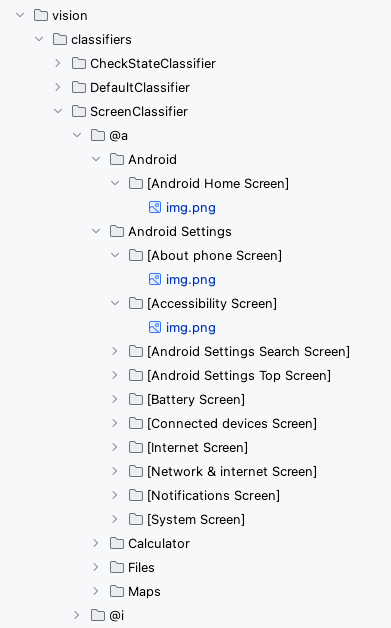

# Screen identification using FeaturePrint and Text recognition (Vision)

Shirates/Vision combines two techniques to identify screens.

- Image FeaturePrint
- Text recognition by AI-OCR

## Image FeaturePrint

- Image FeaturePrint is an object (vector representation) for calculating image similarity in Vision Framework.
- FeaturePrints can be generated from images and the distance between FeaturePrints can be calculated.
- The smaller the distance, the higher the similarity.
- Can perform more abstract comparisons than simple pixel comparisons

In Shirates/Vision, FeaturePrint is used to find most similar images.

## Text recognition by AI-OCR

When you get the most similar screen image template with FeaturePrint distance,
you can not determine if the image corresponds to the screen of the screenshot exactly.<br>
It's just that it's the most similar.

To complement this, a textual similarity comparison is performed using AI-OCR.<br>

AI-OCR is not performed to every screen image templates because of performance problem.
On the other hand, calculating FeaturePrint is so fast that can be performed
to every screen image templates on starting up the vision-server.
FeaturePrint is used to improve performance like indexing.

## Why not just using ImageClassifier?

Classifiers are not always 100% accurate, so you cannot simply use ImageClassifier to identify screens.
To overcome this weakness, getting some screen candidates (e.g. top 3)
in the template images and inspecting texts on them is required.

## Screen image templates

See ```vision/screens```



You can append screen image templates under the directory `vision/screens`.

### Link

- [index](../../../index.md)
