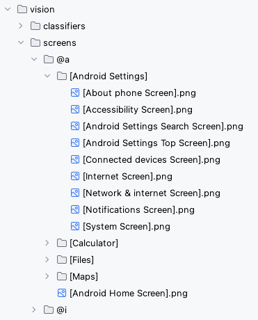

# Screen identification using FeaturePrint and Text recognition (Vision)

Shirates/Vision combines two techniques to identify screens.

- Image FeaturePrint
- Text recognition by AI-OCR

## Image FeaturePrint

- Image FeaturePrint is an object (vector representation) for calculating image similarity in Vision Framework.
- FeaturePrints can be generated from images and the distance between FeaturePrints can be calculated.
- The smaller the distance, the higher the similarity.
- Can perform more abstract comparisons than simple pixel comparisons

In Shirates/Vision, FeaturePrint is used to find most similar images.

## Text recognition by AI-OCR

When you get the most similar template screen image with FeaturePrint distance,
you can not determine if the image corresponds to the screen of the screenshot exactly.

To complement this, a textual similarity comparison is performed using AI-OCR.<br>

AI-OCR is not performed to every template screen images because of performance problem.
On the other hand, calculating FeaturePrint is so fast that can be performed
to every template screen images on starting up the vision-server.
FeaturePrint is used to improve performance (like indexing).

## Why not using ImageClassifier?

Because the screen is very complex image and the accuracy of ImageClassifier may not be 100%.
To overcome this weakness, getting some screen candidates (e.g. top 3)
in the template images and inspecting texts on them is required.

## Template screen images

See ```vision/screens```



You can append template images under the directory `vision/screens`.

## Sample code

[Getting samples](../../getting_samples.md)

### AndroidSettingsVisionDemo.kt

(`src/test/kotlin/demo/vision/AndroidSettingsVisionDemo.kt`)

```kotlin
    @Test
    fun airplaneModeSwitch() {

        scenario {
            case(1) {
                condition {
                    it.screenIs("[Android Settings Top Screen]")
                }.action {
                    it.tap("Network & internet")
                }.expectation {
                    it.screenIs("[Network & internet Screen]")
                }
            }
            case(2) {
                condition {
                    it.detect("Airplane mode")
                        .rightItem()
                        .checkIsOFF()
                }.action {
                    it.tap()
                }.expectation {
                    it.detect("Airplane mode")
                        .rightItem()
                        .checkIsON()
                }
            }
            case(3) {
                action {
                    it.tap()
                }.expectation {
                    it.detect("Airplane mode")
                        .rightItem()
                        .checkIsOFF()
                }
            }
        }
    }
```

### Running test

1. Set `os` in `testrun.global.properties` to run as android (default is android).

```properties
## OS --------------------
#os=ios
```

2. Right-click on `airplaneModeSwitch()` and select `debug` to run test.

### Link

- [index](../../../index.md)
