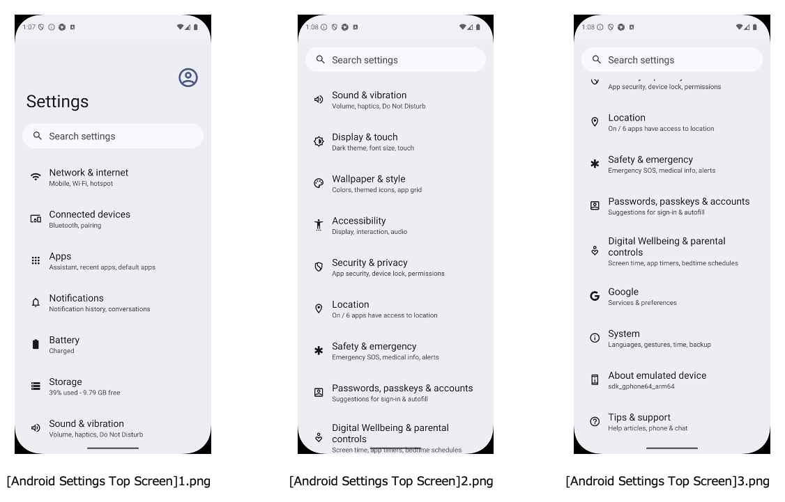

# Setting up screen image templates (Vision)

## Single registration

You can register one screen image template for one screen name.

1. Capture the screen image. <br>
2. Copy the image and paste in `vision/screens` directory. Set the file name to
   `[Some Screen].png`.<br><br>

Now you can use `screenIs` function.
(See [Screen assertion](../function_property/asserting_existence/screen_assertion.md))

<br>
Single registration is suitable for static screens.
However, slight differences (such as different button ON/OFF settings) are absorbed by the screen recognition logic
and can be used without any problems. <br>
It's not suitable for screens with scrolling.

## Multiple registration

You can register multiple screen image templates for one screen name
using **suffix** in filename.




All of these can be used as the screen name `[Android Settings Top Screen]`.

The suffix is any string. They do not need to be consecutive numbers. You can also set it as below.

```
[Android Settings Top Screen]a(Top).png
[Android Settings Top Screen]b(Middle).png
[Android Settings Top Screen]c(Bottom).png
```

All of these can be used as the screen name `[Android Settings Top Screen]`.

### Link

- [index](../../../index.md)
