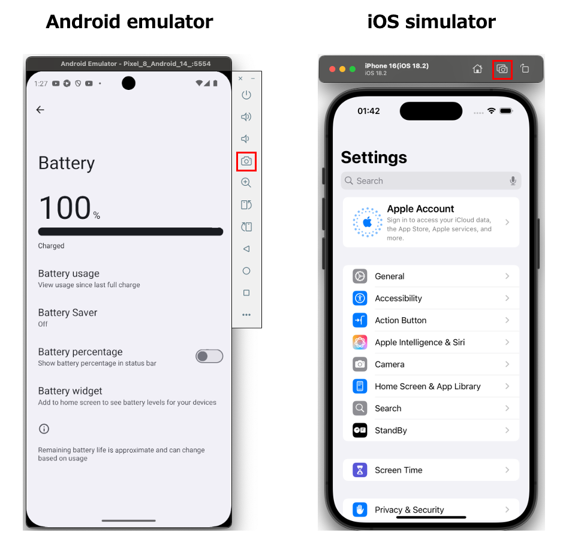
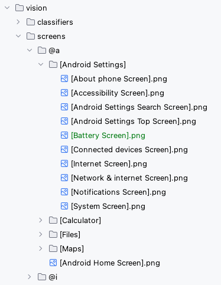

# 画面イメージテンプレートの設定 (Vision)

1. 画面イメージをキャプチャします。  
2. 画面イメージをコピーして `vision/screens` ディレクトリ配下にペーストします。 ファイル名を
   `[画面名].png`.に設定します。    

`screenIs`関数が使用できるようになります。
(参照 [画面が表示されていることの検証](../function_property/asserting_existence/screen_assertion_ja.md))

### Link

- [index](../../../index_ja.md)
