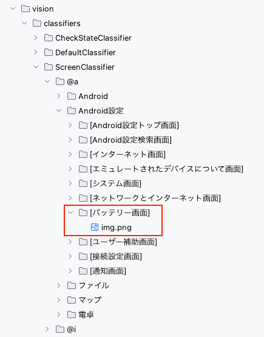

# 画面イメージテンプレートのセットアップ (Vision)

## シングル登録

1つの画面名に対して対応する画面イメージテンプレートを1つ登録することができます。

1. 画面イメージをキャプチャします。 <br>
2. 画面イメージをコピーして `vision/screens` ディレクトリ配下にペーストします。 ファイル名を
   `[画面名].png`.に設定します。<br><br> <br>

`screenIs`関数が使用できるようになります。
(参照 [画面が表示されていることの検証](../function_property/asserting_existence/screen_assertion_ja.md))

<br>
シングル登録は静的な画面に向いています。
ただし、若干の差異（ボタンのON/OFFが異なるなど）は画面判定のロジックで吸収され、問題なく使用できます。<br>
スクロールが発生する画面には不向きです。

## マルチ登録

1つの画面名に対して対応する画面イメージテンプレートを複数登録することができます。
ファイル名に**サフィックス**を使用します。


これらは全て`[Android設定トップ画面]`という画面名として使用できます。

サフィックスは任意の文字列です。連番である必要はありません。以下のように設定することもできます。

```
[Android設定トップ画面]a（トップ）.png
[Android設定トップ画面]b（ミドル）.png
[Android設定トップ画面]c（ボトム）.png
```

これらは全て`[Android設定トップ画面]`という画面名として使用できます。

### Link

- [index](../../../index_ja.md)
