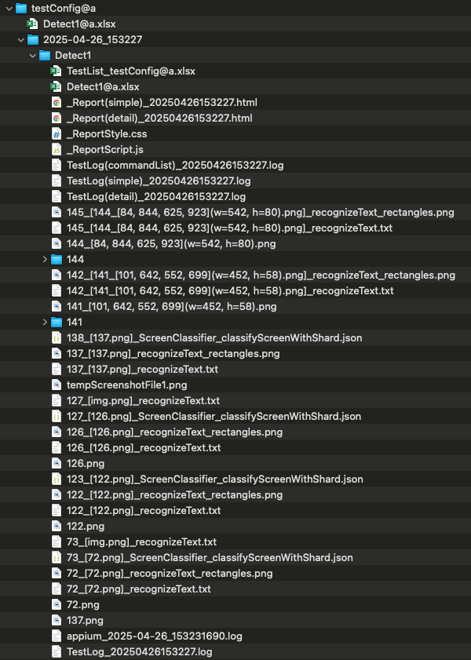
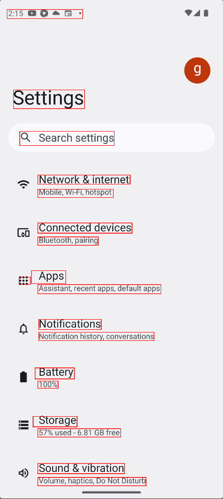
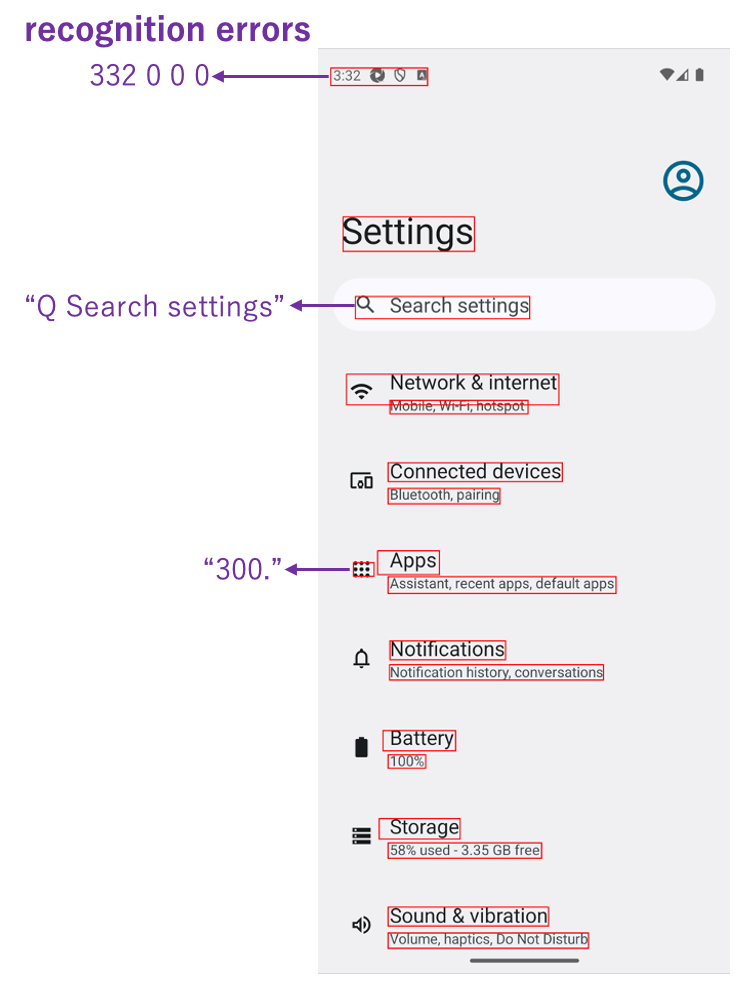
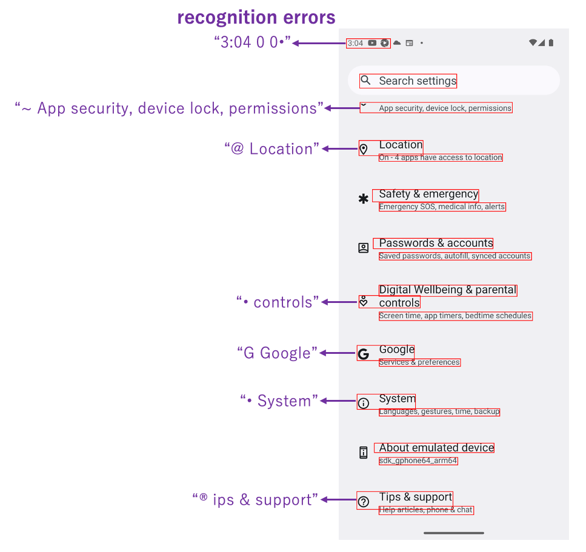
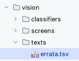
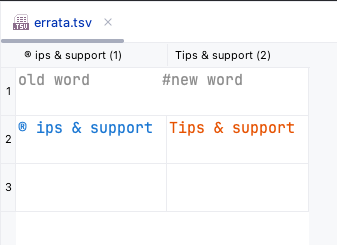

# Text Recognition by AI-OCR (Vision)

Shirates/Vision recognizes texts in the screen by AI-OCR feature of Vision Framework.

### Pros.

- You can detect **every text in the screen**, even the text in the image or icon.
- Vision Framework's AI-OCR is **faster** than Appium's DOM API in finding all texts in the screen (especially for iOS).

### Cons.

- **Text recognition error** may occur. You have to correct it by errata.
- Text cannot be compared by **character code**.

### Workaround

If you have to avoid the cons, use classic mode.

## Sample code

[Getting samples](../../getting_samples.md)

### Detect1.kt

(`kotlin/tutorial/basic/Detect1.kt`)

```kotlin
    @Test
    @Order(10)
    fun detect() {

        scenario {
            case(1) {
                action {
                    it.detect("Search settings")
                    output(it)

                    it.detect("Network & internet")
                    output(it)
                }
            }
        }
    }
```

### Running test

1. Set `os` in `testrun.global.properties` to run as android (default is android).

```properties
## OS --------------------
#os=ios
```

2. Right-click on `detect()` and select `debug` to run test.

### Console output

```
125	[00:00:20]	2025/01/26 02:47:26.298	{detect-1}	0	-	[CASE]	+834	!	()	(1)
126	[00:00:20]	2025/01/26 02:47:26.299	{detect-1}	0	-	[ACTION]	+1	!	()	action
127	[00:00:20]	2025/01/26 02:47:27.051	{detect-1}	0	-	[info]	+752	!	()	Syncing screen.
128	[00:00:21]	2025/01/26 02:47:27.267	{detect-1}	0	-	[info]	+216	!	()	[syncScreenshot] in 0.459 sec
129	[00:00:21]	2025/01/26 02:47:27.354	{detect-1}	0	-	[screenshot]	+87	!	()	screenshot: 129.png
130	[00:00:21]	2025/01/26 02:47:27.688	{detect-1}	0	-	[info]	+334	!	()	[TextRecognizer/recognizeText] in 0.332 sec
131	[00:00:21]	2025/01/26 02:47:27.990	{detect-1}	0	-	[info]	+302	!	()	130_[129.png]_recognized_text_rectangles.png
132	[00:00:22]	2025/01/26 02:47:28.180	{detect-1}	0	-	[info]	+190	!	()	[detect] in 1.879 sec
133	[00:00:22]	2025/01/26 02:47:28.185	{detect-1}	0	-	[output]	+5	!	(output)	text: "Q Search settings", bounds: [97,634][552,701] width=456, height=68, centerX=325, centerY=668, rect: [97, 634, 552, 701](w=456, h=68)
134	[00:00:22]	2025/01/26 02:47:28.190	{detect-1}	0	-	[info]	+5	!	()	[detect] in 0.004 sec
135	[00:00:22]	2025/01/26 02:47:28.198	{detect-1}	0	-	[output]	+8	!	(output)	text: "Network & internet", bounds: [184,844][628,887] width=445, height=44, centerX=406, centerY=866, rect: [184, 844, 628, 887](w=445, h=44)
```

### TestResults

You got test results files in TestResults directory(`~/Downloads/TestResults` is default).



### 130_[129.png]_recognized_text_rectangles.png

You can see recognized text rectangles.



### 129_[129.png]_TextRecognizer_recognizeText.json

You can see text recognition results in json file.

```json
{
  "input" : "\/Users\/wave1008\/Downloads\/TestResults\/testConfig@a\/2025-01-26_024706\/Detect1\/129.png",
  "language" : "",
  "candidates" : [
    {
      "confidence" : 0.5,
      "text" : "2:47 0 0•0•",
      "rect" : {
        "height" : 44,
        "width" : 364,
        "y" : 49,
        "x" : 36
      }
    },
    {
      "text" : "Settings",
      "rect" : {
        "y" : 435,
        "x" : 67,
        "width" : 342,
        "height" : 90
      },
      "confidence" : 1
    },
    {
      "rect" : {
        "width" : 456,
        "x" : 97,
        "y" : 634,
        "height" : 68
      },
      "text" : "Q Search settings",
      "confidence" : 1
    },
    {
      "text" : "Network & internet",
      "rect" : {
        "x" : 184,
        "y" : 844,
        "width" : 445,
        "height" : 44
      },
      "confidence" : 1
    },
    {
      "rect" : {
        "y" : 912,
        "x" : 184,
        "height" : 40,
        "width" : 364
      },
      "confidence" : 1,
      "text" : "Mobile, Wi-Fi, hotspot"
    },
    {
      "confidence" : 1,
      "rect" : {
        "width" : 454,
        "x" : 184,
        "height" : 49,
        "y" : 1074
      },
      "text" : "Connected devices"
    },
    {
      "text" : "Bluetooth, pairing",
      "rect" : {
        "y" : 1141,
        "width" : 292,
        "height" : 40,
        "x" : 184
      },
      "confidence" : 1
    },
    {
      "rect" : {
        "width" : 76,
        "height" : 53,
        "x" : 85,
        "y" : 1325
      },
      "confidence" : 0.5,
      "text" : "88:"
    },
    {
      "text" : "Apps",
      "confidence" : 0.5,
      "rect" : {
        "height" : 62,
        "x" : 153,
        "width" : 166,
        "y" : 1303
      }
    },
    {
      "rect" : {
        "x" : 184,
        "y" : 1370,
        "height" : 44,
        "width" : 594
      },
      "text" : "Assistant, recent apps, default apps",
      "confidence" : 1
    },
    {
      "text" : "Notifications",
      "rect" : {
        "y" : 1537,
        "x" : 189,
        "height" : 49,
        "width" : 301
      },
      "confidence" : 1
    },
    {
      "text" : "Notification history, conversations",
      "confidence" : 1,
      "rect" : {
        "width" : 557,
        "x" : 188,
        "y" : 1599,
        "height" : 40
      }
    },
    {
      "rect" : {
        "width" : 189,
        "x" : 171,
        "y" : 1770,
        "height" : 53
      },
      "confidence" : 1,
      "text" : "Battery"
    },
    {
      "text" : "100%",
      "rect" : {
        "y" : 1833,
        "x" : 184,
        "width" : 98,
        "height" : 35
      },
      "confidence" : 1
    },
    {
      "rect" : {
        "y" : 2003,
        "width" : 212,
        "x" : 161,
        "height" : 50
      },
      "confidence" : 1,
      "text" : "Storage"
    },
    {
      "confidence" : 1,
      "rect" : {
        "x" : 184,
        "height" : 40,
        "width" : 400,
        "y" : 2062
      },
      "text" : "57% used - 6.82 GB free"
    },
    {
      "text" : "Sound & vibration",
      "confidence" : 1,
      "rect" : {
        "height" : 49,
        "x" : 184,
        "width" : 418,
        "y" : 2229
      }
    },
    {
      "rect" : {
        "y" : 2296,
        "width" : 522,
        "x" : 184,
        "height" : 40
      },
      "confidence" : 1,
      "text" : "Volume, haptics, Do Not Disturb"
    }
  ]
}
```

### Text recognition errors

**Text recognition error** may occur. It depends on the accuracy of AI-OCR(RecognizeTextRequest) of Vision Framework (
maybe improved in the future).<br>



### Detect1.kt

(`kotlin/tutorial/basic/Detect1.kt`)

```kotlin
    @Test
    @Order(20)
    fun detectWithScrollDown_detectWithScrollUp() {

        scenario {
            case(1) {
                action {
                    it.detectWithScrollDown("Tips & support")
                    output(it)
                }
            }
        }
    }
```

Right-click on `detect()` and select `debug` to run test.

### TestResults

You got test results files in TestResults directory(`~/Downloads/TestResults` is default).

### Text recognition errors



You can detect **substrings** text by `detect` function.

```kotlin
// works
detect("Search settings")
detect("App security, device lock, permissions")
detect("Location")
detect("controls")
detect("Google")
detect("System")
```

But you **can not** detect the followings because text recognition does not work properly because of **garbled
characters**.

```kotlin
// does not work
detect("Tips & support")    // "® ips & support" does not match
```

### errata (correction table)

If garbled characters occur, use erratta(correction table).

 <br>



### Console

Run the test again.
Garbled characters are corrected.

```
[info]	+14	!	()	"® ips & support" is replaced to "Tips & support"
```

### Link

- [index](../../../index.md)
