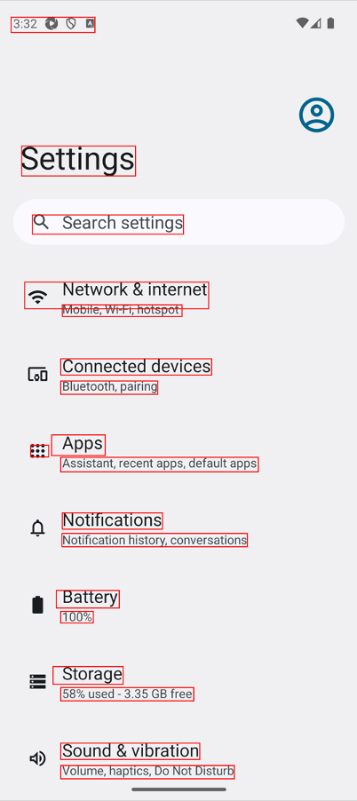

# Text Recognition by AI-OCR (Vision)

**Shirates/Vision** recognizes texts in the screen by **AI-OCR** feature of Vision Framework.

### Pros.

- You can detect **every text in the screen**, even the text in the image or icon.
- Vision Framework's AI-OCR is **faster** than Appium's DOM API in finding all texts in the screen (especially for iOS).

### Cons.

- **Text recognition error** may occur. You have to correct it by errata.
- Text cannot be compared by **character code**.

### Workaround

If you have to avoid the cons, use classic mode.

## Sample code

[Getting samples](../../getting_samples.md)

### Detect1.kt

(`kotlin/tutorial/basic/Detect1.kt`)

```kotlin
    @Test
    @Order(10)
    fun detect() {

        scenario {
            case(1) {
                action {
                    it.detect("Search settings")
                    output(it)

                    it.detect("Network & internet")
                    output(it)
                }
            }
        }
    }
```

### Running test

1. Set `os` in `testrun.global.properties` to run as android (default is android).

```properties
## OS --------------------
#os=ios
```

2. Right-click on `detect()` and select `debug` to run test.

### Console output

```
132	[00:00:25]	2025/04/26 15:32:53.243	{detect-1}	0	-	[CASE]	+507	!	()	(1)
133	[00:00:25]	2025/04/26 15:32:53.243	{detect-1}	0	-	[ACTION]	+0	!	()	action
134	[00:00:26]	2025/04/26 15:32:53.765	{detect-1}	0	-	[info]	+522	!	()	Syncing screen.(isSame: false, changed: false, matchRate: 0.3052353858947754, distance=0.6947646141052246)
135	[00:00:27]	2025/04/26 15:32:54.689	{detect-1}	0	-	[info]	+924	!	()	Syncing screen.(isSame: false, changed: true, matchRate: 0.22204530239105225, distance=0.7779546976089478)
136	[00:00:27]	2025/04/26 15:32:55.603	{detect-1}	0	-	[info]	+914	!	()	Syncing screen.(isSame: true, changed: true, matchRate: 0.999935973144602, distance=6.402685539796948E-5)
137	[00:00:27]	2025/04/26 15:32:55.604	{detect-1}	0	-	[screenshot]	+1	!	()	screenshot: 137.png
138	[00:00:28]	2025/04/26 15:32:55.903	{detect-1}	0	-	[info]	+299	!	()	137_[137.png]_recognizeText_rectangles.png
139	[00:00:28]	2025/04/26 15:32:56.046	{detect-1}	0	-	[info]	+143	!	()	[Android Settings Top Screen] found by matchTextScoreRate
140	[00:00:28]	2025/04/26 15:32:56.047	{detect-1}	0	-	[info]	+1	!	()	[recognizeScreen] in 0.442 sec
141	[00:00:28]	2025/04/26 15:32:56.047	{detect-1}	0	-	[info]	+0	!	()	currentScreen=[Android Settings Top Screen]
142	[00:00:28]	2025/04/26 15:32:56.120	{detect-1}	0	-	[info]	+73	!	()	141_[101, 642, 552, 699](w=452, h=58).png
143	[00:00:28]	2025/04/26 15:32:56.242	{detect-1}	0	-	[info]	+122	!	()	142_[141_[101, 642, 552, 699](w=452, h=58).png]_recognizeText_rectangles.png
144	[00:00:28]	2025/04/26 15:32:56.368	{detect-1}	0	-	[output]	+126	!	(output)	text: "Search settings", bounds: [101,642][552,699] width=452, height=58, centerX=327, centerY=671, rect: [101, 642, 552, 699](w=452, h=58)
145	[00:00:28]	2025/04/26 15:32:56.403	{detect-1}	0	-	[info]	+35	!	()	144_[84, 844, 625, 923](w=542, h=80).png
146	[00:00:28]	2025/04/26 15:32:56.573	{detect-1}	0	-	[info]	+170	!	()	145_[144_[84, 844, 625, 923](w=542, h=80).png]_recognizeText_rectangles.png
147	[00:00:29]	2025/04/26 15:32:56.662	{detect-1}	0	-	[output]	+89	!	(output)	text: "Network & internet", bounds: [84,844][625,923] width=542, height=80, centerX=355, centerY=884, rect: [84, 844, 625, 923](w=542, h=80)
```

### TestResults

You got test results files in TestResults directory(`~/Downloads/TestResults` is default).


### recognizeText_rectangles.png

You can see recognized text rectangles.



### recognizeText.txt

You can see text recognition results in a text file.

```text
x	y	width	height	confidence	text
35	48	252	46	0.5	332 0 0 0
67	435	342	90	1.0	Settings
99	642	454	58	1.0	Q Search settings
76	844	553	80	1.0	= Network & internet
189	912	360	35	1.0	Mobile, Wi-Fi, hotspot
184	1074	454	49	1.0	Connected devices
184	1141	292	40	1.0	Bluetooth, pairing
94	1334	54	35	0.3	300.
157	1303	161	62	0.5	Apps
184	1370	594	44	1.0	Assistant, recent apps, default apps
189	1537	301	49	1.0	Notifications
188	1599	557	40	1.0	Notification history, conversations
171	1770	189	53	1.0	Battery
184	1833	98	35	1.0	100%
161	1999	211	53	1.0	Storage
184	2062	400	40	1.0	58% used - 3.35 GB free
184	2229	418	49	1.0	Sound & vibration
184	2296	522	40	1.0	Volume, haptics, Do Not Disturb
```

### Text recognition errors

**Text recognition error** may occur. It depends on the accuracy of AI-OCR(RecognizeTextRequest) of Vision Framework.
It maybe improved in the future version.<br>


You can detect text by `detect` function just as followings.

```kotlin
// works
detect("Search settings")
detect("Apps")
```

On the other hand, if text recognition does not function properly and results in garbled characters, the expected text
cannot be detected.

```kotlin
// does not work
detect("Tips & support")    // "® ips & support" does not match
```

### errata (correction table)

If garbled characters occur, use erratta(correction table).

 <br>


**CSV Editor** plugin is useful.

### Rerun test

Run the test again.
The garbled characters are corrected and a message like this is output.

```
[info]	+14	!	()	"® ips & support" is replaced to "Tips & support"
```

### Link

- [index](../../../index.md)
