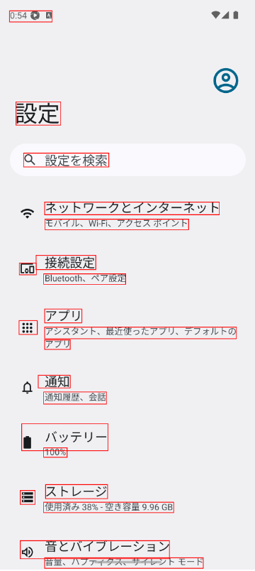
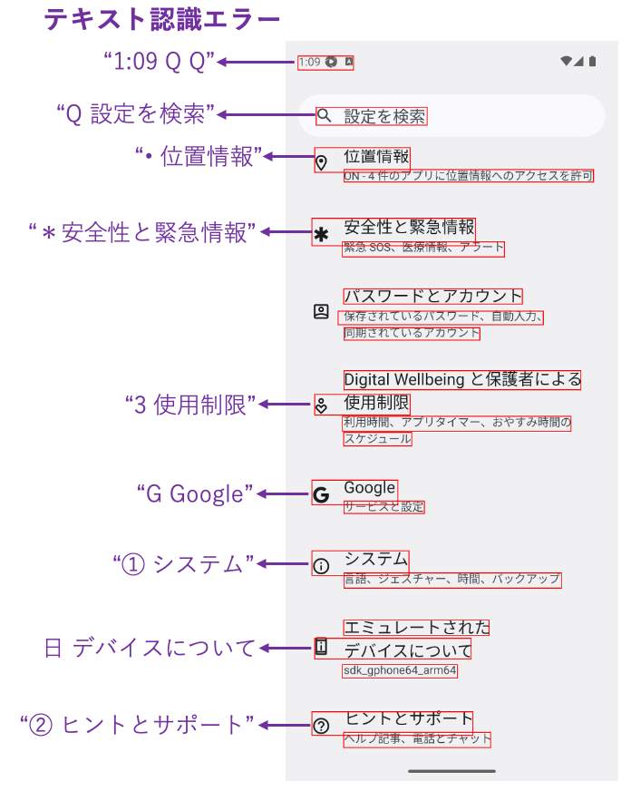

# AI-OCRによるテキスト認識 (Vision)

Shirates/Visionは Vision Framework のAI-OCR機能によって画面のテキストを認識します。

### 利点

- **画面上の全てのテキスト**を検出することができます。画像やアイコン内のテキストも検出できます
- 画面上の全てのテキストを取得する場合、Vision FrameworkのAI-OCRはAppiumのDOM APIよりも高速です（特にiOSの場合）

### 難点

- **テキスト認識エラー** が発生する場合があります。この場合はエラッタ(訂正表)を使用して訂正する必要があります
- **文字コード** としてテキストを比較することはできません

### 回避策

「難点」を回避するにはclassicモードを使用してください。

### サンプルコード

[サンプルの入手](../../getting_samples_ja.md)

### Detect1.kt

(`kotlin/tutorial/basic/Detect1.kt`)

```kotlin
    @Test
    @Order(10)
    fun detect() {

        scenario {
            case(1) {
                action {
                    it.detect("設定を検索")
                    output(it)

                    it.detect("ネットワークとインターネット")
                    output(it)
                }
            }
        }
    }
```

### テストを実行する

1. Androidで実行されるように`testrun.global.properties`の`os`を設定します (デフォルトは`android`
   なので単にコメントアウトします)。

```properties
## OS --------------------
#os=ios
```

2. `detect()`を右クリックして`debug`を選択し、テストを実行します。

### コンソール出力

```
126	[00:00:18]	2025/02/07 00:51:21.746	{detect-1}	0	-	[CASE]	+451	!	()	(1)
127	[00:00:18]	2025/02/07 00:51:21.747	{detect-1}	0	-	[ACTION]	+1	!	()	アクション
128	[00:00:18]	2025/02/07 00:51:22.455	{detect-1}	0	-	[info]	+708	!	()	Syncing screen.
129	[00:00:19]	2025/02/07 00:51:22.695	{detect-1}	0	-	[info]	+240	!	()	[syncScreenshot] in 0.440 sec
130	[00:00:19]	2025/02/07 00:51:22.780	{detect-1}	0	-	[screenshot]	+85	!	()	screenshot: 130.png
131	[00:00:19]	2025/02/07 00:51:23.393	{detect-1}	0	-	[info]	+613	!	()	[TextRecognizer/recognizeText] in 0.608 sec
132	[00:00:20]	2025/02/07 00:51:23.725	{detect-1}	0	-	[info]	+332	!	()	131_[130.png]_recognized_text_rectangles.png
133	[00:00:20]	2025/02/07 00:51:24.034	{detect-1}	0	-	[info]	+309	!	()	132_[101, 650, 452, 704](w=352, h=55).png
134	[00:00:20]	2025/02/07 00:51:24.126	{detect-1}	0	-	[info]	+92	!	()	[TextRecognizer/recognizeText] in 0.086 sec
135	[00:00:20]	2025/02/07 00:51:24.135	{detect-1}	0	-	[info]	+9	!	()	134_[132_[101, 650, 452, 704](w=352, h=55).png]_recognized_text_rectangles.png
136	[00:00:20]	2025/02/07 00:51:24.338	{detect-1}	0	-	[info]	+203	!	()	[detect] in 2.589 sec
137	[00:00:20]	2025/02/07 00:51:24.343	{detect-1}	0	-	[output]	+5	!	(output)	text: "設定を検索", bounds: [101,650][452,704] width=352, height=55, centerX=277, centerY=677, rect: [101, 650, 452, 704](w=352, h=55)
138	[00:00:20]	2025/02/07 00:51:24.351	{detect-1}	0	-	[info]	+8	!	()	[detect] in 0.005 sec
139	[00:00:20]	2025/02/07 00:51:24.353	{detect-1}	0	-	[output]	+2	!	(output)	text: "ネットワークとインターネット", bounds: [188,853][925,905] width=738, height=53, centerX=557, centerY=879, rect: [188, 853, 925, 905](w=738, h=53)
```

### TestResults

TestResults ディレクトリ(デフォルトは`~/Downloads/TestResults`)にテスト結果のファイルが出力されます。


### 131_[130.png]_recognized_text_rectangles.png

認識されたテキストの矩形を確認できます。



### 129_[129.png]_TextRecognizer_recognizeText.json

テキスト認識の結果をjsonファイルで確認できます。

```json
{
  "input" : "\/Users\/wave1008\/Downloads\/TestResults\/testConfig@a\/2025-02-07_005432\/Detect1\/130.png",
  "candidates" : [
    {
      "text" : "0:54@ ロ",
      "confidence" : 0.5,
      "rect" : {
        "height" : 47,
        "x" : 40,
        "y" : 48,
        "width" : 180
      }
    },
    {
      "confidence" : 0.5,
      "rect" : {
        "width" : 189,
        "height" : 98,
        "x" : 67,
        "y" : 431
      },
      "text" : "設定"
    },
    {
      "confidence" : 0.5,
      "rect" : {
        "width" : 360,
        "y" : 647,
        "x" : 99,
        "height" : 58
      },
      "text" : "Q 設定を検索"
    },
    {
      "confidence" : 1,
      "text" : "ネットワークとインターネット",
      "rect" : {
        "x" : 188,
        "width" : 738,
        "height" : 53,
        "y" : 853
      }
    },
    {
      "rect" : {
        "width" : 607,
        "x" : 189,
        "y" : 925,
        "height" : 44
      },
      "text" : "モバイル、Wi-Fi、アクセスポイント",
      "confidence" : 1
    },
    {
      "confidence" : 0.5,
      "text" : "Loo",
      "rect" : {
        "y" : 1110,
        "width" : 72,
        "x" : 81,
        "height" : 49
      }
    },
    {
      "text" : "接続設定",
      "rect" : {
        "y" : 1077,
        "width" : 252,
        "height" : 60,
        "x" : 152
      },
      "confidence" : 0.5
    },
    {
      "text" : "Bluetooth、ペア設定",
      "rect" : {
        "x" : 184,
        "y" : 1155,
        "width" : 346,
        "height" : 44
      },
      "confidence" : 1
    },
    {
      "text" : "！：",
      "confidence" : 0.5,
      "rect" : {
        "x" : 80,
        "height" : 58,
        "y" : 1352,
        "width" : 77
      }
    },
    {
      "rect" : {
        "y" : 1303,
        "x" : 188,
        "height" : 58,
        "width" : 157
      },
      "confidence" : 1,
      "text" : "アプリ"
    },
    {
      "confidence" : 1,
      "text" : "アプリ",
      "rect" : {
        "width" : 108,
        "height" : 40,
        "y" : 1433,
        "x" : 188
      }
    },
    {
      "confidence" : 1,
      "rect" : {
        "y" : 1379,
        "x" : 188,
        "width" : 810,
        "height" : 49
      },
      "text" : "アシスタント、最近使ったアプリ、デフォルトの"
    },
    {
      "confidence" : 0.5,
      "rect" : {
        "x" : 161,
        "width" : 135,
        "height" : 53,
        "y" : 1582
      },
      "text" : "通知"
    },
    {
      "text" : "通知履歴、会話",
      "rect" : {
        "x" : 184,
        "height" : 51,
        "width" : 265,
        "y" : 1652
      },
      "confidence" : 0.5
    },
    {
      "text" : "■ バッテリー",
      "rect" : {
        "width" : 365,
        "height" : 113,
        "x" : 91,
        "y" : 1786
      },
      "confidence" : 1
    },
    {
      "rect" : {
        "height" : 40,
        "x" : 184,
        "y" : 1887,
        "width" : 99
      },
      "confidence" : 1,
      "text" : "100%"
    },
    {
      "rect" : {
        "y" : 2067,
        "width" : 63,
        "x" : 85,
        "height" : 58
      },
      "confidence" : 0.5,
      "text" : "="
    },
    {
      "text" : "ストレージ",
      "rect" : {
        "height" : 59,
        "x" : 192,
        "width" : 262,
        "y" : 2042
      },
      "confidence" : 1
    },
    {
      "rect" : {
        "height" : 44,
        "width" : 549,
        "x" : 184,
        "y" : 2116
      },
      "text" : "使用済み 38%-空き容量 9.96 GB",
      "confidence" : 1
    },
    {
      "rect" : {
        "x" : 85,
        "height" : 76,
        "y" : 2278,
        "width" : 630
      },
      "confidence" : 0.5,
      "text" : "4） 音とバイブレーション"
    },
    {
      "rect" : {
        "height" : 44,
        "x" : 188,
        "y" : 2350,
        "width" : 670
      },
      "text" : "音量、ハプティクス、サイレント モード",
      "confidence" : 0.5
    }
  ],
  "language" : "ja"
}
```

### テキスト認識エラー

**テキスト認識エラー**が発生する場合があります。これはVision FrameworkのAI-OCR(RecognizeTextRequest)
の精度に依存します。精度は将来のバージョンで改善される可能性があります。
<br>




`detect`関数で部分文字列を指定することでテキストを検出することができます。

```kotlin
// 正しく動作します
detect("設定を検索")
detect("位置情報")
detect("使用制限")
detect("Google")
detect("システム")
```

一方、テキスト認識が正しく機能せず**文字化け**のような結果になる場合は期待したテキストは検出できません。

```kotlin
// does not work
detect("Tips & support")    // "® ips & support" does not match
```

### エラッタ (訂正表)

文字化けが発生する場合はエラッタ（訂正表）を使用します。

 <br>


**CSV Editor**プラグインが便利です。

### 再実行(英語版サンプルのみ)

テストを再実行します。
文字化けが訂正され、以下のようなログが出力されます。

```
[info]	+14	!	()	"® ips & support" is replaced to "Tips & support"
```

### Link

- [index](../../../index_ja.md)
