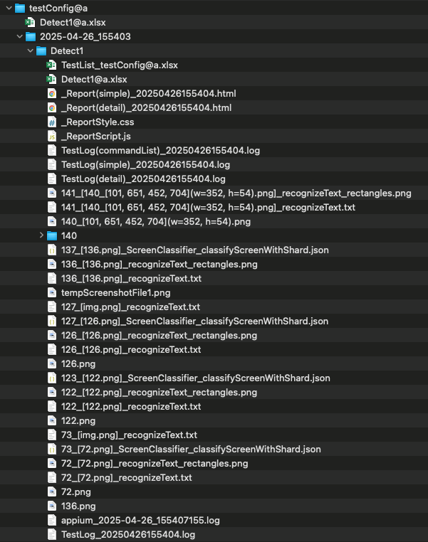
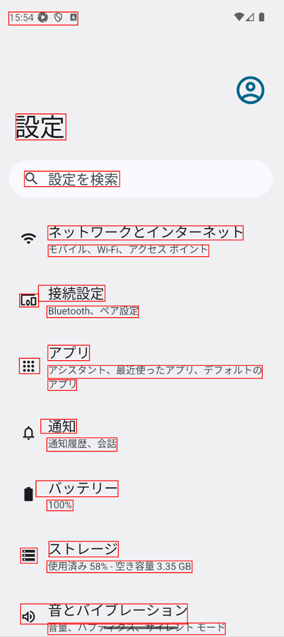
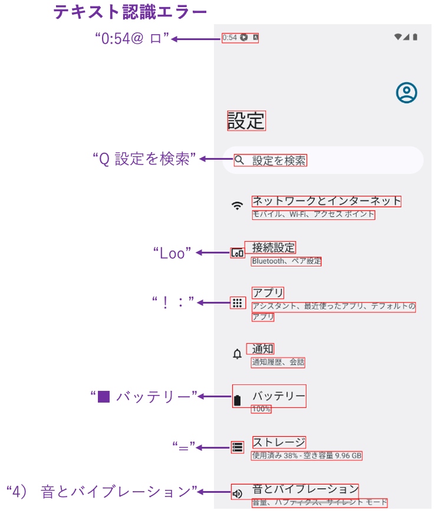

# AI-OCRによるテキスト認識 (Vision)

Shirates/Visionは Vision Framework のAI-OCR機能によって画面のテキストを認識します。

### 利点

- **画面上の全てのテキスト**を検出することができます。画像やアイコン内のテキストも検出できます
- 画面上の全てのテキストを取得する場合、Vision FrameworkのAI-OCRはAppiumのDOM APIよりも高速です（特にiOSの場合）

### 難点

- **テキスト認識エラー** が発生する場合があります。この場合はエラッタ(訂正表)を使用して訂正する必要があります
- **文字コード** としてテキストを比較することはできません

### 回避策

「難点」を回避するにはclassicモードを使用してください。

## サンプルコード

[サンプルの入手](../../getting_samples_ja.md)

### Detect1.kt

(`kotlin/tutorial/basic/Detect1.kt`)

```kotlin
    @Test
    @Order(10)
    fun detect() {

        scenario {
            case(1) {
                action {
                    it.detect("設定を検索")
                    output(it)

                    it.detect("ネットワークとインターネット")
                    output(it)
                }
            }
        }
    }
```

### テストを実行する

1. Androidで実行されるように`testrun.global.properties`の`os`を設定します (デフォルトは`android`
   なので単にコメントアウトします)。

```properties
## OS --------------------
#os=ios
```

2. `detect()`を右クリックして`debug`を選択し、テストを実行します。

### コンソール出力

```
131	[00:00:25]	2025/04/26 15:54:29.037	{detect-1}	0	-	[CASE]	+402	!	()	(1)
132	[00:00:25]	2025/04/26 15:54:29.038	{detect-1}	0	-	[ACTION]	+1	!	()	アクション
133	[00:00:25]	2025/04/26 15:54:29.869	{detect-1}	0	-	[info]	+831	!	()	Syncing screen.(isSame: false, changed: false, matchRate: 0.7721806913614273, distance=0.2278193086385727)
134	[00:00:26]	2025/04/26 15:54:30.862	{detect-1}	0	-	[info]	+993	!	()	Syncing screen.(isSame: false, changed: true, matchRate: 0.4840959906578064, distance=0.5159040093421936)
135	[00:00:27]	2025/04/26 15:54:31.777	{detect-1}	0	-	[info]	+915	!	()	Syncing screen.(isSame: true, changed: true, matchRate: 0.9999670145552955, distance=3.298544470453635E-5)
136	[00:00:27]	2025/04/26 15:54:31.778	{detect-1}	0	-	[screenshot]	+1	!	()	screenshot: 136.png
137	[00:00:28]	2025/04/26 15:54:32.361	{detect-1}	0	-	[info]	+583	!	()	136_[136.png]_recognizeText_rectangles.png
138	[00:00:28]	2025/04/26 15:54:32.489	{detect-1}	0	-	[info]	+128	!	()	[Android設定トップ画面] found by matchTextScoreRate
139	[00:00:28]	2025/04/26 15:54:32.490	{detect-1}	0	-	[info]	+1	!	()	[recognizeScreen] in 0.711 sec
140	[00:00:28]	2025/04/26 15:54:32.490	{detect-1}	0	-	[info]	+0	!	()	currentScreen=[Android設定トップ画面]
141	[00:00:28]	2025/04/26 15:54:32.566	{detect-1}	0	-	[info]	+76	!	()	140_[101, 651, 452, 704](w=352, h=54).png
142	[00:00:28]	2025/04/26 15:54:32.675	{detect-1}	0	-	[info]	+109	!	()	141_[140_[101, 651, 452, 704](w=352, h=54).png]_recognizeText_rectangles.png
143	[00:00:28]	2025/04/26 15:54:32.773	{detect-1}	0	-	[output]	+98	!	(output)	text: "設定を検索", bounds: [101,651][452,704] width=352, height=54, centerX=277, centerY=678, rect: [101, 651, 452, 704](w=352, h=54)
144	[00:00:28]	2025/04/26 15:54:32.778	{detect-1}	0	-	[output]	+5	!	(output)	text: "ネットワークとインターネット", bounds: [188,853][925,905] width=738, height=53, centerX=557, centerY=879, rect: [188, 853, 925, 905](w=738, h=53)
```

### TestResults

TestResults ディレクトリ(デフォルトは`~/Downloads/TestResults`)にテスト結果のファイルが出力されます。



### recognizeText_rectangles.png

認識されたテキストの矩形を確認できます。



### recognizeText.txt

テキスト認識の結果をテキストファイルで確認できます。

```text
x	y	width	height	confidence	text
40	47	261	49	0.5	15:54 ♥ Q Q
67	431	189	98	0.5	設定
99	647	360	58	0.5	Q 設定を検索
188	853	738	53	1.0	ネットワークとインターネット
189	925	607	44	1.0	モバイル、Wi-Fi、アクセスポイント
81	1110	72	49	0.5	Loo
152	1077	252	60	0.5	接続設定
184	1155	346	44	1.0	Bluetooth、ペア設定
80	1352	77	58	0.5	！：
188	1303	157	58	1.0	アプリ
188	1433	108	40	1.0	アプリ
188	1379	810	49	1.0	アシスタント、最近使ったアプリ、デフォルトの
161	1582	135	53	0.5	通知
184	1652	265	51	0.5	通知履歴、会話
143	1814	310	60	1.0	バッテリー
184	1887	99	40	1.0	100%
85	2067	63	58	0.5	=
192	2042	262	59	1.0	ストレージ
184	2116	549	44	1.0	使用済み 58%-空き容量 3.35GB
85	2278	630	76	0.5	4） 音とバイブレーション
188	2350	670	44	0.5	音量、ハプティクス、サイレシト モード
```

### テキスト認識エラー

**テキスト認識エラー**が発生する場合があります。これはVision FrameworkのAI-OCR(RecognizeTextRequest)
の精度に依存します。精度は将来のバージョンで改善される可能性があります。
<br>



以下のように`detect`関数でテキストを検出することができます。

```kotlin
// 正しく動作します
detect("設定を検索")
detect("接続設定")
detect("アプリ")
detect("ストレージ")
detect("音とバイブレーション")
```

一方、テキスト認識が正しく機能せず**文字化け**のような結果になる場合は期待したテキストは検出できません。

```kotlin
// does not work
detect("Tips & support")    // "® ips & support" does not match
```

### エラッタ (訂正表)

文字化けが発生する場合はエラッタ（訂正表）を使用します。

 <br>


**CSV Editor**プラグインが便利です。

### 再実行(英語版サンプルのみ)

テストを再実行します。
文字化けが訂正され、以下のようなログが出力されます。

```
[info]	+14	!	()	"® ips & support" is replaced to "Tips & support"
```

### Link

- [index](../../../index_ja.md)
