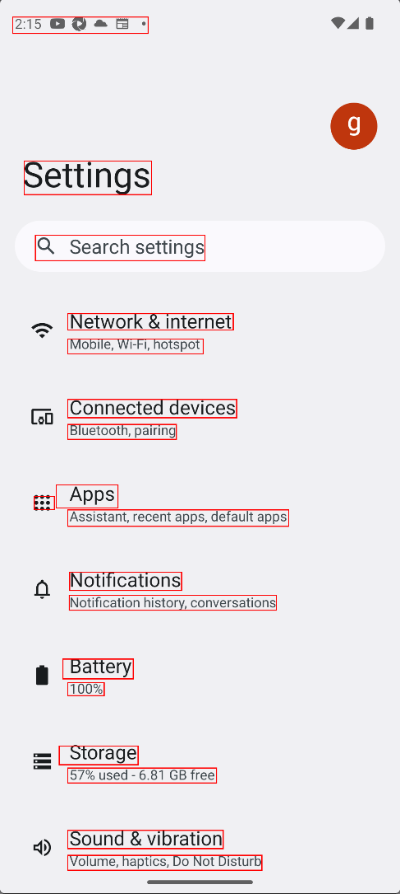
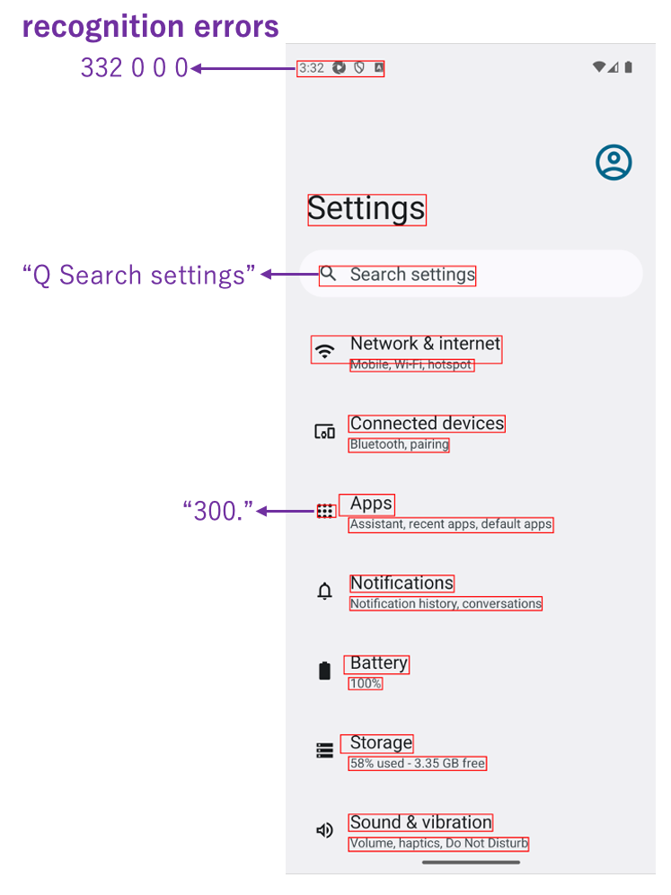
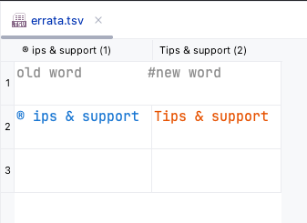

# AI-OCRによるテキスト認識 (Vision)

Shirates/Visionは Vision Framework のAI-OCR機能によって画面のテキストを認識します。

### 利点

- **画面上の全てのテキスト**を検出することができます。画像やアイコン内のテキストも検出できます
- 画面上の全てのテキストを取得する場合、Vision FrameworkのAI-OCRはAppiumのDOM APIよりも高速です（特にiOSの場合）

### 難点

- **テキスト認識エラー** が発生する場合があります。この場合はエラッタ(訂正表)を使用して訂正する必要があります
- **文字コード** としてテキストを比較することはできません

### 回避策

「難点」を回避するにはclassicモードを使用してください。

### サンプルコード

[サンプルの入手](../../getting_samples_ja.md)

### Detect1.kt

(`kotlin/tutorial/basic/Detect1.kt`)

```kotlin
    @Test
    @Order(10)
    fun detect() {

        scenario {
            case(1) {
                action {
                    it.detect("Search settings")
                    output(it)

                    it.detect("Network & internet")
                    output(it)
                }
            }
        }
    }
```

### テストを実行する

1. Androidで実行されるように`testrun.global.properties`の`os`を設定します (デフォルトは`android`
   なので単にコメントアウトします)。

```properties
## OS --------------------
#os=ios
```

2. `detect()`を右クリックして`debug`を選択し、テストを実行します。

### コンソール出力

```
125	[00:00:20]	2025/01/26 02:47:26.298	{detect-1}	0	-	[CASE]	+834	!	()	(1)
126	[00:00:20]	2025/01/26 02:47:26.299	{detect-1}	0	-	[ACTION]	+1	!	()	action
127	[00:00:20]	2025/01/26 02:47:27.051	{detect-1}	0	-	[info]	+752	!	()	Syncing screen.
128	[00:00:21]	2025/01/26 02:47:27.267	{detect-1}	0	-	[info]	+216	!	()	[syncScreenshot] in 0.459 sec
129	[00:00:21]	2025/01/26 02:47:27.354	{detect-1}	0	-	[screenshot]	+87	!	()	screenshot: 129.png
130	[00:00:21]	2025/01/26 02:47:27.688	{detect-1}	0	-	[info]	+334	!	()	[TextRecognizer/recognizeText] in 0.332 sec
131	[00:00:21]	2025/01/26 02:47:27.990	{detect-1}	0	-	[info]	+302	!	()	130_[129.png]_recognized_text_rectangles.png
132	[00:00:22]	2025/01/26 02:47:28.180	{detect-1}	0	-	[info]	+190	!	()	[detect] in 1.879 sec
133	[00:00:22]	2025/01/26 02:47:28.185	{detect-1}	0	-	[output]	+5	!	(output)	text: "Q Search settings", bounds: [97,634][552,701] width=456, height=68, centerX=325, centerY=668, rect: [97, 634, 552, 701](w=456, h=68)
134	[00:00:22]	2025/01/26 02:47:28.190	{detect-1}	0	-	[info]	+5	!	()	[detect] in 0.004 sec
135	[00:00:22]	2025/01/26 02:47:28.198	{detect-1}	0	-	[output]	+8	!	(output)	text: "Network & internet", bounds: [184,844][628,887] width=445, height=44, centerX=406, centerY=866, rect: [184, 844, 628, 887](w=445, h=44)
```

### TestResults

TestResults ディレクトリ(デフォルトは`~/Downloads/TestResults`)にテスト結果のファイルが出力されます。


### 130_[129.png]_recognized_text_rectangles.png

認識されたテキストの矩形を確認できます。



### 129_[129.png]_TextRecognizer_recognizeText.json

テキスト認識の結果をjsonファイルで確認できます。

```json
{
  "input" : "\/Users\/wave1008\/Downloads\/TestResults\/testConfig@a\/2025-01-26_024706\/Detect1\/129.png",
  "language" : "",
  "candidates" : [
    {
      "confidence" : 0.5,
      "text" : "2:47 0 0•0•",
      "rect" : {
        "height" : 44,
        "width" : 364,
        "y" : 49,
        "x" : 36
      }
    },
    {
      "text" : "Settings",
      "rect" : {
        "y" : 435,
        "x" : 67,
        "width" : 342,
        "height" : 90
      },
      "confidence" : 1
    },
    {
      "rect" : {
        "width" : 456,
        "x" : 97,
        "y" : 634,
        "height" : 68
      },
      "text" : "Q Search settings",
      "confidence" : 1
    },
    {
      "text" : "Network & internet",
      "rect" : {
        "x" : 184,
        "y" : 844,
        "width" : 445,
        "height" : 44
      },
      "confidence" : 1
    },
    {
      "rect" : {
        "y" : 912,
        "x" : 184,
        "height" : 40,
        "width" : 364
      },
      "confidence" : 1,
      "text" : "Mobile, Wi-Fi, hotspot"
    },
    {
      "confidence" : 1,
      "rect" : {
        "width" : 454,
        "x" : 184,
        "height" : 49,
        "y" : 1074
      },
      "text" : "Connected devices"
    },
    {
      "text" : "Bluetooth, pairing",
      "rect" : {
        "y" : 1141,
        "width" : 292,
        "height" : 40,
        "x" : 184
      },
      "confidence" : 1
    },
    {
      "rect" : {
        "width" : 76,
        "height" : 53,
        "x" : 85,
        "y" : 1325
      },
      "confidence" : 0.5,
      "text" : "88:"
    },
    {
      "text" : "Apps",
      "confidence" : 0.5,
      "rect" : {
        "height" : 62,
        "x" : 153,
        "width" : 166,
        "y" : 1303
      }
    },
    {
      "rect" : {
        "x" : 184,
        "y" : 1370,
        "height" : 44,
        "width" : 594
      },
      "text" : "Assistant, recent apps, default apps",
      "confidence" : 1
    },
    {
      "text" : "Notifications",
      "rect" : {
        "y" : 1537,
        "x" : 189,
        "height" : 49,
        "width" : 301
      },
      "confidence" : 1
    },
    {
      "text" : "Notification history, conversations",
      "confidence" : 1,
      "rect" : {
        "width" : 557,
        "x" : 188,
        "y" : 1599,
        "height" : 40
      }
    },
    {
      "rect" : {
        "width" : 189,
        "x" : 171,
        "y" : 1770,
        "height" : 53
      },
      "confidence" : 1,
      "text" : "Battery"
    },
    {
      "text" : "100%",
      "rect" : {
        "y" : 1833,
        "x" : 184,
        "width" : 98,
        "height" : 35
      },
      "confidence" : 1
    },
    {
      "rect" : {
        "y" : 2003,
        "width" : 212,
        "x" : 161,
        "height" : 50
      },
      "confidence" : 1,
      "text" : "Storage"
    },
    {
      "confidence" : 1,
      "rect" : {
        "x" : 184,
        "height" : 40,
        "width" : 400,
        "y" : 2062
      },
      "text" : "57% used - 6.82 GB free"
    },
    {
      "text" : "Sound & vibration",
      "confidence" : 1,
      "rect" : {
        "height" : 49,
        "x" : 184,
        "width" : 418,
        "y" : 2229
      }
    },
    {
      "rect" : {
        "y" : 2296,
        "width" : 522,
        "x" : 184,
        "height" : 40
      },
      "confidence" : 1,
      "text" : "Volume, haptics, Do Not Disturb"
    }
  ]
}
```

### テキスト認識エラー

**テキスト認識エラー**が発生する場合があります。これはVision FrameworkのAI-OCR(RecognizeTextRequest)
の精度に依存します。精度は将来のバージョンで改善される可能性があります。
<br>




`detect`関数で部分文字列を指定することでテキストを検出することができます。

```kotlin
// works
detect("Search settings")
detect("App security, device lock, permissions")
detect("Location")
detect("controls")
detect("Google")
detect("System")
```

一方、テキスト認識が正しく機能せず文字化けのような結果になる場合は期待したテキストは検出できません。
But you **can not** detect the followings because text recognition does not work properly because of **garbled
characters**.

```kotlin
// does not work
detect("Tips & support")    // "® ips & support" does not match
```

### エラッタ (訂正表)

文字化けが発生する場合はエラッタ（訂正表）を使用します。

 <br>



**CSV Editor**プラグインが便利です。

### 再実行

テストを再実行します。
文字化けが訂正され、以下のようなログが出力されます。

```
[info]	+14	!	()	"® ips & support" is replaced to "Tips & support"
```

### Link

- [index](../../../index_ja.md)
