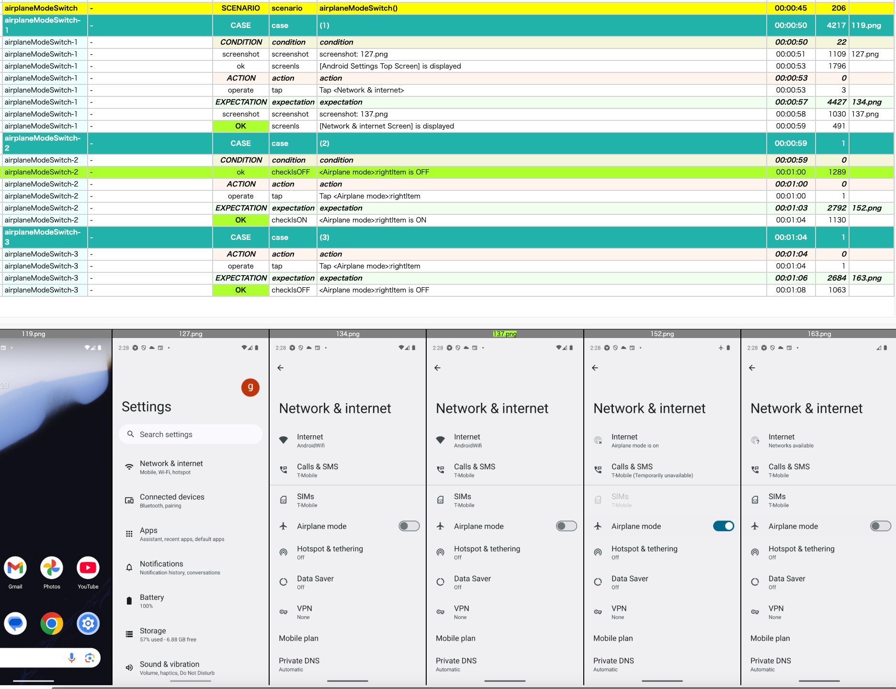

# CheckStateClassifierを使用する (Vision)

Shirates/Visionは画像のチェック状態(`[ON]`/`[OFF]`)を認識します。

### サンプルコード

[サンプルの入手](../../getting_samples_ja.md)

### AndroidSettingsVisionDemo.kt

(`src/test/kotlin/demo/vision/AndroidSettingsVisionDemo.kt`)

```kotlin
    @Test
    fun airplaneModeSwitch() {

        scenario {
            case(1) {
                condition {
                    it.screenIs("[Android Settings Top Screen]")
                }.action {
                    it.tap("Network & internet")
                }.expectation {
                    it.screenIs("[Network & internet Screen]")
                }
            }
            case(2) {
                condition {
                    it.detect("Airplane mode")
                        .rightItem()
                        .checkIsOFF()
                }.action {
                    it.tap()
                }.expectation {
                    it.detect("Airplane mode")
                        .rightItem()
                        .checkIsON()
                }
            }
            case(3) {
                action {
                    it.tap()
                }.expectation {
                    it.detect("Airplane mode")
                        .rightItem()
                        .checkIsOFF()
                }
            }
        }
    }
```

### テストを実行する

1. Androidで実行されるように`testrun.global.properties`の`os`を設定します (デフォルトは`android`
   なので単にコメントアウトします)。

```properties
## OS --------------------
#os=ios
```

2. `airplaneModeSwitch()`を右クリックして`debug`を選択し、テストを実行します。

### TestResults

TestResults ディレクトリ(デフォルトは`~/Downloads/TestResults`)にテスト結果のファイルが出力されます。

### _Report(Simple).html



### checkIsON, checkIsOFF

`checkIsON` と `checkIsOFF` は`CheckStateClassifier`を使用して以下のように実装されています。

```kotlin
/**
 * checkIsON
 */
fun VisionElement.checkIsON(
    classifierName: String = "CheckStateClassifier",
    containedText: String = "[ON]",
    waitSeconds: Double = testContext.syncWaitSeconds,
    message: String? = null,
): VisionElement {

    val command = "checkIsON"
    val assertMessage = message ?: message(id = command, subject = subject, replaceRelative = true)

    val context = TestDriverCommandContext(null)
    context.execCheckCommand(command = command, message = assertMessage, subject = subject) {
        this.checkIsCore(
            containedText = containedText,
            message = assertMessage,
            classifierName = classifierName,
            waitSeconds = waitSeconds
        )
    }
    return this
}

/**
 * checkIsOFF
 */
fun VisionElement.checkIsOFF(
    classifierName: String = "CheckStateClassifier",
    containedText: String = "[OFF]",
    waitSeconds: Double = testContext.syncWaitSeconds,
    message: String? = null,
): VisionElement {

    val command = "checkIsOFF"
    val assertMessage = message ?: message(id = command, subject = subject, replaceRelative = true)

    val context = TestDriverCommandContext(null)
    context.execCheckCommand(command = command, message = assertMessage, subject = subject) {
        this.checkIsCore(
            containedText = containedText,
            message = assertMessage,
            classifierName = classifierName,
            waitSeconds = waitSeconds
        )
    }
    return this
}
```

### Link

- [index](../../../index_ja.md)
