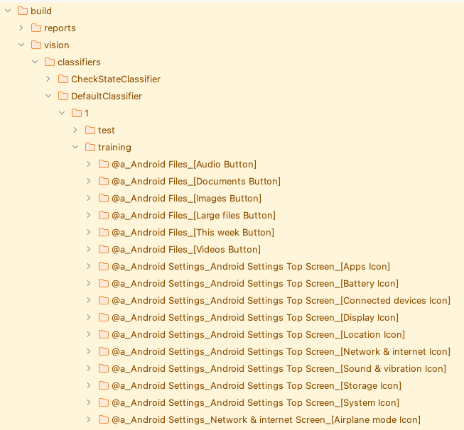

# Using DefaultClassifier (Vision)

Shirates/Vision classifies the image using DefaultClassifier.

## Sample code

[Getting samples](../../getting_samples.md)

### Classify1.kt

(`src/test/kotlin/tutorial/basic/Classify1.kt`)

```kotlin
    @Test
    @Order(10)
    fun classify() {

        scenario {
            case(1) {
                condition {
                    it.screenIs("[Android Settings Top Screen]")
                }.action {
                    v1 = it.detect("Network & internet")
                        .leftItem()
                    s1 = v1.classify()
                }.expectation {
                    s1.thisIs("[Network & internet Icon]", message = "label is $s1")
                }
            }
            case(2) {
                action {
                    s2 = v1.classifyFull()
                }.expectation {
                    s2.thisIs(
                        "@a[Android Settings App][Android Settings Top Screen][Network & internet Icon]",
                        message = "fullLabel is $s2"
                    )
                }
            }
        }
    }
```

Right-click on `classify()` and select `debug` to run test.

### Console output

```
136	[00:00:21]	2025/01/28 15:05:21.579	{classify-1}	0	-	[info]	+241	!	()	135_[134.png]_recognized_text_rectangles.png
137	[00:00:21]	2025/01/28 15:05:21.760	{classify-1}	0	-	[info]	+181	!	()	[detect] in 1.706 sec
2025-01-28 15:05:21.780 java[5081:84512] +[IMKClient subclass]: chose IMKClient_Modern
2025-01-28 15:05:21.780 java[5081:84512] +[IMKInputSession subclass]: chose IMKInputSession_Modern
138	[00:00:22]	2025/01/28 15:05:22.906	{classify-1}	0	-	[info]	+1146	!	()	<Network & internet>_leftItem.png
139	[00:00:22]	2025/01/28 15:05:22.958	{classify-1}	0	-	[info]	+52	!	()	[ImageClassifier/classifyImage] in 0.049 sec
140	[00:00:22]	2025/01/28 15:05:22.960	{classify-1}	0	-	[EXPECTATION]	+2	!	()	expectation
141	[00:00:22]	2025/01/28 15:05:22.962	{classify-1}	0	-	[OK]	+2	!	(thisIs)	label is [Network & internet Icon]
142	[00:00:22]	2025/01/28 15:05:22.962	{classify-2}	0	-	[CASE]	+0	!	()	(2)
143	[00:00:22]	2025/01/28 15:05:22.963	{classify-2}	0	-	[ACTION]	+1	!	()	action
144	[00:00:22]	2025/01/28 15:05:22.992	{classify-2}	0	-	[info]	+29	!	()	[ImageClassifier/classifyImage] in 0.029 sec
145	[00:00:22]	2025/01/28 15:05:22.994	{classify-2}	0	-	[EXPECTATION]	+2	!	()	expectation
146	[00:00:22]	2025/01/28 15:05:22.994	{classify-2}	0	-	[OK]	+0	!	(thisIs)	fullLabel is @a[Android Settings App][Android Settings Top Screen][Network & internet Icon]
```

### TestResults

You got test results files in TestResults directory(`~/Downloads/TestResults` is default).

### fullLabel and label

Open the directory `build/vision/classifiers/DefaultClassifier/training`.



`fullLabel` is the full description of the label.

```
@a[Android Settings App][Android Settings Top Screen][Network & internet Icon]
```

`label` is the short description.

```
[Network & internet Icon]
```

<br>
<hr>

### ImageLabelIs1.kt

(`src/test/kotlin/tutorial/basic/ImageLabelIs1.kt`)

```kotlin
    @Test
    @Order(10)
    fun imageLabelIs() {

        scenario {
            case(1) {
                condition {
                    it.screenIs("[Android Settings Top Screen]")
                }.action {
                    v1 = it.detect("Network & internet")
                        .leftItem()
                }.expectation {
                    v1.imageLabelIs("[Network & internet Icon]")
                }
            }
            case(2) {
                expectation {
                    v1.imageFullLabelIs("@a[Android Settings App][Android Settings Top Screen][Network & internet Icon]")
                }
            }
        }
    }
```

Right-click on `imageLabelIs()` and select `debug` to run test.

### Console output

```
138	[00:00:22]	2025/01/28 16:08:14.065	{imageLabelIs-1}	0	-	[EXPECTATION]	+1082	!	()	expectation
139	[00:00:22]	2025/01/28 16:08:14.069	{imageLabelIs-1}	0	-	[info]	+4	!	(imageLabelIs)	<Network & internet>_leftItem.png
140	[00:00:22]	2025/01/28 16:08:14.135	{imageLabelIs-1}	0	-	[info]	+66	!	(imageLabelIs)	[ImageClassifier/classifyImage] in 0.064 sec
141	[00:00:22]	2025/01/28 16:08:14.136	{imageLabelIs-1}	0	-	[info]	+1	!	(imageLabelIs)	label: [Network & internet Icon]
142	[00:00:22]	2025/01/28 16:08:14.137	{imageLabelIs-1}	0	-	[info]	+1	!	(imageLabelIs)	141_text_ "", bounds_ [84,867][146,913] width=63, height=47, centerX=115, centerY=890, rect_ [84, 867, 146, 913](w=63, h=47).png
143	[00:00:22]	2025/01/28 16:08:14.139	{imageLabelIs-1}	0	-	[OK]	+2	!	(imageLabelIs)	Image label of <Network & internet>:leftItem is [Network & internet Icon]
144	[00:00:22]	2025/01/28 16:08:14.141	{imageLabelIs-2}	0	-	[CASE]	+2	!	()	(2)
145	[00:00:22]	2025/01/28 16:08:14.141	{imageLabelIs-2}	0	-	[EXPECTATION]	+0	!	()	expectation
146	[00:00:22]	2025/01/28 16:08:14.187	{imageLabelIs-2}	0	-	[info]	+46	!	(imageFullLabelIs)	[ImageClassifier/classifyImage] in 0.044 sec
147	[00:00:22]	2025/01/28 16:08:14.188	{imageLabelIs-2}	0	-	[info]	+1	!	(imageFullLabelIs)	fullLabel: @a[Android Settings App][Android Settings Top Screen][Network & internet Icon]
148	[00:00:22]	2025/01/28 16:08:14.189	{imageLabelIs-2}	0	-	[info]	+1	!	(imageFullLabelIs)	147_text_ "", bounds_ [84,867][146,913] width=63, height=47, centerX=115, centerY=890, rect_ [84, 867, 146, 913](w=63, h=47).png
149	[00:00:22]	2025/01/28 16:08:14.191	{imageLabelIs-2}	0	-	[OK]	+2	!	(imageFullLabelIs)	Image fullLabel of <Network & internet>:leftItem is @a[Android Settings App][Android Settings Top Screen][Network & internet Icon]
```

<br>
<hr>

## Sample code

[Getting samples](../../getting_samples.md)

### FindImage1.kt

(`src/test/kotlin/tutorial/basic/FindImage1.kt`)

```kotlin
    @Test
    @Order(10)
    fun findImage() {

        scenario {
            case(1) {
                condition {
                    it.macro("[Android Settings Top Screen]")
                }.action {
                    withScrollDown {
                        v1 = it.findImage("[Network & internet Icon]")
                        v2 = it.findImage("[Display Icon]")
                    }
                }.expectation {
                    v1.isFound.thisIsTrue("[Network & internet Icon] is found.")
                    v2.isFound.thisIsTrue("[Display Icon] is found.")
                }
            }
        }
    }
```

### Running test

1. Set `os` in `testrun.global.properties` to run as android (default is android).

```properties
## OS --------------------
#os=ios
```

2. Right-click on `findImage()` and select `debug` to run test.

### Console output

```
126	[00:00:20]	2025/01/28 16:14:35.571	{findImage-1}	0	-	[ACTION]	+3390	!	()	action
127	[00:00:20]	2025/01/28 16:14:35.574	{findImage-1}	0	-	[info]	+3	!	()	Trying to find image with scroll. (label="[Network & internet Icon]")
128	[00:00:20]	2025/01/28 16:14:35.761	{findImage-1}	0	-	[info]	+187	!	()	127_[0, 0, 1079, 2399](w=1080, h=2400).png
129	[00:00:21]	2025/01/28 16:14:36.100	{findImage-1}	0	-	[info]	+339	!	()	normalized_template_img.png
130	[00:00:23]	2025/01/28 16:14:38.305	{findImage-1}	0	-	[info]	+2205	!	()	[findImage] in 2.731 sec
131	[00:00:23]	2025/01/28 16:14:38.308	{findImage-1}	0	-	[info]	+3	!	()	Trying to find image with scroll. (label="[Display Icon]")
132	[00:00:23]	2025/01/28 16:14:38.442	{findImage-1}	0	-	[info]	+134	!	()	131_[0, 0, 1079, 2399](w=1080, h=2400).png
133	[00:00:23]	2025/01/28 16:14:38.541	{findImage-1}	0	-	[info]	+99	!	()	normalized_template_img.png
134	[00:00:25]	2025/01/28 16:14:40.018	{findImage-1}	0	-	[info]	+1477	!	()	findImage("[Display Icon]") not found. (distance 0.61345655 > 0.1)
135	[00:00:25]	2025/01/28 16:14:40.020	{findImage-1}	0	-	[operate]	+2	!	(scrollDown)	Scroll down
136	[00:00:29]	2025/01/28 16:14:44.178	{findImage-1}	0	-	[info]	+4158	!	()	endOfScroll=false
137	[00:00:29]	2025/01/28 16:14:44.180	{findImage-1}	0	-	[info]	+2	!	()	136_[0, 0, 1079, 2399](w=1080, h=2400).png
138	[00:00:29]	2025/01/28 16:14:44.259	{findImage-1}	0	-	[info]	+79	!	()	normalized_template_img.png
139	[00:00:31]	2025/01/28 16:14:46.636	{findImage-1}	0	-	[info]	+2377	!	()	[findImage] in 8.328 sec
140	[00:00:31]	2025/01/28 16:14:46.640	{findImage-1}	0	-	[EXPECTATION]	+4	!	()	expectation
141	[00:00:31]	2025/01/28 16:14:46.643	{findImage-1}	0	-	[OK]	+3	!	(thisIsTrue)	[Network & internet Icon] is found.
142	[00:00:31]	2025/01/28 16:14:46.644	{findImage-1}	0	-	[OK]	+1	!	(thisIsTrue)	[Display Icon] is found.
```

### Link

- [index](../../../index.md)
