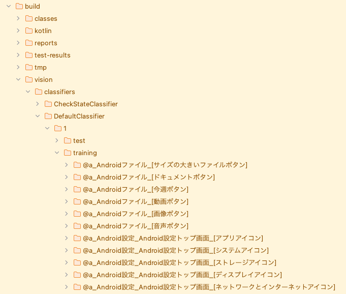

# DefaultClassifierを使用する (Vision)

Shirates/Vision はusing DefaultClassifierを使用して画像を認識します。

## サンプルコード

[サンプルの入手](../../getting_samples_ja.md)

### Classify1.kt

(`src/test/kotlin/tutorial/basic/Classify1.kt`)

```kotlin
    @Test
    @Order(10)
    fun classify() {

        scenario {
            case(1) {
                condition {
                    it.screenIs("[Android設定トップ画面]")
                }.action {
                    v1 = it.detect("ネットワークとインターネット")
                        .leftItem()
                    s1 = v1.classify()
                }.expectation {
                    s1.thisIs("[ネットワークとインターネットアイコン]", message = "label is $s1")
                }
            }
            case(2) {
                action {
                    s2 = v1.classifyFull()
                }.expectation {
                    s2.thisIs(
                        "@a_Android設定_Android設定トップ画面_[ネットワークとインターネットアイコン]",
                        message = "fullLabel is $s2"
                    )
                }
            }
        }
    }
```

`classify()`を右クリックして`debug`を選択してテストを実行します。

### コンソール出力

```
146	[00:00:22]	2025/02/19 22:41:37.137	{classify-1}	0	-	[info]	+278	!	()	145_[144.png]_recognized_text_rectangles.png
2025-02-19 22:41:37.343 java[23542:329672] +[IMKClient subclass]: chose IMKClient_Modern
2025-02-19 22:41:37.343 java[23542:329672] +[IMKInputSession subclass]: chose IMKInputSession_Modern
147	[00:00:22]	2025/02/19 22:41:37.346	{classify-1}	0	-	[info]	+209	!	()	[detect] in 2.212 sec
148	[00:00:22]	2025/02/19 22:41:37.407	{classify-1}	0	-	[info]	+61	!	()	[SegmentContainer] in 0.057 sec
149	[00:00:22]	2025/02/19 22:41:37.423	{classify-1}	0	-	[info]	+16	!	()	[split screenshot into segments] in 0.072 sec
150	[00:00:23]	2025/02/19 22:41:38.140	{classify-1}	0	-	[info]	+717	!	()	[SegmentContainer] in 0.716 sec
151	[00:00:23]	2025/02/19 22:41:38.323	{classify-1}	0	-	[info]	+183	!	()	split screenshot into segments. visionElements:2
152	[00:00:23]	2025/02/19 22:41:38.326	{classify-1}	0	-	[info]	+3	!	()	[rightLeftCore] in 0.976 sec
153	[00:00:23]	2025/02/19 22:41:38.331	{classify-1}	0	-	[info]	+5	!	()	<ネットワークとインターネット>[_左のアイテム].png
154	[00:00:23]	2025/02/19 22:41:38.392	{classify-1}	0	-	[info]	+61	!	()	[ImageClassifier/classifyImage] in 0.057 sec
155	[00:00:23]	2025/02/19 22:41:38.394	{classify-1}	0	-	[EXPECTATION]	+2	!	()	期待結果
156	[00:00:23]	2025/02/19 22:41:38.396	{classify-1}	0	-	[OK]	+2	!	(thisIs)	label is [ネットワークとインターネットアイコン]
157	[00:00:23]	2025/02/19 22:41:38.398	{classify-2}	0	-	[CASE]	+2	!	()	(2)
158	[00:00:23]	2025/02/19 22:41:38.402	{classify-2}	0	-	[ACTION]	+4	!	()	アクション
159	[00:00:23]	2025/02/19 22:41:38.438	{classify-2}	0	-	[info]	+36	!	()	[ImageClassifier/classifyImage] in 0.035 sec
160	[00:00:23]	2025/02/19 22:41:38.441	{classify-2}	0	-	[EXPECTATION]	+3	!	()	期待結果
161	[00:00:23]	2025/02/19 22:41:38.442	{classify-2}	0	-	[OK]	+1	!	(thisIs)	fullLabel is @a_Android設定_Android設定トップ画面_[ネットワークとインターネットアイコン]
```

### TestResults

TestResults ディレクトリ(デフォルトは`~/Downloads/TestResults`)にテスト結果のファイルが出力されます。

### fullLabel と label

ディレクトリ`build/vision/classifiers/DefaultClassifier/training`を開きます。



`fullLabel` ラベルの完全な記述です。

```
@a[Android設定アプリ][Android設定トップ画面][ネットワークとインターネットアイコン]
```

`label` は短い記述です。

```
[ネットワークとインターネットアイコン]
```

<br>
<hr>

## サンプルコード

[サンプルの入手](../../getting_samples_ja.md)

### ImageIs1.kt

(`src/test/kotlin/tutorial/basic/ImageIs1.kt`)

```kotlin
    @Test
    @Order(10)
    fun imageIs() {

        scenario {
            case(1) {
                condition {
                    it.screenIs("[Android設定トップ画面]")
                }.action {
                    v1 = it.detect("ネットワークとインターネット")
                        .leftItem()
                }.expectation {
                    v1.imageIs("[ネットワークとインターネットアイコン]")
                }
            }
            case(2) {
                expectation {
                    v1.imageFullLabelIs("@a_Android設定_Android設定トップ画面_[ネットワークとインターネットアイコン]")
                }
            }
        }
    }
```

`imageIs()`を右クリックし`debug`を選択してテストを実行します。

### コンソール出力

```
153	[00:00:24]	2025/02/19 22:58:02.598	{imageIs-1}	0	-	[EXPECTATION]	+4	!	()	期待結果
154	[00:00:24]	2025/02/19 22:58:02.601	{imageIs-1}	0	-	[info]	+3	!	(imageIs)	<ネットワークとインターネット>[_左のアイテム].png
155	[00:00:24]	2025/02/19 22:58:02.663	{imageIs-1}	0	-	[info]	+62	!	(imageIs)	[ImageClassifier/classifyImage] in 0.060 sec
156	[00:00:24]	2025/02/19 22:58:02.665	{imageIs-1}	0	-	[info]	+2	!	(imageIs)	label: [ネットワークとインターネットアイコン]
157	[00:00:24]	2025/02/19 22:58:02.668	{imageIs-1}	0	-	[info]	+3	!	(imageIs)	156_text_ "", bounds_ [84,880][147,925] width=64, height=46, centerX=116, centerY=903, rect_ [84, 880, 147, 925](w=64, h=46).png
158	[00:00:24]	2025/02/19 22:58:02.671	{imageIs-1}	0	-	[OK]	+3	!	(imageIs)	<ネットワークとインターネット>[:左のアイテム]の画像が"[ネットワークとインターネットアイコン]"であること
159	[00:00:24]	2025/02/19 22:58:02.672	{imageIs-2}	0	-	[CASE]	+1	!	()	(2)
160	[00:00:24]	2025/02/19 22:58:02.676	{imageIs-2}	0	-	[EXPECTATION]	+4	!	()	期待結果
161	[00:00:24]	2025/02/19 22:58:02.732	{imageIs-2}	0	-	[info]	+56	!	(imageFullLabelIs)	[ImageClassifier/classifyImage] in 0.053 sec
162	[00:00:24]	2025/02/19 22:58:02.734	{imageIs-2}	0	-	[info]	+2	!	(imageFullLabelIs)	fullLabel: @a_Android設定_Android設定トップ画面_[ネットワークとインターネットアイコン]
163	[00:00:24]	2025/02/19 22:58:02.735	{imageIs-2}	0	-	[info]	+1	!	(imageFullLabelIs)	162_text_ "", bounds_ [84,880][147,925] width=64, height=46, centerX=116, centerY=903, rect_ [84, 880, 147, 925](w=64, h=46).png
164	[00:00:24]	2025/02/19 22:58:02.738	{imageIs-2}	0	-	[OK]	+3	!	(imageFullLabelIs)	<ネットワークとインターネット>[:左のアイテム]の画像フルラベルが@a_Android設定_Android設定トップ画面_[ネットワークとインターネットアイコン]であること
```

<br>
<hr>

### FindImage1.kt

(`src/test/kotlin/tutorial/basic/FindImage1.kt`)

```kotlin
    @Test
    @Order(10)
    fun findImage() {

        scenario {
            case(1) {
                condition {
                    it.macro("[Android設定トップ画面]")
                }.action {
                    withScrollDown {
                        v1 = it.findImage("[ネットワークとインターネットアイコン]")
                        v2 = it.findImage("[ディスプレイアイコン]")
                    }
                }.expectation {
                    v1.isFound.thisIsTrue("[ネットワークとインターネットアイコン]が見つかりました。")
                    v2.isFound.thisIsTrue("[ディスプレイアイコン]が見つかりました。")
                }
            }
        }
    }
```

### テストを実行する

1. Androidで実行されるように`testrun.global.properties`の`os`を設定します (デフォルトは`android`
   なので単にコメントアウトします)。

```properties
## OS --------------------
#os=ios
```

2. `findImage()`を右クリックし`debug`を選択してテストを実行します。

### コンソール出力

```
129	[00:00:24]	2025/02/07 02:05:46.080	{findImage-1}	0	-	[ACTION]	+4575	!	()	アクション
130	[00:00:24]	2025/02/07 02:05:46.082	{findImage-1}	0	-	[info]	+2	!	()	Trying to find image with scroll. (label="[ネットワークとインターネットアイコン]")
131	[00:00:24]	2025/02/07 02:05:46.225	{findImage-1}	0	-	[info]	+143	!	()	130_[0, 0, 1079, 2399](w=1080, h=2400).png
132	[00:00:24]	2025/02/07 02:05:46.574	{findImage-1}	0	-	[info]	+349	!	()	normalized_template_img.png
2025-02-07 02:05:46.780 java[28200:754113] +[IMKClient subclass]: chose IMKClient_Modern
2025-02-07 02:05:46.780 java[28200:754113] +[IMKInputSession subclass]: chose IMKInputSession_Modern
133	[00:00:27]	2025/02/07 02:05:49.540	{findImage-1}	0	-	[info]	+2966	!	()	[findImage] in 3.458 sec
134	[00:00:27]	2025/02/07 02:05:49.541	{findImage-1}	0	-	[info]	+1	!	()	Trying to find image with scroll. (label="[ディスプレイアイコン]")
135	[00:00:27]	2025/02/07 02:05:49.647	{findImage-1}	0	-	[info]	+106	!	()	134_[0, 0, 1079, 2399](w=1080, h=2400).png
136	[00:00:27]	2025/02/07 02:05:49.751	{findImage-1}	0	-	[info]	+104	!	()	normalized_template_img.png
137	[00:00:30]	2025/02/07 02:05:52.090	{findImage-1}	0	-	[info]	+2339	!	()	findImage("[ディスプレイアイコン]") not found. (distance:0.6129697 > threshold:0.1)
138	[00:00:30]	2025/02/07 02:05:52.092	{findImage-1}	0	-	[operate]	+2	!	(scrollDown)	下方向へスクロールする
139	[00:00:34]	2025/02/07 02:05:56.306	{findImage-1}	0	-	[info]	+4214	!	()	endOfScroll=false
140	[00:00:34]	2025/02/07 02:05:56.307	{findImage-1}	0	-	[info]	+1	!	()	139_[0, 0, 1079, 2399](w=1080, h=2400).png
141	[00:00:34]	2025/02/07 02:05:56.385	{findImage-1}	0	-	[info]	+78	!	()	normalized_template_img.png
142	[00:00:37]	2025/02/07 02:05:59.316	{findImage-1}	0	-	[info]	+2931	!	()	[findImage] in 9.775 sec
143	[00:00:37]	2025/02/07 02:05:59.317	{findImage-1}	0	-	[EXPECTATION]	+1	!	()	期待結果
144	[00:00:37]	2025/02/07 02:05:59.318	{findImage-1}	0	-	[OK]	+1	!	(thisIsTrue)	[ネットワークとインターネットアイコン]が見つかりました。
145	[00:00:37]	2025/02/07 02:05:59.319	{findImage-1}	0	-	[OK]	+1	!	(thisIsTrue)	[ディスプレイアイコン]が見つかりました。
```

### Link

- [index](../../../index_ja.md)
