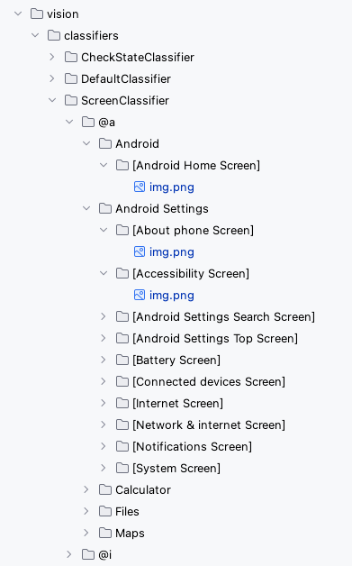
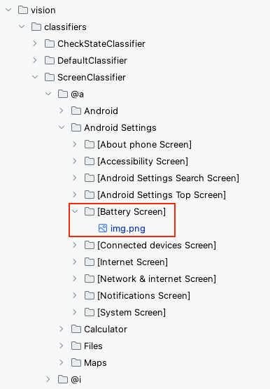

# Using ScreenClassifier (Vision)

Shirates/Vision combines two techniques to identify screens.

- Screen recognition by ScreenClassifier
- Text recognition by AI-OCR

## Settings up screen image templates

Put the screen image template under the directory `vision/classifiers/ScreenClassifier`.<br>
You can register one or more screen image templates in one screen name directory.



### Procedure

1. Capture the screen image. <br><br>
2. Create the directory corresponding to the screen name under the directory `ScreenClassifier`. Name the directory
   enclosed in brackets like `[Some Screen]`.<br><br>
   <br><br>
3. Paste the screen image on the screen directory. File name is arbitrary. You may leave it as `img.png`.<br><br>

When you want register files for Android and iOS, you should put annotation as follows.

```
img@a.png
img@i.png
```

Files with `@a` for Android and `@i` for iOS will be given higher priority in test execution.

<br>

Now you can use `screenIs` function.
(See [Screen assertion](../function_property/asserting_existence/screen_assertion.md))

### Link

- [index](../../../index.md)
