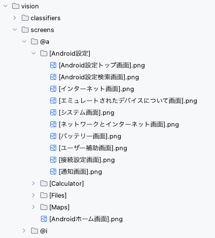
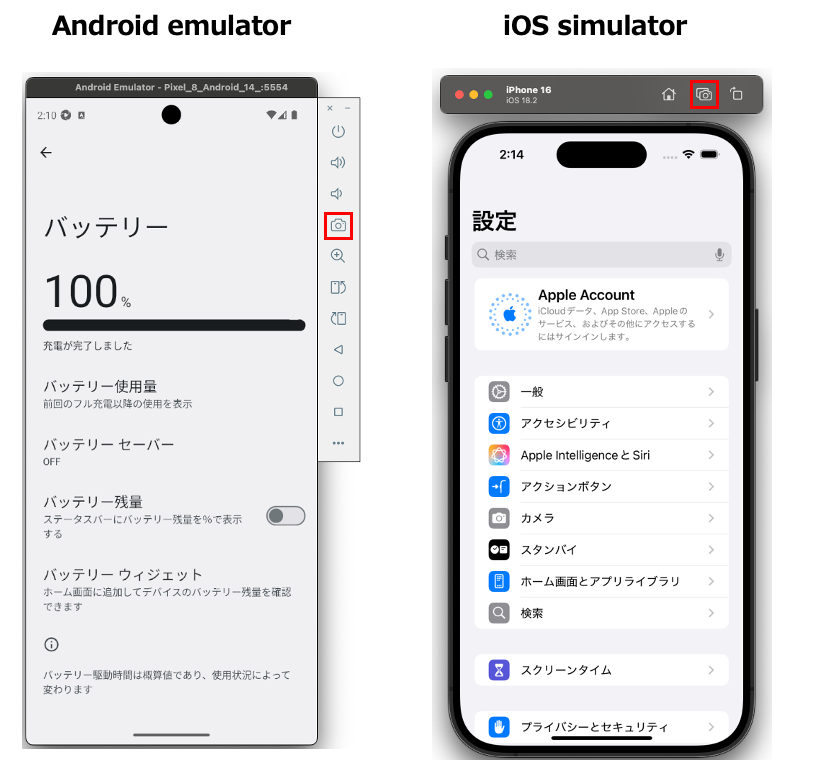
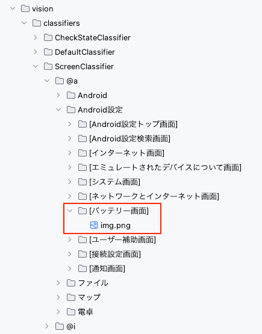

# ScreenClassifierを使用する (Vision)

Shirates/Visionは2つのテクニックを使用して画面を識別します。

- ScreenClassifierによる画像認識
- AI-OCRによるテキスト認識

## 画面イメージテンプレートのセットアップ

`vision/classifiers/ScreenClassifier`ディレクトリ配下に画面イメージテンプレートを配置します。<br>
1つの画面名に対して画面イメージテンプレートを1つ以上登録することができます。



### 登録手順

1. 画面イメージをキャプチャします。 <br><br>
2. 画面名に対応するディレクトリを`ScreenClassifier`ディレクトリ配下に作成します。ディレクトリ名は`[〇〇画面]`
   のように角括弧で囲みます。<br><br>
   <br><br>
3. 画面名のディレクトリに画面イメージをペーストします。ファイル名は任意です。`img.png`のままでもかまいません。<br><br>

同じ画面名に対してAndroidとiOSで別々の画像を登録したい場合は

```
img@a.png
img@i.png
```

のようにアノテーションを付与します。（Androidの場合は`@a`、iOSの場合は`@i`）<br>

<br>

上記の設定により`screenIs`関数が使用できるようになります。
(参照 [画面が表示されていることの検証](../function_property/asserting_existence/screen_assertion_ja.md))

### Link

- [index](../../../index_ja.md)
