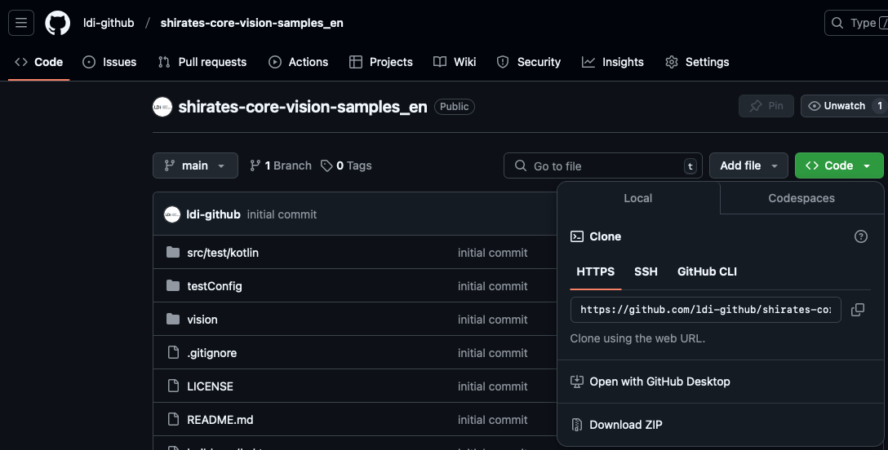

# Getting samples

Get samples from [shirates-core-vision-samples_en](https://github.com/ldi-github/shirates-core-vision-samples_en)



Download the zip file or git clone.

```
git clone https://github.com/ldi-github/shirates-core-vision-samples_en.git
```

Open `build.gradle.kts` with IntelliJ IDEA. <br>


Refer these sample codes while reading tutorial.

### Link

- [index](../index.md)
