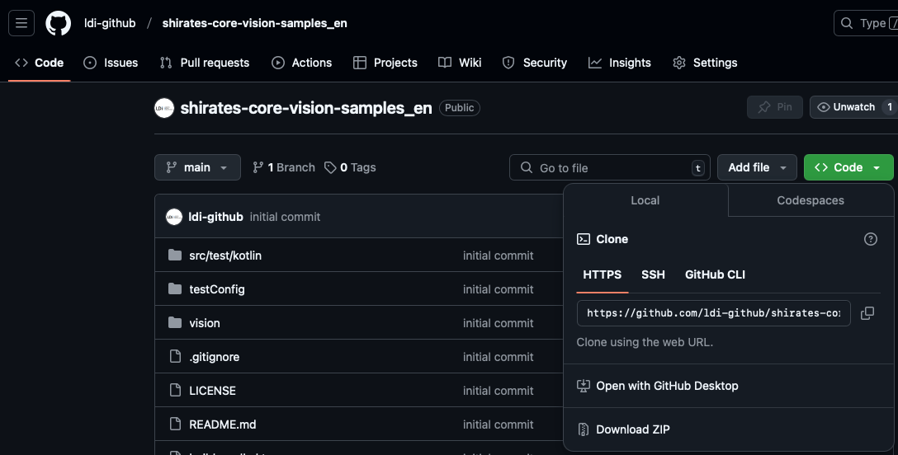
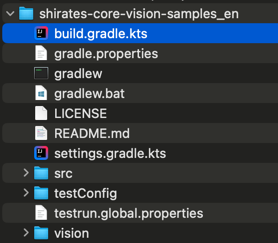

# サンプルの入手

[shirates-core-vision-samples_en](https://github.com/ldi-github/shirates-core-vision-samples_en)からサンプルを入手してください。



zipファイルをダウンロードするか、git cloneを実行してください。

```
git clone https://github.com/ldi-github/shirates-core-vision-samples_en.git
```

IntelliJ IDEAで`build.gradle.kts`を開きます。 <br>


チュートリアルを読む際にこれらのサンプルコードを参照してください。

### Link

- [index](../index_ja.md)
