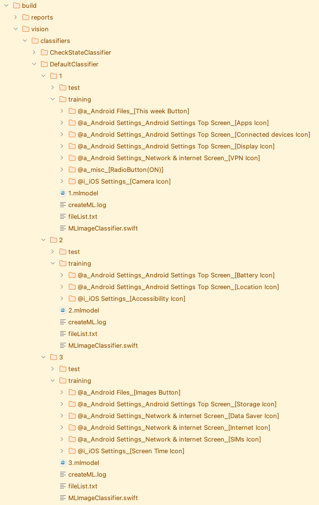

# Classifier sharding to reduce the learning time (Vision)

The more image data a classifier needs to train on, the longer it takes to train: adding or updating one image will
cause the classifier to train again on all image data. This is inefficient during test code development, as image data
is frequently added or updated, requiring a longer training time each time.

**Shirates/Vision** has a feature called **Classifier Sharding** that splits the training data for a classifier.
When enabled, the data folder for training classifiers is split into multiple folders. The image data to be trained will
be copied to one of the training folders, depending on the file name. Only those classifiers whose training data has
changed are re-trained, thus reducing the time required for re-training.

## Enabling the feature

In the properties file, set [visionClassifierShardNodeCount](../../../common/parameter/parameters.md)

### Example 1

Set DefaultClassifier=5, ScreenClassifier=3.

```properties
visionClassifierShardNodeCount=DefaultClassifier=5:ScreenClassifier=3
```

Run the test. Then data folders are split into multiple, and learnings are executed.


Each data folder will contain dispersion of image data for training.



### Example 2

Split all classifiers into 2.

```properties
visionClassifierShardNodeCount=2
```

### Example 3

Set ScreenClassifier to be divided into 10.

```properties
visionClassifierShardNodeCount=ScreenClassifier=10
```

In this case, the following warning it output.

```
..
42	[00:00:05]	2025/04/26 22:41:07.190	{}	0	-	[WARN]	+22	C	()	Learning skipped. Too few labels in training directory. (ScreenClassifier(6), labelCount=1, trainingDirectory=/Users/wave1008/github/ldi-github/shirates-core-vision-samples_en/build/vision/classifiers/ScreenClassifier/6/training, visionClassifierShardNodeCount=ScreenClassifier=10)
43	[00:00:05]	2025/04/26 22:41:07.191	{}	0	-	[WARN]	+1	C	()	Learning skipped. Too few labels in training directory. (ScreenClassifier(7), labelCount=1, trainingDirectory=/Users/wave1008/github/ldi-github/shirates-core-vision-samples_en/build/vision/classifiers/ScreenClassifier/7/training, visionClassifierShardNodeCount=ScreenClassifier=10)
44	[00:00:05]	2025/04/26 22:41:07.191	{}	0	-	[WARN]	+0	C	()	Learning skipped. Too few labels in training directory. (ScreenClassifier(8), labelCount=1, trainingDirectory=/Users/wave1008/github/ldi-github/shirates-core-vision-samples_en/build/vision/classifiers/ScreenClassifier/8/training, visionClassifierShardNodeCount=ScreenClassifier=10)
45	[00:00:05]	2025/04/26 22:41:07.192	{}	0	-	[WARN]	+1	C	()	Learning skipped. Too few labels in training directory. (ScreenClassifier(9), labelCount=1, trainingDirectory=/Users/wave1008/github/ldi-github/shirates-core-vision-samples_en/build/vision/classifiers/ScreenClassifier/9/training, visionClassifierShardNodeCount=ScreenClassifier=10)
..
```

Since at least two labels are required per data folder for training data, either increase the data so that the number of
labels is greater than two or set the number of divisions small enough.

### Link

- [index](../../../index.md)

