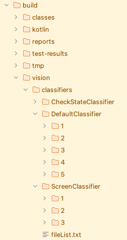
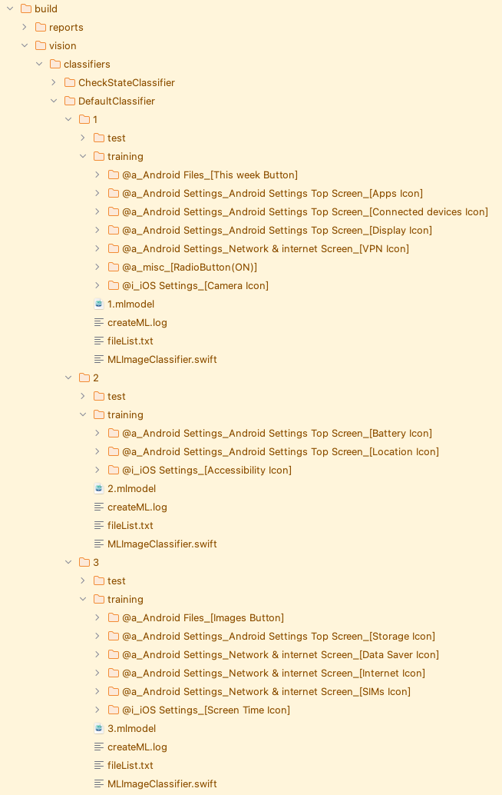

# 分類器のシャーディングによる学習時間の短縮 (Vision)

分類器(Classifier)
に学習させる画像データが増えると、学習に必要な時間が長くなります。1つの画像データを追加、あるいは更新すると、すべての画像データを使用して再度分類器の学習が行われます。テストコードの開発時は頻繁に画像データを追加・更新するため、その都度学習のため長い時間が必要となり、非効率です。<br>

**Shirates/Vision**には分類器の学習データを分割する機能（**Classifier Sharding: 分類器シャーディング**）があります。<br>
この機能を有効にすると分類器の学習用データフォルダが複数に分割されます。学習する画像データはファイル名によっていずれか1つの学習用データフォルダにコピーされます。学習用データに変更があった分類器のみが再学習されるため、再学習に必要な時間を短縮することができます。<br>

## 有効化の方法

propertiesファイルでパラメーター [visionClassifierShardNodeCount](../../../common/parameter/parameters_ja.md) を設定します。

### 例1

DefaultClassifierを5つに、ScreenClassifierを3つに分割するように設定します。

```properties
visionClassifierShardNodeCount=DefaultClassifier=5:ScreenClassifier=3
```

テストを実行するとデータフォルダが分割されて学習が実行されます。



各データフォルダには学習用の画像データが分散して配置されます。



### 例2

すべてのClassifierを2つに分割します。

```properties
visionClassifierShardNodeCount=2
```

### 例3

ScreenClassifierを10に分割するように設定します。

```properties
visionClassifierShardNodeCount=ScreenClassifier=10
```

この場合、以下の警告が出力されました。

```
..
41	[00:00:02]	2025/04/26 22:46:01.739	{}	0	-	[WARN]	+20	C	()	Learning skipped. Too few labels in training directory. (ScreenClassifier(3), labelCount=1, trainingDirectory=/Users/wave1008/github/ldi-github/shirates-core-vision-samples_ja/build/vision/classifiers/ScreenClassifier/3/training, visionClassifierShardNodeCount=ScreenClassifier=10)
42	[00:00:02]	2025/04/26 22:46:01.745	{}	0	-	[WARN]	+6	C	()	Learning skipped. Too few labels in training directory. (ScreenClassifier(4), labelCount=1, trainingDirectory=/Users/wave1008/github/ldi-github/shirates-core-vision-samples_ja/build/vision/classifiers/ScreenClassifier/4/training, visionClassifierShardNodeCount=ScreenClassifier=10)
43	[00:00:02]	2025/04/26 22:46:01.751	{}	0	-	[WARN]	+6	C	()	Learning skipped. Too few labels in training directory. (ScreenClassifier(6), labelCount=1, trainingDirectory=/Users/wave1008/github/ldi-github/shirates-core-vision-samples_ja/build/vision/classifiers/ScreenClassifier/6/training, visionClassifierShardNodeCount=ScreenClassifier=10)
44	[00:00:02]	2025/04/26 22:46:01.762	{}	0	-	[WARN]	+11	C	()	Learning skipped. Too few labels in training directory. (ScreenClassifier(10), labelCount=0, trainingDirectory=/Users/wave1008/github/ldi-github/shirates-core-vision-samples_ja/build/vision/classifiers/ScreenClassifier/10/training, visionClassifierShardNodeCount=ScreenClassifier=10)
..
```

学習用データのラベルはデータフォルダあたり最低2つ必要なので、データを増やしてラベル数が2つ以上になるようにするか、分割数を十分小さく設定してください。

### Link

- [index](../../../index_ja.md)

