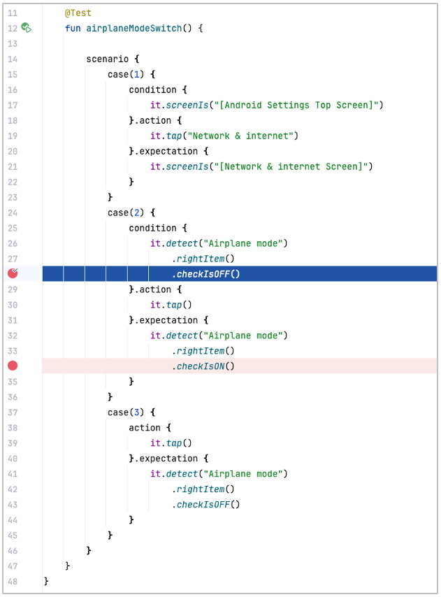
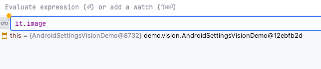
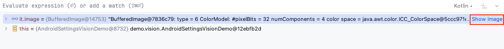
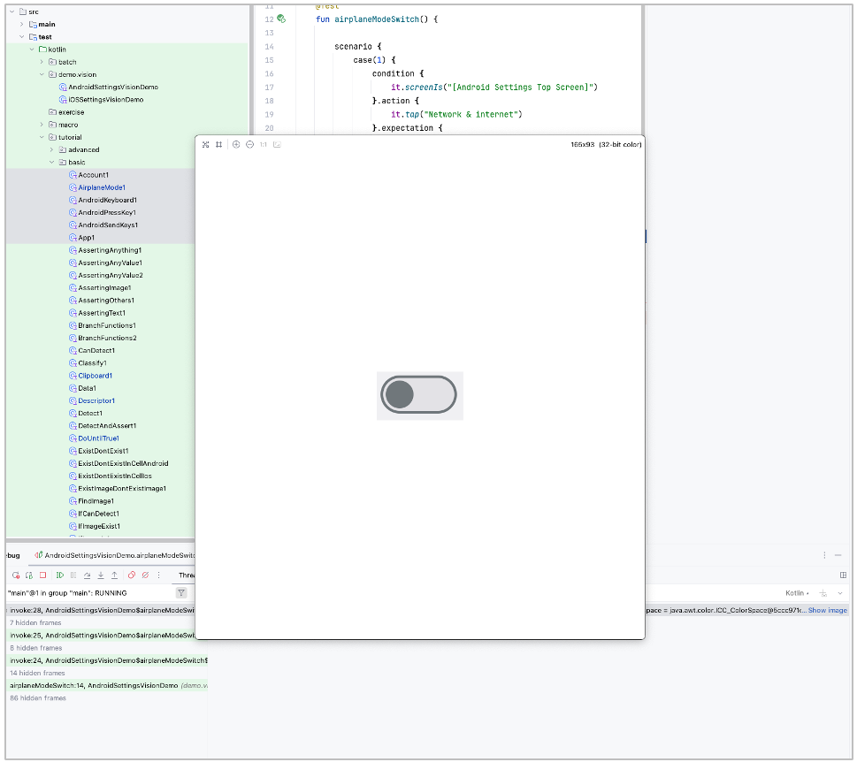

# 画像をデバッガで確認する (Vision)

デバッグ中に `VisionElement` の画像を確認することができます。

1. ブレークポイントを設定します。  
2. ウォッチ式に `it.image` を追加します。  
3. `Show image` をクリックします。  
4. ウィンドウが表示され画像を確認できます。

### Link

- [index](../../../index_ja.md)

