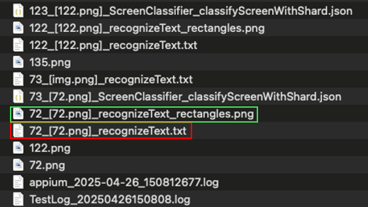

# Watching recognizeText.txt (Vision)

You can see recognized texts by AI-OCR in **recognizeText.txt**.

### TestResults



### recognized_text_rectangles.png


### recognizeText.txt

```text
x	y	width	height	confidence	text
35	48	252	47	0.5	308 0 0 0
67	435	342	90	1.0	Settings
97	634	457	68	1.0	Q Search settings
76	844	553	80	1.0	= Network & internet
189	912	359	35	1.0	Mobile, Wi-Fi, hotspot
184	1074	454	49	1.0	Connected devices
184	1141	292	40	1.0	Bluetooth, pairing
85	1325	76	53	0.5	88:
153	1303	166	62	0.5	Apps
184	1370	594	44	1.0	Assistant, recent apps, default apps
189	1537	301	49	1.0	Notifications
188	1599	557	40	1.0	Notification history, conversations
171	1770	189	53	1.0	Battery
184	1833	98	35	1.0	100%
161	2000	211	53	1.0	Storage
184	2062	400	40	1.0	59% used - 3.30 GB free
184	2229	418	49	1.0	Sound & vibration
184	2296	522	40	1.0	Volume, haptics, Do Not Disturb
```

### Link

- [index](../../../index.md)

