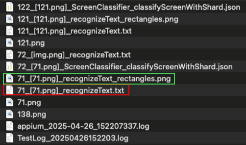
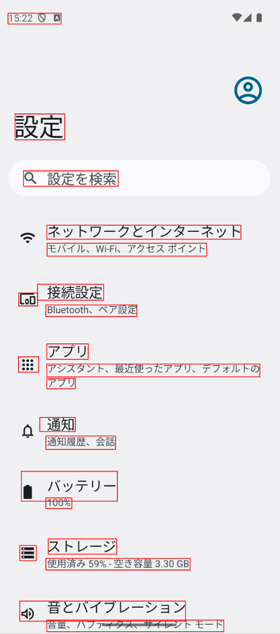

# recognizeText.txtを確認する (Vision)

AI-OCRが認識したテキスト情報を **recognizeText.txt** で確認することができます。

### TestResults



### recognized_text_rectangles.png



### recognizeText.txt

```text
x	y	width	height	confidence	text
40	49	202	41	1.0	15:22 G 2
67	431	189	98	0.5	設定
99	647	360	58	0.5	Q 設定を検索
188	853	738	53	1.0	ネットワークとインターネット
189	921	607	49	1.0	モバイル、Wi-Fi、アクセス ポイント
81	1110	72	49	0.5	Loo
152	1077	252	60	0.5	接続設定
184	1155	346	44	1.0	Bluetooth、ペア設定
80	1352	77	58	0.5	！：
188	1303	157	58	1.0	アプリ
188	1433	108	40	1.0	アプリ
188	1379	810	49	1.0	アシスタント、最近使ったアプリ、デフォルトの
161	1582	135	53	0.5	通知
184	1652	265	51	0.5	通知履歴、会話
91	1786	365	113	1.0	■ バッテリー
184	1887	99	40	1.0	100%
85	2067	63	58	0.5	=
193	2042	261	58	1.0	ストレージ
184	2116	549	44	1.0	使用済み 59%-空き容量 3.30 GB
85	2278	630	76	0.5	4） 音とバイブレーション
188	2350	673	44	0.5	音量、ハプティクス、サイレシト モード
```

### Link

- [index](../../../index_ja.md)

