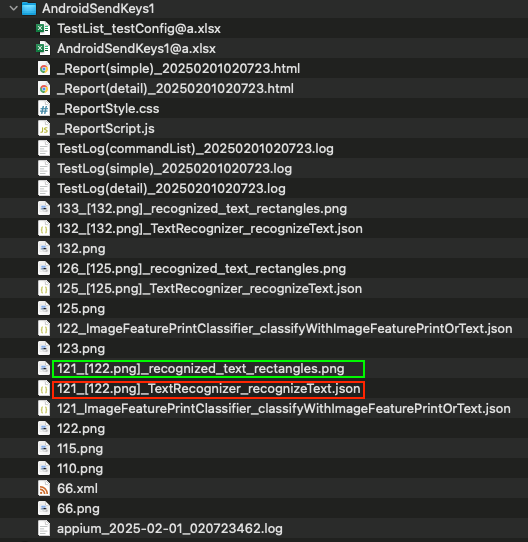
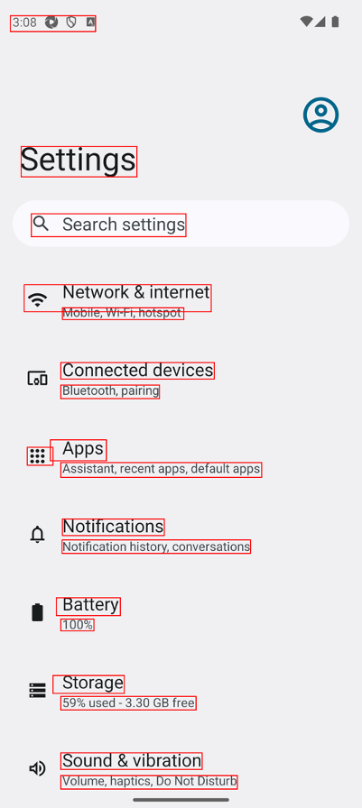

# Watching recognizeText.json (Vision)

You can see recognized texts by AI-OCR in **recognizeText.json**.

### testresults directory



### recognized_text_rectangles.png



### recognizeText.json

```json
{
  "language" : "",
  "candidates" : [
    {
      "rect" : {
        "width" : 194,
        "x" : 35,
        "height" : 51,
        "y" : 46
      },
      "text" : "2:07 0 A",
      "confidence" : 0.5
    },
    {
      "confidence" : 1,
      "rect" : {
        "y" : 435,
        "width" : 342,
        "x" : 67,
        "height" : 90
      },
      "text" : "Settings"
    },
    {
      "confidence" : 1,
      "rect" : {
        "height" : 58,
        "x" : 99,
        "width" : 454,
        "y" : 642
      },
      "text" : "Q Search settings"
    },
    {
      "confidence" : 1,
      "rect" : {
        "width" : 553,
        "x" : 76,
        "height" : 80,
        "y" : 844
      },
      "text" : "= Network & internet"
    },
    {
      "confidence" : 1,
      "text" : "Mobile, Wi-Fi, hotspot",
      "rect" : {
        "y" : 912,
        "width" : 360,
        "height" : 35,
        "x" : 189
      }
    },
    {
      "text" : "Connected devices",
      "rect" : {
        "x" : 184,
        "height" : 49,
        "y" : 1074,
        "width" : 454
      },
      "confidence" : 1
    },
    {
      "confidence" : 1,
      "text" : "Bluetooth, pairing",
      "rect" : {
        "width" : 292,
        "x" : 184,
        "height" : 40,
        "y" : 1141
      }
    },
    {
      "confidence" : 0.5,
      "rect" : {
        "height" : 53,
        "y" : 1325,
        "x" : 85,
        "width" : 76
      },
      "text" : "88:"
    },
    {
      "text" : "Apps",
      "rect" : {
        "x" : 153,
        "height" : 62,
        "y" : 1303,
        "width" : 166
      },
      "confidence" : 0.5
    },
    {
      "confidence" : 1,
      "text" : "Assistant, recent apps, default apps",
      "rect" : {
        "height" : 44,
        "x" : 184,
        "width" : 594,
        "y" : 1370
      }
    },
    {
      "confidence" : 1,
      "text" : "Notifications",
      "rect" : {
        "width" : 301,
        "y" : 1537,
        "x" : 189,
        "height" : 49
      }
    },
    {
      "text" : "Notification history, conversations",
      "confidence" : 1,
      "rect" : {
        "height" : 40,
        "x" : 188,
        "y" : 1599,
        "width" : 557
      }
    },
    {
      "text" : "Battery",
      "rect" : {
        "y" : 1770,
        "x" : 171,
        "height" : 53,
        "width" : 189
      },
      "confidence" : 1
    },
    {
      "text" : "100%",
      "confidence" : 1,
      "rect" : {
        "width" : 98,
        "y" : 1833,
        "height" : 35,
        "x" : 184
      }
    },
    {
      "text" : "Storage",
      "confidence" : 1,
      "rect" : {
        "y" : 2003,
        "width" : 212,
        "height" : 50,
        "x" : 161
      }
    },
    {
      "text" : "40% used - 9.60 GB free",
      "rect" : {
        "x" : 184,
        "y" : 2062,
        "height" : 40,
        "width" : 400
      },
      "confidence" : 1
    },
    {
      "rect" : {
        "width" : 418,
        "y" : 2229,
        "height" : 49,
        "x" : 184
      },
      "confidence" : 1,
      "text" : "Sound & vibration"
    },
    {
      "text" : "Volume, haptics, Do Not Disturb",
      "confidence" : 1,
      "rect" : {
        "width" : 522,
        "x" : 184,
        "y" : 2296,
        "height" : 40
      }
    }
  ],
  "input" : "\/Users\/wave1008\/Downloads\/TestResults\/testConfig@a\/2025-02-01_020414\/AndroidSendKeys1\/122.png"
}
```

### Link

- [index(Vision)](../../../index.md)
- [index(Classic)](../../../classic/index.md)

