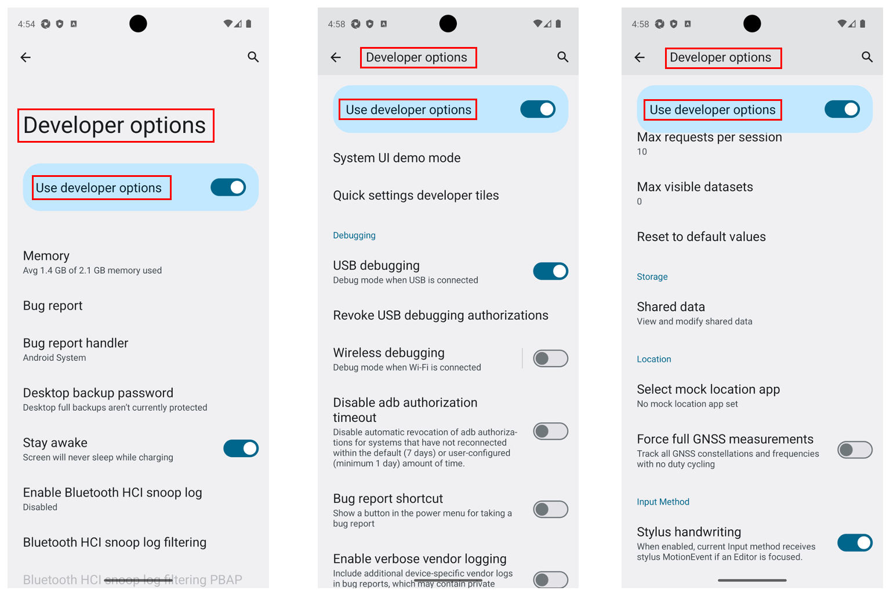
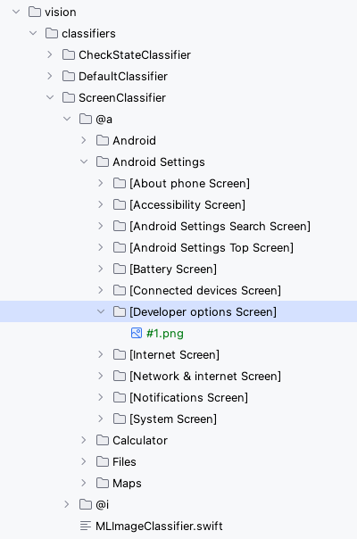
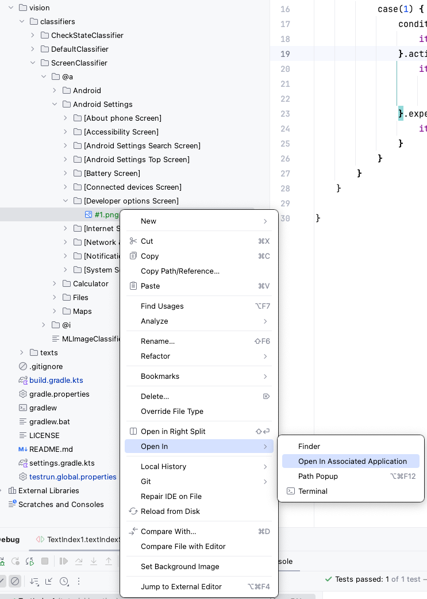
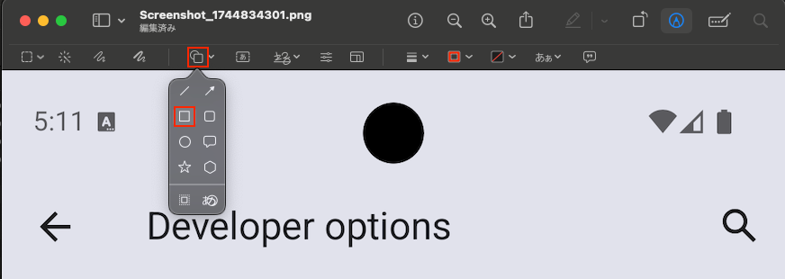
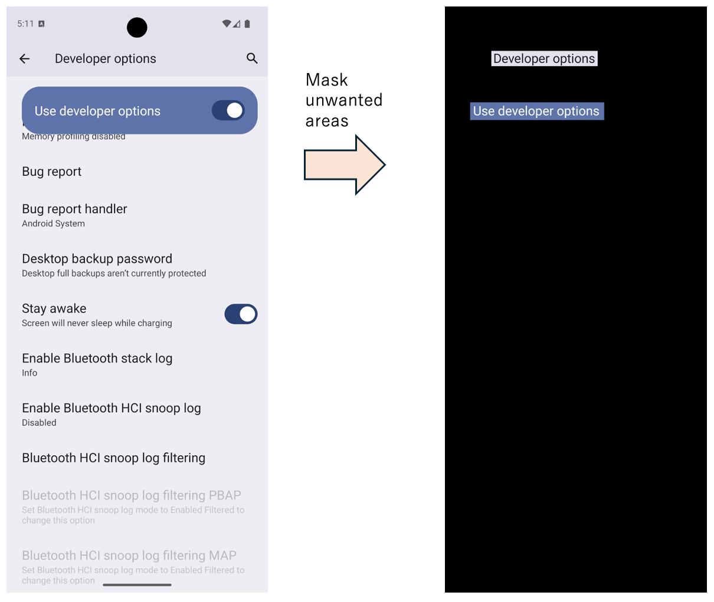
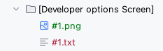
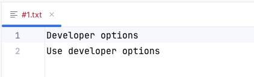

# Improving screen recognition accuracy with TextIndex (Vision)

Using [ScreenClassifier](../../basic/text_and_image_recognition/using_screen_classifier.md)
allows you to bind the screen image to the screen name with machine learning, and you can get screen name from the
screenshot.<br>
If each screen has a distinctive layout, the ScreenClassifier works well.<br>
On the other hand, if there are many screens with similar layouts, misrecognition is likely to occur and there are cases
where it does not work.
<br>
Adding more images to be trained may improve recognition accuracy in certain situations, but it may not improve
recognition accuracy as much as expected. This is not a good approach because machine learning a large number of images
increases the time required for training.
A different approach is needed for stable operation of large-scale automated testing.

Shirates/Vision can use **TextIndex** to solve this problem.

## TextIndex

The text on the screen is extracted by AI-OCR and this is used as an index for screen recognition.

### TextIndex requirements

The text to be used as the TextIndex must be fixedly displayed on the screen, i.e., it must always be displayed even if
the screen content is rewritten or scrolled.

For example, the `Developer options screen` of the Android settings application scrolls up and down, but there is text
that is always visible.



Thus, the appropriate TextIndex for this screen would be a combination of the following text

- `Developer options`
- `Use developer options`

<br>

### Example of creating TextIndex

1. Create a directory named `[Developer options Screen]` under the ScreenClassifier directory.
2. Take a screenshot of the screen and place the image file under the directory of the screen name. Name the image file
   starting with `#`.
   The image file should have a name starting with `#`.



3. Click the image and select `Open In > Open In Associated Application` to open the Preview App.



4. Switch to edit mode.


5. Insert a rectangle shape.



5. Masks all but the text index portion. Save the file.
   

4. Run any test in Shirates. AI-OCR will read the text from the image and create a TextIndex file.



5. The contents of the text index file will look like this.



## Sample code

[Getting samples](../../getting_samples.md)

### in_action/TextIndex1.kt

`src/test/kotlin/tutorial/inaction/TextIndex1.kt`

```kotlin
    @Test
    fun textIndexScenario1() {

        scenario {
            case(1) {
                condition {
                    it.macro("[Android Settings Top Screen]")
                }.action {
                    it.flickAndGoDown()
                        .tapWithScrollDown("System")
                        .tapWithScrollDown("Developer options")
                }.expectation {
                    it.screenIs("[Developer options Screen]")
                }
            }
        }
    }
```

This sample code does the following.

1. Launch the Android Settings app.
2. Tap `System`.
3. Tap `Developer options`.
4. Verify that the screen name displayed is `[Developer options screen]`.

When the sample code is executed, the following log will be output.

```
...
64	[00:00:13]	2025/04/17 05:21:45.969	{}	0	-	[info]	+421	C	()	Running device found. (udid=emulator-5554, avd=Pixel_8_Android_14)
65	[00:00:13]	2025/04/17 05:21:45.970	{}	0	-	[info]	+1	C	()	Connected device found. (Pixel_8_Android_14:5554, Android 14, emulator-5554)
66	[00:00:13]	2025/04/17 05:21:46.088	{}	0	-	[info]	+118	C	()	Starting Appium Server.
67	[00:00:13]	2025/04/17 05:21:46.089	{}	0	-	[info]	+1	C	()	appium --session-override --relaxed-security --log /Users/wave1008/Downloads/TestResults/testConfig@a/2025-04-17_052132/TextIndex1/appium_2025-04-17_052145972.log --port 4721
68	[00:00:16]	2025/04/17 05:21:49.368	{}	0	-	[info]	+3279	C	()	Appium Server started. (pid=26115, port=4721)
69	[00:00:17]	2025/04/17 05:21:50.386	{}	0	-	[info]	+1018	C	()	Connecting to Appium Server.(http://127.0.0.1:4721/)
70	[00:00:25]	2025/04/17 05:21:57.994	{}	0	-	[info]	+7608	C	()	implicitlyWaitSeconds: 5.0
71	[00:00:25]	2025/04/17 05:21:58.122	{}	0	-	[info]	+128	C	()	(settings) always_finish_activities: 0
72	[00:00:25]	2025/04/17 05:21:58.561	{}	0	-	[info]	+439	C	()	Syncing screen.(isSame: false, changed: false, matchRate: 0.0, distance=1.0)
73	[00:00:26]	2025/04/17 05:21:59.681	{}	0	-	[info]	+1120	C	()	Syncing screen.(isSame: false, changed: true, matchRate: 0.9391859024763107, distance=0.06081409752368927)
74	[00:00:27]	2025/04/17 05:22:00.557	{}	0	-	[info]	+876	C	()	Syncing screen.(isSame: true, changed: true, matchRate: 1.0, distance=0.0)
75	[00:00:27]	2025/04/17 05:22:00.558	{}	0	-	[screenshot]	+1	C	()	screenshot: 75.png
76	[00:00:28]	2025/04/17 05:22:01.113	{}	0	-	[info]	+555	C	()	75_[75.png]_recognizeText_rectangles.png
2025-04-17 05:22:01.319 java[26079:835863] +[IMKClient subclass]: chose IMKClient_Modern
2025-04-17 05:22:01.319 java[26079:835863] +[IMKInputSession subclass]: chose IMKInputSession_Modern
77	[00:00:28]	2025/04/17 05:22:01.643	{}	0	-	[info]	+530	C	()	[Android Settings Top Screen] found by matchTextScoreRate
78	[00:00:28]	2025/04/17 05:22:01.643	{}	0	-	[info]	+0	C	()	[recognizeScreen] in 1.083 sec
79	[00:00:28]	2025/04/17 05:22:01.644	{}	0	-	[info]	+1	C	()	currentScreen=[Android Settings Top Screen]
80	[00:00:28]	2025/04/17 05:22:01.644	{}	0	-	[info]	+0	C	()	AppiumDriver initialized.
81	[00:00:28]	2025/04/17 05:22:01.645	{}	0	-	[-]	+1	C	()	testMode: Vision
82	[00:00:28]	2025/04/17 05:22:01.645	{}	0	-	[-]	+0	C	()	testrun: testrun.global.properties
83	[00:00:28]	2025/04/17 05:22:01.646	{}	0	-	[-]	+1	C	()	testConfigName: testConfig@a(/Users/wave1008/github/ldi-github/shirates-core-vision-samples_en/testConfig/android/testConfig@a.json)
84	[00:00:28]	2025/04/17 05:22:01.648	{}	0	-	[-]	+2	C	()	profileName: Pixel 8(Android 14)
85	[00:00:28]	2025/04/17 05:22:01.649	{}	0	-	[-]	+1	C	()	appIconName: Settings
86	[00:00:28]	2025/04/17 05:22:01.649	{}	0	-	[-]	+0	C	()	(capabilities)
87	[00:00:28]	2025/04/17 05:22:01.651	{}	0	-	[-]	+2	C	()	appium:newCommandTimeout: 300
88	[00:00:28]	2025/04/17 05:22:01.651	{}	0	-	[-]	+0	C	()	appium:takesScreenshot: true
89	[00:00:28]	2025/04/17 05:22:01.652	{}	0	-	[-]	+1	C	()	appium:warnings: {}
90	[00:00:28]	2025/04/17 05:22:01.653	{}	0	-	[-]	+1	C	()	appium:deviceApiLevel: 34
91	[00:00:28]	2025/04/17 05:22:01.657	{}	0	-	[-]	+4	C	()	appium:automationName: UiAutomator2
92	[00:00:28]	2025/04/17 05:22:01.657	{}	0	-	[-]	+0	C	()	appium:locationContextEnabled: false
93	[00:00:28]	2025/04/17 05:22:01.658	{}	0	-	[-]	+1	C	()	appium:deviceScreenSize: 1080x2400
94	[00:00:28]	2025/04/17 05:22:01.658	{}	0	-	[-]	+0	C	()	appium:deviceManufacturer: Google
95	[00:00:28]	2025/04/17 05:22:01.659	{}	0	-	[-]	+1	C	()	appium:enforceXPath1: true
96	[00:00:28]	2025/04/17 05:22:01.659	{}	0	-	[-]	+0	C	()	appium:udid: emulator-5554
97	[00:00:28]	2025/04/17 05:22:01.659	{}	0	-	[-]	+0	C	()	appium:pixelRatio: 2.625
98	[00:00:28]	2025/04/17 05:22:01.660	{}	0	-	[-]	+1	C	()	platformName: ANDROID
99	[00:00:28]	2025/04/17 05:22:01.660	{}	0	-	[-]	+0	C	()	appium:networkConnectionEnabled: true
100	[00:00:28]	2025/04/17 05:22:01.661	{}	0	-	[-]	+1	C	()	appium:locale: US
101	[00:00:28]	2025/04/17 05:22:01.661	{}	0	-	[-]	+0	C	()	appium:deviceScreenDensity: 420
102	[00:00:28]	2025/04/17 05:22:01.662	{}	0	-	[-]	+1	C	()	appium:viewportRect: {left=0, top=132, width=1080, height=2268}
103	[00:00:28]	2025/04/17 05:22:01.662	{}	0	-	[-]	+0	C	()	appium:language: en
104	[00:00:28]	2025/04/17 05:22:01.663	{}	0	-	[-]	+1	C	()	appium:avd: Pixel_8_Android_14
105	[00:00:28]	2025/04/17 05:22:01.664	{}	0	-	[-]	+1	C	()	appium:deviceModel: sdk_gphone64_arm64
106	[00:00:28]	2025/04/17 05:22:01.665	{}	0	-	[-]	+1	C	()	appium:platformVersion: 14
107	[00:00:28]	2025/04/17 05:22:01.665	{}	0	-	[-]	+0	C	()	appium:databaseEnabled: false
108	[00:00:28]	2025/04/17 05:22:01.666	{}	0	-	[-]	+1	C	()	appium:deviceUDID: emulator-5554
109	[00:00:28]	2025/04/17 05:22:01.666	{}	0	-	[-]	+0	C	()	appium:statBarHeight: 132
110	[00:00:28]	2025/04/17 05:22:01.666	{}	0	-	[-]	+0	C	()	appium:webStorageEnabled: false
111	[00:00:28]	2025/04/17 05:22:01.667	{}	0	-	[-]	+1	C	()	appium:appActivity: com.android.settings.Settings
112	[00:00:28]	2025/04/17 05:22:01.667	{}	0	-	[-]	+0	C	()	appium:deviceName: emulator-5554
113	[00:00:28]	2025/04/17 05:22:01.667	{}	0	-	[-]	+0	C	()	appium:javascriptEnabled: true
114	[00:00:28]	2025/04/17 05:22:01.668	{}	0	-	[-]	+1	C	()	appium:appPackage: com.android.settings
115	[00:00:28]	2025/04/17 05:22:01.668	{}	0	-	[-]	+0	C	()	settings
116	[00:00:28]	2025/04/17 05:22:01.757	{}	0	-	[-]	+89	C	()	always_finish_activities: 0
117	[00:00:28]	2025/04/17 05:22:01.757	{}	0	-	[-]	+0	C	()	(others)
118	[00:00:28]	2025/04/17 05:22:01.758	{}	0	-	[-]	+1	C	()	isEmulator: true
119	[00:00:28]	2025/04/17 05:22:01.759	{}	0	-	[-]	+1	C	()	hasOsaifuKeitai: false
120	[00:00:28]	2025/04/17 05:22:01.761	{}	0	-	[info]	+2	C	()	disableCache
121	[00:00:28]	2025/04/17 05:22:01.763	{}	0	-	[info]	+2	!	()	Setup executed. (duration: 28.0 sec)
122	[00:00:28]	2025/04/17 05:22:01.767	{}	0	-	[info]	+4	!	()	Running scenario ..................................................
123	[00:00:29]	2025/04/17 05:22:02.505	{}	0	-	[info]	+738	!	()	Startup package: com.android.settings
124	[00:00:29]	2025/04/17 05:22:02.507	{textIndexScenario1}	0	-	[SCENARIO]	+2	!	()	textIndexScenario1()
125	[00:00:30]	2025/04/17 05:22:03.693	{textIndexScenario1}	0	-	[screenshot]	+1186	!	(silent)	screenshot: 125.png
126	[00:00:31]	2025/04/17 05:22:03.992	{textIndexScenario1}	0	-	[info]	+299	!	(silent)	125_[125.png]_recognizeText_rectangles.png
127	[00:00:31]	2025/04/17 05:22:04.116	{textIndexScenario1}	0	-	[info]	+124	!	(silent)	[Android Settings Top Screen] found by matchTextScoreRate
128	[00:00:31]	2025/04/17 05:22:04.289	{textIndexScenario1}	0	-	[info]	+173	!	(silent)	launchAppMethod: auto
129	[00:00:32]	2025/04/17 05:22:05.670	{textIndexScenario1}	0	-	[screenshot]	+1381	!	(silent)	screenshot: 129.png
130	[00:00:33]	2025/04/17 05:22:05.964	{textIndexScenario1}	0	-	[info]	+294	!	(silent)	129_[129.png]_recognizeText_rectangles.png
131	[00:00:33]	2025/04/17 05:22:06.361	{textIndexScenario1}	0	-	[info]	+397	!	(silent)	launchAppMethod: auto
132	[00:00:33]	2025/04/17 05:22:06.739	{textIndexScenario1}	0	-	[info]	+378	!	(silent)	Running device found. (udid=emulator-5554, avd=Pixel_8_Android_14)
133	[00:00:33]	2025/04/17 05:22:06.740	{textIndexScenario1}	0	-	[info]	+1	!	(silent)	Connected device found. (Pixel_8_Android_14:5554, Android 14, emulator-5554)
134	[00:00:34]	2025/04/17 05:22:07.082	{textIndexScenario1-1}	0	-	[CASE]	+342	!	()	(1)
135	[00:00:34]	2025/04/17 05:22:07.084	{textIndexScenario1-1}	0	-	[CONDITION]	+2	!	()	condition
136	[00:00:34]	2025/04/17 05:22:07.085	{textIndexScenario1-1}	0	-	[operate]	+1	!	()	[Android Settings Top Screen]
137	[00:00:36]	2025/04/17 05:22:09.291	{textIndexScenario1-1}	1	[Android Settings Top Screen]	[screenshot]	+2206	!	()	screenshot: 137.png
138	[00:00:36]	2025/04/17 05:22:09.602	{textIndexScenario1-1}	1	[Android Settings Top Screen]	[info]	+311	!	()	137_[137.png]_recognizeText_rectangles.png
139	[00:00:36]	2025/04/17 05:22:09.722	{textIndexScenario1-1}	1	[Android Settings Top Screen]	[info]	+120	!	()	[Android Settings Top Screen] found by matchTextScoreRate
140	[00:00:37]	2025/04/17 05:22:10.423	{textIndexScenario1-1}	0	-	[info]	+701	!	()	Syncing screen.(isSame: true, changed: false, matchRate: 1.0, distance=0.0)
141	[00:00:37]	2025/04/17 05:22:10.424	{textIndexScenario1-1}	0	-	[ACTION]	+1	!	()	action
142	[00:00:37]	2025/04/17 05:22:10.425	{textIndexScenario1-1}	0	-	[operate]	+1	!	(flickAndGoDown)	Flick and go down
143	[00:00:38]	2025/04/17 05:22:11.154	{textIndexScenario1-1}	0	-	[info]	+729	!	()	Syncing screen.(isSame: false, changed: false, matchRate: 0.8273269236087799, distance=0.1726730763912201)
144	[00:00:39]	2025/04/17 05:22:12.028	{textIndexScenario1-1}	0	-	[info]	+874	!	()	Syncing screen.(isSame: false, changed: true, matchRate: 0.9136035442352295, distance=0.08639645576477051)
145	[00:00:40]	2025/04/17 05:22:12.913	{textIndexScenario1-1}	0	-	[info]	+885	!	()	Syncing screen.(isSame: true, changed: true, matchRate: 1.0, distance=0.0)
146	[00:00:40]	2025/04/17 05:22:12.915	{textIndexScenario1-1}	0	-	[screenshot]	+2	!	()	screenshot: 146.png
147	[00:00:40]	2025/04/17 05:22:13.287	{textIndexScenario1-1}	0	-	[info]	+372	!	()	"® ips & support" is replaced to "Tips & support"
148	[00:00:40]	2025/04/17 05:22:13.294	{textIndexScenario1-1}	0	-	[info]	+7	!	()	147_[146.png]_recognizeText_rectangles.png
149	[00:00:40]	2025/04/17 05:22:13.424	{textIndexScenario1-1}	0	-	[info]	+130	!	()	[Android Settings Top Screen] found by confidence > 0.995
150	[00:00:40]	2025/04/17 05:22:13.425	{textIndexScenario1-1}	0	-	[info]	+1	!	()	[recognizeScreen] in 0.509 sec
151	[00:00:40]	2025/04/17 05:22:13.425	{textIndexScenario1-1}	0	-	[info]	+0	!	()	currentScreen=[Android Settings Top Screen]
152	[00:00:40]	2025/04/17 05:22:13.426	{textIndexScenario1-1}	0	-	[operate]	+1	!	(tapWithScrollDown)	Tap <System> (scroll down)
153	[00:00:41]	2025/04/17 05:22:14.170	{textIndexScenario1-1}	0	-	[info]	+744	!	(tapWithScrollDown)	152_[87, 1716, 358, 1787](w=272, h=72).png
154	[00:00:41]	2025/04/17 05:22:14.234	{textIndexScenario1-1}	0	-	[info]	+64	!	(tapWithScrollDown)	153_[152_[87, 1716, 358, 1787](w=272, h=72).png]_recognizeText_rectangles.png
155	[00:00:42]	2025/04/17 05:22:15.478	{textIndexScenario1-1}	0	-	[screenshot]	+1244	!	(tapWithScrollDown)	screenshot: 155.png
156	[00:00:43]	2025/04/17 05:22:15.824	{textIndexScenario1-1}	0	-	[info]	+346	!	(tapWithScrollDown)	155_[155.png]_recognizeText_rectangles.png
157	[00:00:43]	2025/04/17 05:22:15.941	{textIndexScenario1-1}	0	-	[info]	+117	!	(tapWithScrollDown)	[Android Settings Top Screen] found by confidence > 0.995
158	[00:00:45]	2025/04/17 05:22:18.489	{textIndexScenario1-1}	0	-	[screenshot]	+2548	!	(tapWithScrollDown)	screenshot: 158.png
159	[00:00:46]	2025/04/17 05:22:18.826	{textIndexScenario1-1}	0	-	[info]	+337	!	(tapWithScrollDown)	158_[158.png]_recognizeText_rectangles.png
160	[00:00:46]	2025/04/17 05:22:19.217	{textIndexScenario1-1}	0	-	[info]	+391	!	(tapWithScrollDown)	[System Screen] found by matchTextScoreRate
161	[00:00:46]	2025/04/17 05:22:19.223	{textIndexScenario1-1}	0	-	[operate]	+6	!	(tapWithScrollDown)	Tap <Developer options> (scroll down)
162	[00:00:46]	2025/04/17 05:22:19.720	{textIndexScenario1-1}	0	-	[info]	+497	!	(tapWithScrollDown)	Syncing screen.(isSame: true, changed: false, matchRate: 0.9958240720443428, distance=0.004175927955657244)
163	[00:00:47]	2025/04/17 05:22:20.041	{textIndexScenario1-1}	0	-	[operate]	+321	!	(tapWithScrollDown)	Scroll down
164	[00:00:47]	2025/04/17 05:22:20.048	{textIndexScenario1-1}	0	-	[info]	+7	!	(tapWithScrollDown)	scrollableRect: [0,0][1079,2399] width=1080, height=2400, centerX=540, centerY=1200
165	[00:00:50]	2025/04/17 05:22:23.482	{textIndexScenario1-1}	0	-	[info]	+3434	!	(tapWithScrollDown)	Syncing screen.(isSame: false, changed: false, matchRate: 0.8739402890205383, distance=0.12605971097946167)
166	[00:00:51]	2025/04/17 05:22:24.378	{textIndexScenario1-1}	0	-	[info]	+896	!	(tapWithScrollDown)	Syncing screen.(isSame: false, changed: true, matchRate: 0.9170974120497704, distance=0.08290258795022964)
167	[00:00:52]	2025/04/17 05:22:25.248	{textIndexScenario1-1}	0	-	[info]	+870	!	(tapWithScrollDown)	Syncing screen.(isSame: true, changed: true, matchRate: 1.0, distance=0.0)
168	[00:00:52]	2025/04/17 05:22:25.249	{textIndexScenario1-1}	0	-	[screenshot]	+1	!	(tapWithScrollDown)	screenshot: 168.png
169	[00:00:52]	2025/04/17 05:22:25.559	{textIndexScenario1-1}	0	-	[info]	+310	!	(tapWithScrollDown)	168_[168.png]_recognizeText_rectangles.png
170	[00:00:52]	2025/04/17 05:22:25.701	{textIndexScenario1-1}	0	-	[info]	+142	!	(tapWithScrollDown)	[System Screen] found by matchTextScoreRate
171	[00:00:52]	2025/04/17 05:22:25.702	{textIndexScenario1-1}	0	-	[info]	+1	!	(tapWithScrollDown)	[recognizeScreen] in 0.451 sec
172	[00:00:52]	2025/04/17 05:22:25.702	{textIndexScenario1-1}	0	-	[info]	+0	!	(tapWithScrollDown)	currentScreen=[System Screen]
173	[00:00:53]	2025/04/17 05:22:25.797	{textIndexScenario1-1}	0	-	[info]	+95	!	(tapWithScrollDown)	endOfScroll=false
174	[00:00:53]	2025/04/17 05:22:26.158	{textIndexScenario1-1}	0	-	[info]	+361	!	(tapWithScrollDown)	Syncing screen.(isSame: true, changed: false, matchRate: 1.0, distance=0.0)
175	[00:00:53]	2025/04/17 05:22:26.491	{textIndexScenario1-1}	0	-	[info]	+333	!	(tapWithScrollDown)	174_[192, 2084, 613, 2137](w=422, h=54).png
176	[00:00:53]	2025/04/17 05:22:26.567	{textIndexScenario1-1}	0	-	[info]	+76	!	(tapWithScrollDown)	175_[174_[192, 2084, 613, 2137](w=422, h=54).png]_recognizeText_rectangles.png
177	[00:00:54]	2025/04/17 05:22:27.757	{textIndexScenario1-1}	0	-	[screenshot]	+1190	!	(tapWithScrollDown)	screenshot: 177.png
178	[00:00:55]	2025/04/17 05:22:28.079	{textIndexScenario1-1}	0	-	[info]	+322	!	(tapWithScrollDown)	177_[177.png]_recognizeText_rectangles.png
179	[00:00:55]	2025/04/17 05:22:28.195	{textIndexScenario1-1}	0	-	[info]	+116	!	(tapWithScrollDown)	[System Screen] found by matchTextScoreRate
180	[00:00:57]	2025/04/17 05:22:30.725	{textIndexScenario1-1}	0	-	[screenshot]	+2530	!	(tapWithScrollDown)	screenshot: 180.png
181	[00:00:58]	2025/04/17 05:22:31.034	{textIndexScenario1-1}	0	-	[info]	+309	!	(tapWithScrollDown)	180_[180.png]_recognizeText_rectangles.png
182	[00:00:58]	2025/04/17 05:22:31.129	{textIndexScenario1-1}	0	-	[info]	+95	!	(tapWithScrollDown)	[Developer options Screen] found by textIndex: [Developer options, Use developer options]
183	[00:00:58]	2025/04/17 05:22:31.131	{textIndexScenario1-1}	0	-	[EXPECTATION]	+2	!	()	expectation
184	[00:00:58]	2025/04/17 05:22:31.133	{textIndexScenario1-1}	0	-	[OK]	+2	!	(screenIs)	[Developer options Screen] is displayed
185	[00:00:58]	2025/04/17 05:22:31.134	{textIndexScenario1-1}	0	-	[info]	+1	!	()	Scenario executed. (duration: 29.4 sec)
186	[00:00:58]	2025/04/17 05:22:31.135	{}	0	-	[info]	+1	!	()	Test function executed. (duration: 58.1 sec)
187	[00:00:58]	2025/04/17 05:22:31.136	{}	0	-	[info]	+1	!	()	End of Test function: textIndexScenario1 [textIndexScenario1()]
...
```

<br>

You can see that the `[Developer options screen]` has been recognized using the TextIndex.

```
[Developer options Screen] found by textIndex: [Developer options, Use developer options]
```

<br>

Note that other screens are recognized by ScreenClassifier.

```
[Android設定トップ画面] found by matchTextScoreRate

[システム画面] found by matchTextScoreRate
```

## Priority of TextIndex

The source image file for the text index is a file name starting with `#`, but increasing the number of `#` will
increase the priority.

#a.txt // priority1<br>
##a.txt // priority2<br>
###a.txt // priority3<br>

Note: The screen with the higher priority value will be given priority.

If the file priority is the same, the screen with the highest number of items comprising the TextIndex will be given
priority.

- A screen with 3 items has priority over a screen with 2 items.
- If the number of items is the same on a screen, the priority is indefinite. If you wish to differentiate the priority,
  please adjust the number of items.

## Is screen recognition required?

The use of the screen recognition feature is optional.<br>
It is not a bad idea to stop using the screen recognition function, which requires time-consuming setup such as learning
images or creating text indexes, and instead implement the test procedure in a straightforward manner as test code.

However, getting screen recognition right has the following advantages

- Easier debugging by easily identifying in the log what screen is being displayed when an action is executed
- Callbacks via the **onScreen function** can be used. Easy and reliable handling of screen transitions such as pop-up
  dialogs displayed asynchronously

In particular, the **onScreen function** is so effective that once you use it, you will understand its effectiveness and
be motivated to take the time to maintain a TextIndex file.

### Link

- [index](../../../index.md)

