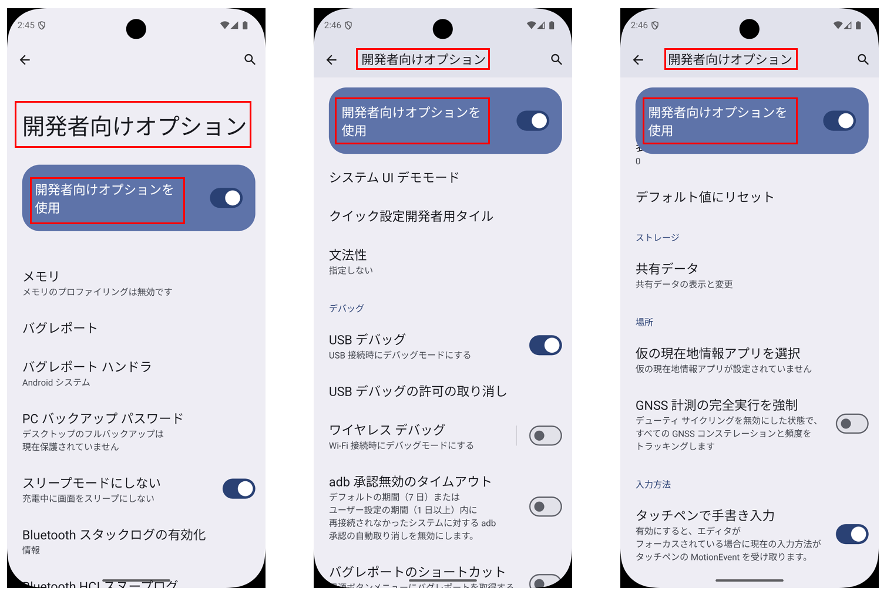
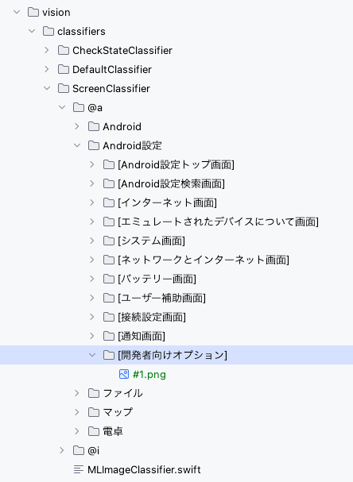
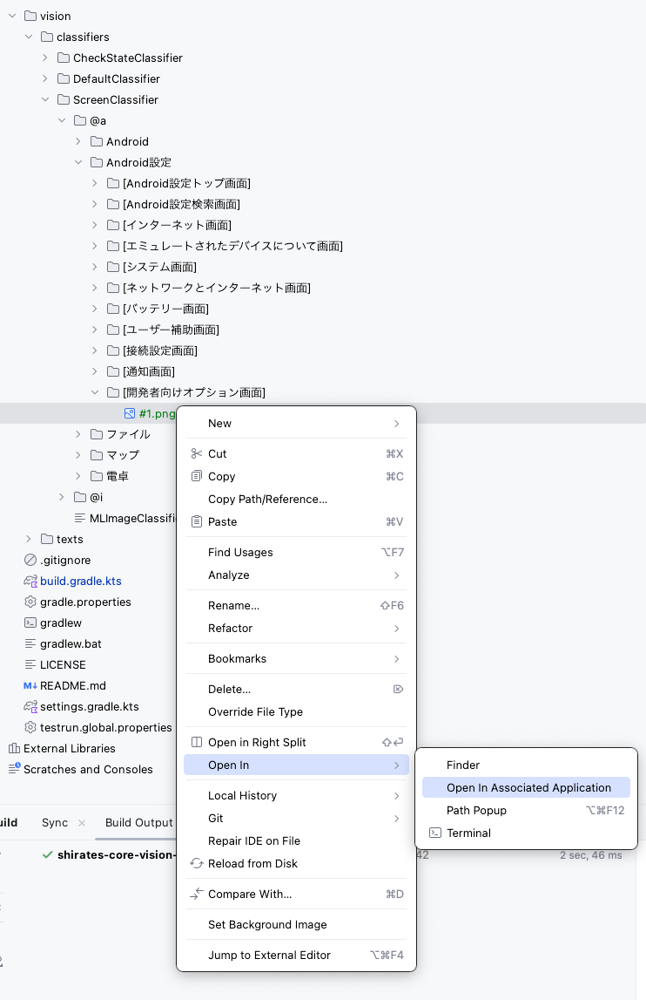
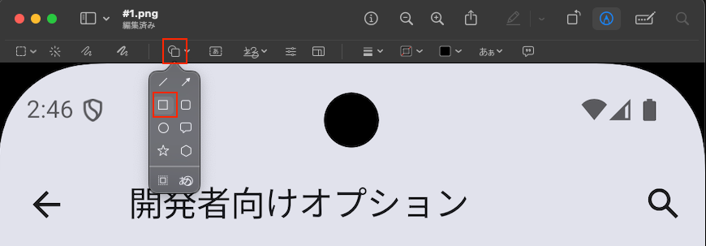
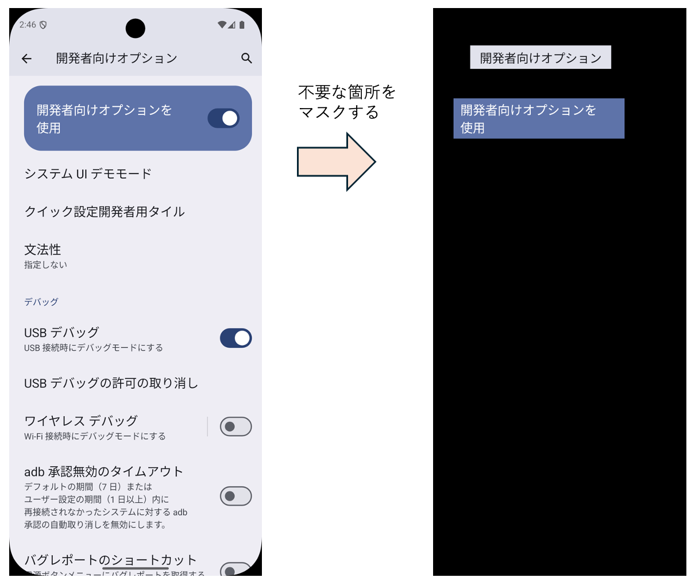
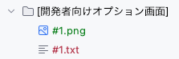
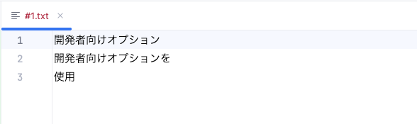

# 画像認識用のテキストインデックス (Vision)

[ScreenClassifier](../../basic/text_and_image_recognition/using_screen_classifier_ja.md)
を使用すると機械学習によって画面の画像と画面名の紐付け行い、これを利用してスクリーンショットから対応する画面名を取得することができます。各画面が特徴的なレイアウトである場合は
ScreenClassifier はうまく機能します。
一方で、似たようなレイアウトの画面が多い場合は誤認識が発生しやすく、うまくいかないケースがあります。<br>

学習させる画像を追加すれば特定の状況では認識精度が上がる場合もありますが、期待したほど認識精度が上がらない場合もあります。たくさんの画像を機械学習すると学習に必要な時間が長くなるため、これはあまり良い方法ではありません。
大規模な自動テストを安定的に運用するには別のアプローチが必要です。

Shirates/Visionではこの問題を解決するために **テキストインデックス** を利用することができます。

## テキストインデックス

画面のテキストをAI-OCRで抽出し、これを画面認識のためのインデックスとして利用します。

### テキストインデックスの条件

テキストインデックスとして利用するテキストは、その画面において固定的に表示されているもの、つまり
画面のコンテンツが書き変わったりスクロールして表示状態が変化したりしても常に表示されているテキストを選択する必要があります。

例えばAndroidの設定アプリの`開発者オプション画面`は画面が上下にスクロールしますが、常に表示されるテキストがあります。



したがって、この画面の適切なテキストインデックスは以下のテキストの組み合わせになります。

- `開発者向けオプション`
- `開発者向けオプションを`
- `使用`

※ 改行箇所で分割します

<br>

### テキストインデックスの作成例

1. ScreenClassifier配下のディレクトリに `[開発者向けオプション画面]` という名前のディレクトリを作成します。
2. 画面のスクリーンショットを取得し、画面名のディレクトリ下に画像ファイルを置きます。画像ファイルには`#`
   から開始する名前をつけます。



3. 画像を右クリックし、`Open In > Open In Associated Application` でPreviewで表示します。



4. 編集モードに切り替えます。


5. 矩形のシェイプを挿入します。



5. テキストインデックス部分以外をマスクして保存します。
   

4. Shiratesで任意のテストを実行します。AI-OCRが画像からテキストを読み取り、テキストインデックスファイルが作成されます。



5. テキストインデックスファイルの中身は以下のようになります。



### サンプルコード

[サンプルの入手](../../../getting_samples_ja.md)

### in_action/TextIndex1.kt

```kotlin
    @Test
    fun textIndexScenario1() {

        scenario {
            case(1) {
                condition {
                    it.macro("[Android設定トップ画面]")
                }.action {
                    it.flickAndGoDown()
                        .tapWithScrollDown("システム")
                        .tapWithScrollDown("開発者向けオプション")
                }.expectation {
                    it.screenIs("[開発者向けオプション画面]")
                }
            }
        }
    }
```

このサンプルコードは以下を実行します。

1. Android設定アプリを起動
2. `システム` をタップする
3. `開発者向けオプション` をタップする
4. 表示された画面の画面名が `[開発者向けオプション画面]` であることを検証する

サンプルコードを実行すると、以下のようなログが出力されます。

```
...
127	[00:00:20]	2025/04/14 10:31:28.663	{textIndexScenario1}	0	-	[info]	+227	!	(silent)	Running device found. (udid=emulator-5556, avd=Pixel_8_Android_14)
128	[00:00:20]	2025/04/14 10:31:28.664	{textIndexScenario1}	0	-	[info]	+1	!	(silent)	接続された端末が見つかりました。(Pixel_8_Android_14:5556, Android 14, emulator-5556)
129	[00:00:20]	2025/04/14 10:31:29.344	{textIndexScenario1-1}	0	-	[CASE]	+680	!	()	(1)
130	[00:00:20]	2025/04/14 10:31:29.348	{textIndexScenario1-1}	0	-	[CONDITION]	+4	!	()	事前条件
131	[00:00:20]	2025/04/14 10:31:29.349	{textIndexScenario1-1}	0	-	[operate]	+1	!	()	[Android設定トップ画面]
132	[00:00:23]	2025/04/14 10:31:31.602	{textIndexScenario1-1}	1	[Android設定トップ画面]	[screenshot]	+2253	!	()	screenshot: 132.png
133	[00:00:23]	2025/04/14 10:31:32.209	{textIndexScenario1-1}	1	[Android設定トップ画面]	[info]	+607	!	()	132_[132.png]_recognizeText_rectangles.png
134	[00:00:23]	2025/04/14 10:31:32.335	{textIndexScenario1-1}	1	[Android設定トップ画面]	[info]	+126	!	()	[Android設定トップ画面] found by ScreenClassifier. (matchTextScoreRate: 0.8333333333333334)
135	[00:00:24]	2025/04/14 10:31:33.070	{textIndexScenario1-1}	0	-	[info]	+735	!	()	(isSame: true, changed: false, matchRate: 1.0, distance=0.0)
136	[00:00:24]	2025/04/14 10:31:33.072	{textIndexScenario1-1}	0	-	[ACTION]	+2	!	()	アクション
137	[00:00:24]	2025/04/14 10:31:33.073	{textIndexScenario1-1}	0	-	[operate]	+1	!	(flickAndGoDown)	フリックして下方向へ進む
138	[00:00:25]	2025/04/14 10:31:33.830	{textIndexScenario1-1}	0	-	[info]	+757	!	()	(isSame: false, changed: false, matchRate: 0.8519026041030884, distance=0.14809739589691162)
139	[00:00:26]	2025/04/14 10:31:34.738	{textIndexScenario1-1}	0	-	[info]	+908	!	()	(isSame: false, changed: true, matchRate: 0.8884613811969757, distance=0.11153861880302429)
140	[00:00:27]	2025/04/14 10:31:35.667	{textIndexScenario1-1}	0	-	[info]	+929	!	()	(isSame: true, changed: true, matchRate: 1.0, distance=0.0)
141	[00:00:27]	2025/04/14 10:31:35.668	{textIndexScenario1-1}	0	-	[screenshot]	+1	!	()	screenshot: 141.png
142	[00:00:27]	2025/04/14 10:31:36.465	{textIndexScenario1-1}	0	-	[info]	+797	!	()	141_[141.png]_recognizeText_rectangles.png
143	[00:00:29]	2025/04/14 10:31:37.553	{textIndexScenario1-1}	0	-	[info]	+1088	!	()	[recognizeScreen] in 1.883 sec
144	[00:00:29]	2025/04/14 10:31:37.554	{textIndexScenario1-1}	0	-	[info]	+1	!	()	currentScreen=[Android設定トップ画面]
145	[00:00:29]	2025/04/14 10:31:37.558	{textIndexScenario1-1}	0	-	[operate]	+4	!	(tapWithScrollDown)	<システム>をタップする（下スクロール）
146	[00:00:30]	2025/04/14 10:31:38.890	{textIndexScenario1-1}	0	-	[info]	+1332	!	(tapWithScrollDown)	145_[85, 1653, 400, 1732](w=316, h=80).png
147	[00:00:30]	2025/04/14 10:31:38.991	{textIndexScenario1-1}	0	-	[info]	+101	!	(tapWithScrollDown)	146_[145_[85, 1653, 400, 1732](w=316, h=80).png]_recognizeText_rectangles.png
148	[00:00:31]	2025/04/14 10:31:40.336	{textIndexScenario1-1}	0	-	[screenshot]	+1345	!	(tapWithScrollDown)	screenshot: 148.png
149	[00:00:32]	2025/04/14 10:31:41.133	{textIndexScenario1-1}	0	-	[info]	+797	!	(tapWithScrollDown)	148_[148.png]_recognizeText_rectangles.png
150	[00:00:35]	2025/04/14 10:31:43.965	{textIndexScenario1-1}	0	-	[screenshot]	+2832	!	(tapWithScrollDown)	screenshot: 150.png
151	[00:00:36]	2025/04/14 10:31:44.552	{textIndexScenario1-1}	0	-	[info]	+587	!	(tapWithScrollDown)	150_[150.png]_recognizeText_rectangles.png
152	[00:00:36]	2025/04/14 10:31:44.682	{textIndexScenario1-1}	0	-	[info]	+130	!	(tapWithScrollDown)	[システム画面] found by ScreenClassifier. (matchTextScoreRate: 0.8125)
153	[00:00:36]	2025/04/14 10:31:44.684	{textIndexScenario1-1}	0	-	[operate]	+2	!	(tapWithScrollDown)	<開発者向けオプション>をタップする（下スクロール）
154	[00:00:36]	2025/04/14 10:31:45.181	{textIndexScenario1-1}	0	-	[info]	+497	!	(tapWithScrollDown)	(isSame: false, changed: false, matchRate: 0.9925885302945971, distance=0.007411469705402851)
155	[00:00:37]	2025/04/14 10:31:46.078	{textIndexScenario1-1}	0	-	[info]	+897	!	(tapWithScrollDown)	(isSame: true, changed: true, matchRate: 1.0, distance=0.0)
156	[00:00:37]	2025/04/14 10:31:46.079	{textIndexScenario1-1}	0	-	[screenshot]	+1	!	(tapWithScrollDown)	screenshot: 156.png
157	[00:00:38]	2025/04/14 10:31:46.637	{textIndexScenario1-1}	0	-	[info]	+558	!	(tapWithScrollDown)	156_[156.png]_recognizeText_rectangles.png
158	[00:00:38]	2025/04/14 10:31:46.762	{textIndexScenario1-1}	0	-	[info]	+125	!	(tapWithScrollDown)	[システム画面] found by ScreenClassifier. (matchTextScoreRate: 0.8125)
159	[00:00:38]	2025/04/14 10:31:46.763	{textIndexScenario1-1}	0	-	[info]	+1	!	(tapWithScrollDown)	[recognizeScreen] in 0.683 sec
160	[00:00:38]	2025/04/14 10:31:46.764	{textIndexScenario1-1}	0	-	[info]	+1	!	(tapWithScrollDown)	currentScreen=[システム画面]
161	[00:00:38]	2025/04/14 10:31:46.769	{textIndexScenario1-1}	0	-	[operate]	+5	!	(tapWithScrollDown)	下方向へスクロールする
162	[00:00:38]	2025/04/14 10:31:46.771	{textIndexScenario1-1}	0	-	[info]	+2	!	(tapWithScrollDown)	scrollableRect: [0,0][1079,2399] width=1080, height=2400, centerX=540, centerY=1200
163	[00:00:41]	2025/04/14 10:31:50.257	{textIndexScenario1-1}	0	-	[info]	+3486	!	(tapWithScrollDown)	(isSame: false, changed: false, matchRate: 0.9356023445725441, distance=0.0643976554274559)
164	[00:00:42]	2025/04/14 10:31:51.170	{textIndexScenario1-1}	0	-	[info]	+913	!	(tapWithScrollDown)	(isSame: false, changed: true, matchRate: 0.9617843069136143, distance=0.03821569308638573)
165	[00:00:43]	2025/04/14 10:31:52.078	{textIndexScenario1-1}	0	-	[info]	+908	!	(tapWithScrollDown)	(isSame: true, changed: true, matchRate: 1.0, distance=0.0)
166	[00:00:43]	2025/04/14 10:31:52.079	{textIndexScenario1-1}	0	-	[screenshot]	+1	!	(tapWithScrollDown)	screenshot: 166.png
167	[00:00:44]	2025/04/14 10:31:52.685	{textIndexScenario1-1}	0	-	[info]	+606	!	(tapWithScrollDown)	166_[166.png]_recognizeText_rectangles.png
168	[00:00:44]	2025/04/14 10:31:52.807	{textIndexScenario1-1}	0	-	[info]	+122	!	(tapWithScrollDown)	[システム画面] found by ScreenClassifier. (matchTextScoreRate: 0.8333333333333334)
169	[00:00:44]	2025/04/14 10:31:52.810	{textIndexScenario1-1}	0	-	[info]	+3	!	(tapWithScrollDown)	[recognizeScreen] in 0.731 sec
170	[00:00:44]	2025/04/14 10:31:52.810	{textIndexScenario1-1}	0	-	[info]	+0	!	(tapWithScrollDown)	currentScreen=[システム画面]
171	[00:00:44]	2025/04/14 10:31:52.903	{textIndexScenario1-1}	0	-	[info]	+93	!	(tapWithScrollDown)	endOfScroll=false
172	[00:00:44]	2025/04/14 10:31:53.272	{textIndexScenario1-1}	0	-	[info]	+369	!	(tapWithScrollDown)	(isSame: true, changed: false, matchRate: 1.0, distance=0.0)
173	[00:00:45]	2025/04/14 10:31:53.916	{textIndexScenario1-1}	0	-	[info]	+644	!	(tapWithScrollDown)	172_[192, 2069, 717, 2124](w=526, h=56).png
174	[00:00:45]	2025/04/14 10:31:54.025	{textIndexScenario1-1}	0	-	[info]	+109	!	(tapWithScrollDown)	173_[172_[192, 2069, 717, 2124](w=526, h=56).png]_recognizeText_rectangles.png
175	[00:00:47]	2025/04/14 10:31:55.503	{textIndexScenario1-1}	0	-	[screenshot]	+1478	!	(tapWithScrollDown)	screenshot: 175.png
176	[00:00:47]	2025/04/14 10:31:56.102	{textIndexScenario1-1}	0	-	[info]	+599	!	(tapWithScrollDown)	175_[175.png]_recognizeText_rectangles.png
177	[00:00:47]	2025/04/14 10:31:56.243	{textIndexScenario1-1}	0	-	[info]	+141	!	(tapWithScrollDown)	[システム画面] found by ScreenClassifier. (matchTextScoreRate: 0.8333333333333334)
178	[00:00:50]	2025/04/14 10:31:58.917	{textIndexScenario1-1}	0	-	[screenshot]	+2674	!	(tapWithScrollDown)	screenshot: 178.png
179	[00:00:51]	2025/04/14 10:31:59.519	{textIndexScenario1-1}	0	-	[info]	+602	!	(tapWithScrollDown)	178_[178.png]_recognizeText_rectangles.png
180	[00:00:51]	2025/04/14 10:31:59.617	{textIndexScenario1-1}	0	-	[info]	+98	!	(tapWithScrollDown)	[開発者向けオプション画面] found by TextIndex: [開発者向けオプション, 開発者向けオプションを, 使用]
181	[00:00:51]	2025/04/14 10:31:59.618	{textIndexScenario1-1}	0	-	[EXPECTATION]	+1	!	()	期待結果
182	[00:00:51]	2025/04/14 10:31:59.620	{textIndexScenario1-1}	0	-	[OK]	+2	!	(screenIs)	[開発者向けオプション画面]が表示されること
183	[00:00:51]	2025/04/14 10:31:59.620	{textIndexScenario1-1}	0	-	[info]	+0	!	()	シナリオの実行が完了しました。(処理時間: 37.4 sec)
184	[00:00:51]	2025/04/14 10:31:59.622	{}	0	-	[info]	+2	!	()	テスト関数の実行が完了しました。(処理時間: 50.9 sec)
185	[00:00:51]	2025/04/14 10:31:59.623	{}	0	-	[info]	+1	!	()	End of Test function: textIndexScenario1 [textIndexScenario1()]
...
```

<br>

`[開発者向けオプション画面]`がテキストインデックスを使用して認識されたことがわかります。

```
[開発者向けオプション画面] found by TextIndex: [開発者向けオプション, 開発者向けオプションを, 使用]
```

<br>

なお、他の画面はScreenClassifierで認識されています。

```
[Android設定トップ画面] found by ScreenClassifier. (matchTextScoreRate: 0.8333333333333334)

[システム画面] found by ScreenClassifier. (matchTextScoreRate: 0.8333333333333334)
```

matchTextScoreRate は画面上のテキストとテンプレート画像のテキストを比較したときにどれくらいマッチしているかを示す指標です。

## テキストインデックスの優先度

テキストインデックスの元になる画像ファイルは`#`から開始するファイル名ですが、`#`の数を増やすと優先度が高くなります。

```
#a.txt      // 優先度1
##a.txt     // 優先度2
###a.txt    // 優先度3
```

※優先度の値が大きい方が優先されます。

ファイルの優先度が同じ場合は、テキストインデックスを構成する項目数が多い画面が優先されます。

- 項目数が3の画面は項目数が2の項目より優先されます
- 項目数が同じ画面の場合は不定です。優先度に差をつけたい場合は項目数を調整するように運用してください

## 画面認識は必要なのか？

画面認識機能の利用は任意です。
画像の学習あるいはテキストインデックスの作成などのセットアップに手間のかかる画面認識機能を利用するのはやめて、淡々とテスト手順をテストコードとして実装するのも悪いアイデアではありません。

ただし、画面認識を正しく行うと以下のメリットがあります。

- アクションを実行した時に表示されている画面が何なのかをログ上で容易に把握でき、デバッグが容易になる
- **onScreen関数** が利用できる。非同期で表示されるポップアップダイアログのような画面遷移の処理を簡単かつ確実に行える

### Link

- [index](../../../index_ja.md)

