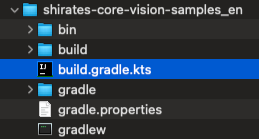

# Quick Start (Shirates/Vision) for macOS

## Environment

See [Tested Environments](../environments.md) before installation.

**Note:** AI-Vision feature is for only macOS currently.

## Installation

Install following prerequisite tools.

**Note:** Do not use OS account with username contains non-ASCII characters or white spaces. Some of following tools
don't work well.


<br>

### IntelliJ IDEA

If you have not installed, download Ultimate or COMMUNITY and install it.
(COMMUNITY is opensource product)

https://www.jetbrains.com/idea/

<br>

### Android Studio

If you have not installed, download Android Studio and install it.

https://developer.android.com/studio

<br>

### Xcode (Mac only)

If you have not installed, search Xcode in App Store and install it.

<br>

### Command Line Tools for Xcode (Mac only)

If you have not installed, open terminal window and run this command.

```
xcode-select --install
```

<br>

### Homebrew (Mac only)

If you have not installed, go to https://brew.sh/ and install it.

<br>

### Java Development Kit (JDK)

If you have not installed, search installation guide and install it.

<br>

### node & npm

If you have not installed, install it.

#### (for Mac)

You can install NPM with brew. Open terminal window and type these.

```
brew install node
node -v
npm -v
```

**Note:** Use newer version to avoid troubles of installing appium.

<br>

### Appium 2.0

Appium 2.0 is required.

If you are already using appium, check version.

```
appium -v
```

If you have installed appium 1.x, uninstall it.

```
npm uninstall -g appium
```

Install appium 2.0 using npm.

```
npm install -g appium
appium -v
```

See [Tested Environments](environments.md) to get tested version.

<br>
If you have already installed appium, uninstall it and install it again.

```
appium -v
npm uninstall -g appium
npm install -g appium
appium -v
```

<br>

### UIAutomator2 driver

Install UIAutomator2 driver.

```
appium driver install uiautomator2
```

<br>
If you have already installed the driver, uninstall it and install it again.

```
appium driver list
appium driver uninstall uiautomator2
appium driver install uiautomator2
appium driver list
```

See [Tested Environments](environments.md) to get tested version.

<br>

### XCUITest driver(Mac only)

Install XCUITest driver.

```
appium driver install xcuitest
```

<br>
If you have already installed the driver, uninstall it and install it again.

```
appium driver list
appium driver uninstall xcuitest
appium driver install xcuitest
appium driver list
```

See [Tested Environments](environments.md) to get tested version.

<br>

### Setting Environment Variables (Mac only)

Set environment variables in initializing script (.zshrc or others).

#### Example

```
export ANDROID_SDK_ROOT=/Users/$USER/Library/Android/sdk
export PATH=$ANDROID_SDK_ROOT/emulator:$ANDROID_SDK_ROOT/tools:$ANDROID_SDK_ROOT/platform-tools:$PATH
```

**Note:** Execute log out/log in to take effect above settings.

#### Example

```
export ANDROID_SDK_ROOT=/home/$USER/Android/Sdk
export PATH=$ANDROID_SDK_ROOT/emulator:$ANDROID_SDK_ROOT/tools:$ANDROID_SDK_ROOT/platform-tools:$PATH
```

## Setting up AVD (Android Virtual Device)

### Create AVD for demo

1. Open **Android Studio**.
2. Select menu `Tools > Device Manager`.
3. Click `[+]`. <br>
   


4. Select `Pixcel 8` and click Next.<br>
   


5. Select `UsideDownCake 34 Android 14.0 (Google Play)` and click `Next` (Google Play Store is required for
   demonstration using **Calculator** app). Select **arm64** image for M1 Mac, otherwise select **x86_64** image.<br>
   

6. Set AVD Name to `Pixel 8(Android 14)`.<br>
   Set `Enable device frame` off.<br>
   Click `Finish`<br>
   

<br>

## Setting up MLModel files

1. Open `shirates-core` project in IntelliJ, right click on `kotlin/shirates/batch/CreateMLExecute.kt` and
   select
   **Debug 'CreateMLExecute'** <br>
2. Wait for the process to complete. The following log will be displayed.

```
Connected to the target VM, address: '127.0.0.1:64541', transport: 'socket'
Copying createml/MLImageClassifier.swift to /Users/wave1008/github/ldi-github/shirates-core/bin/createml/MLImageClassifier.swift
lineNo	[elapsedTime]	logDateTime	{testCaseId}	macroDepth	macroName	[logType]	timeDiff	mode	(group)	message
1	[00:00:00]	2025/01/01 18:42:44.011	{}	0	-	[info]	+0	C	()	Starting leaning.
2	[00:00:11]	2025/01/01 18:42:54.799	{}	0	-	[info]	+10788	C	()	Learning completed. (in 10.769 sec)
["/Users/wave1008/github/ldi-github/shirates-core/bin/createml/MLImageClassifier.swift", "/Users/wave1008/github/ldi-github/shirates-core/vision/mlmodels/widget/RadioButtonStateClassifier", "-noise", "-blur"]
----------------------------------
dataSourceName: RadioButtonStateClassifier
dataSourcePath: file:///Users/wave1008/github/ldi-github/shirates-core/vision/mlmodels/widget/RadioButtonStateClassifier/
options: ["-noise", "-blur"]
featureExtractor: Image Feature Print V2
----------------------------------
Number of examples: 4
Number of classes: 2
Accuracy: 100.00%

******CONFUSION MATRIX******
----------------------------------
True\Pred OFF ON  
OFF       2   0   
ON        0   2   

******PRECISION RECALL******
----------------------------------
Cla Precision(%) Recall(%)
OFF 100.00          100.00         
ON  100.00          100.00         


Model saved to /Users/wave1008/github/ldi-github/shirates-core/vision/mlmodels/widget/RadioButtonStateClassifier/RadioButtonStateClassifier.mlmodel
3	[00:00:11]	2025/01/01 18:42:54.800	{}	0	-	[info]	+1	C	()	Starting leaning.
4	[00:00:11]	2025/01/01 18:42:55.712	{}	0	-	[info]	+912	C	()	Learning completed. (in 0.911 sec)
["/Users/wave1008/github/ldi-github/shirates-core/bin/createml/MLImageClassifier.swift", "/Users/wave1008/github/ldi-github/shirates-core/vision/mlmodels/widget/SwitchStateClassifier", "-noise", "-blur"]
----------------------------------
dataSourceName: SwitchStateClassifier
dataSourcePath: file:///Users/wave1008/github/ldi-github/shirates-core/vision/mlmodels/widget/SwitchStateClassifier/
options: ["-noise", "-blur"]
featureExtractor: Image Feature Print V2
----------------------------------
Number of examples: 4
Number of classes: 2
Accuracy: 100.00%

******CONFUSION MATRIX******
----------------------------------
True\Pred OFF ON  
OFF       2   0   
ON        0   2   

******PRECISION RECALL******
----------------------------------
Cla Precision(%) Recall(%)
OFF 100.00          100.00         
ON  100.00          100.00         


Model saved to /Users/wave1008/github/ldi-github/shirates-core/vision/mlmodels/widget/SwitchStateClassifier/SwitchStateClassifier.mlmodel
```

*.mlmodel files are created.


## Setting up shirates-vision-server

1. Get shirates-vision-server from [shirates-vision-server](https://github.com/ldi-github/shirates-vision-server).
2. Open the project (open Package.swift with Xcode). Wait a while for the background process to finish.
3. Select Product > Destination > My Mac.
4. Select Product > Run. You can see `[ NOTICE ] Server started on http://127.0.0.1:8081`.

## Demonstration

Let's see demonstration.

### Opening Project

1. Open **shirates-core** project directory in Finder.
2. Right click `build.gradle.kts` and open with IntelliJ IDEA. <br>
   

### Enable right-click test running

1. `IntelliJ IDEA > Settings` (or `File > Settings`)
1. `Build, Execution, Deployment > Build Tools > Gradle`
1. Set `Run tests using` to `IntelliJ IDEA`


<br>

### Run AndroidSettingsDemo

1. Launch the AVD of Android 14 from **Device Manager**.
1. Open `shirates-core` project in IntelliJ, right click on `kotlin/demo/vision/AndroidSettingsVisionDemo` and
   select
   **Debug 'AndroidSettingsVisionDemo'**
1. You'll see logs in the Console like this.

#### Console output

```
lineNo	[elapsedTime]	logDateTime	{testCaseId}	macroDepth	macroName	[logType]	timeDiff	mode	(group)	message
1	[00:00:00]	2025/01/01 21:16:30.822	{}	0	-	[-]	+0	C	()	----------------------------------------------------------------------------------------------------
2	[00:00:00]	2025/01/01 21:16:30.840	{}	0	-	[-]	+18	C	()	///
3	[00:00:00]	2025/01/01 21:16:30.841	{}	0	-	[-]	+1	C	()	/// shirates-core 8.0.0-SNAPSHOT
4	[00:00:00]	2025/01/01 21:16:30.841	{}	0	-	[-]	+0	C	()	///
5	[00:00:00]	2025/01/01 21:16:30.842	{}	0	-	[-]	+1	C	()	powered by Appium (io.appium:java-client:9.1.0)
6	[00:00:00]	2025/01/01 21:16:30.842	{}	0	-	[-]	+0	C	()	----------------------------------------------------------------------------------------------------
7	[00:00:00]	2025/01/01 21:16:30.842	{}	0	-	[-]	+0	C	()	testClass: demo.vision.AndroidSettingsVisionDemo
8	[00:00:00]	2025/01/01 21:16:30.842	{}	0	-	[-]	+0	C	()	sheetName: AndroidSettingsVisionDemo
9	[00:00:00]	2025/01/01 21:16:30.842	{}	0	-	[-]	+0	C	()	logLanguage: 
10	[00:00:00]	2025/01/01 21:16:30.863	{}	0	-	[info]	+21	C	()	
11	[00:00:00]	2025/01/01 21:16:30.863	{}	0	-	[info]	+0	C	()	----------------------------------------------------------------------------------------------------
12	[00:00:00]	2025/01/01 21:16:30.863	{}	0	-	[info]	+0	C	()	Test function: airplaneModeSwitch [airplaneModeSwitch()]
13	[00:00:00]	2025/01/01 21:16:30.864	{}	0	-	[info]	+1	C	()	----------------------------------------------------------------------------------------------------
14	[00:00:00]	2025/01/01 21:16:31.540	{}	0	-	[info]	+676	C	()	Initializing with testrun file.(testConfig/android/androidSettingsVision/testrun.properties)
...
```

<br>

### Run iOSSettingsDemo

1. Open Xcode and setup iOS Simulator. `iPhone 16(iOS 18.2)`

2. Open shirates-core project in IntelliJ, right click on `src/test/Kotlin/demo/iOSSettingsVisionDemo` and select
   **Debug 'iOSSettingsVisionDemo'**
3. You'll see the iOS Settings test works.

### Link

- [index](index.md)
